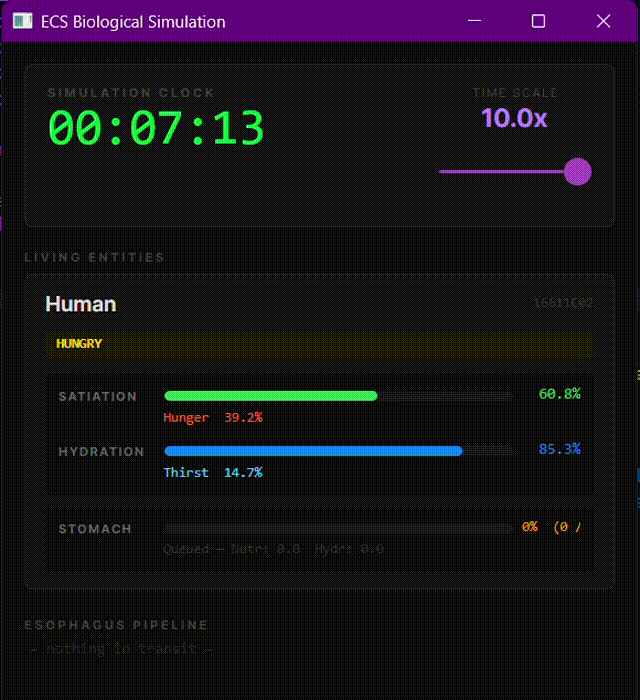

# ECS Simulation Engine

A biological life simulation built on a hand-rolled Entity Component System framework in C# / .NET 8. Built to learn ECS architecture, framework design, and emergent systems from the ground up.



---

Entities are composed from pure data components — metabolism, digestion, hunger, hydration — processed each tick by independent systems. No behaviour is scripted. Everything you see emerges from systems reacting to each other's output.

**Stack:** C# · .NET 8 · Avalonia UI · CommunityToolkit.MVVM

---

## Table of Contents

- [Architecture](#architecture)
- [Project Structure](#project-structure)
- [System Pipeline](#system-pipeline)
- [Systems Reference](#systems-reference)
- [Components Reference](#components-reference)
- [Tags Reference](#tags-reference)
- [Configuration — SimConfig.json](#configuration--simconfigjson)
- [Running the Simulation](#running-the-simulation)
- [Development](#development)

---

## Architecture

The project is split into three completely independent layers. The simulation core has zero knowledge of any frontend.

```
┌──────────────────────────────────────────────────────────────┐
│  ECSVisualizer  (Avalonia UI desktop app)                    │
│  ECSCli         (Headless terminal runner)                   │
│                  — any other frontend goes here —            │
├──────────────────────────────────────────────────────────────┤
│  SimulationBootstrapper  (Composition root)                  │
│  Loads SimConfig.json · Wires systems · Spawns world         │
├──────────────────────────────────────────────────────────────┤
│  APIFramework  (Headless simulation core — no UI dependency) │
│  ┌──────────────┐  ┌─────────────┐  ┌──────────────────┐    │
│  │   Systems    │  │ Components  │  │  Core (ECS glue) │    │
│  └──────────────┘  └─────────────┘  └──────────────────┘    │
└──────────────────────────────────────────────────────────────┘
```

### Key Design Principles

**Pure ECS** — Entities are GUIDs with no behaviour. Components are plain data structs. Systems are stateless processors that read components and write components. Nothing else.

**Headless core** — `APIFramework` compiles and runs with no UI package references. A frontend drives it by calling `Engine.Update(deltaTime)` in whatever loop it wants.

**One system per file** — Every system has a single, clearly named responsibility. Any developer can open one file and understand the complete behaviour it implements.

**Data-driven** — Every tuning value lives in `SimConfig.json`. Systems receive their config through constructor injection. Nothing biologically or mechanically significant is hardcoded.

**No cyclic dependencies** — `ECSVisualizer → APIFramework`. Never the reverse.

---

## Project Structure

```
_ecs-simulation-engine/
├── ECSSimulation.sln
├── SimConfig.json                  ← All tuning values live here
│
├── APIFramework/                   ← Headless simulation core (class library)
│   ├── Core/
│   │   ├── Entity.cs
│   │   ├── EntityManager.cs
│   │   ├── ISystem.cs
│   │   ├── IComponent.cs
│   │   ├── SimulationEngine.cs
│   │   ├── SimulationClock.cs
│   │   └── SimulationBootstrapper.cs
│   ├── Config/
│   │   └── SimConfig.cs            ← Typed config loader (JSON → C# classes)
│   ├── Components/
│   │   ├── MetabolismComponent.cs
│   │   ├── StomachComponent.cs
│   │   ├── DriveComponent.cs       ← Brain priority queue output
│   │   ├── EsophagusTransitComponent.cs
│   │   ├── BolusComponent.cs
│   │   ├── LiquidComponent.cs
│   │   ├── FoodObjectComponent.cs
│   │   ├── IdentityComponent.cs
│   │   ├── Tags.cs
│   │   └── EntityTemplates.cs
│   └── Systems/
│       ├── MetabolismSystem.cs
│       ├── BiologicalConditionSystem.cs
│       ├── BrainSystem.cs          ← Priority queue
│       ├── FeedingSystem.cs
│       ├── DrinkingSystem.cs       ← Split from BiologicalConditionSystem
│       ├── InteractionSystem.cs
│       ├── EsophagusSystem.cs
│       └── DigestionSystem.cs
│
├── ECSVisualizer/                  ← Avalonia desktop UI
│   ├── Views/MainWindow.axaml
│   └── ViewModels/
│       ├── MainViewModel.cs
│       └── EntityViewModel.cs
│
└── ECSCli/                         ← Headless CLI runner
    ├── Program.cs
    ├── CliOptions.cs
    └── CliRenderer.cs
```

---

## System Pipeline

Systems execute in this exact order every tick. Order is declared once in `SimulationBootstrapper.RegisterSystems()` and nowhere else.

| # | System | Reads | Writes | Purpose |
|---|--------|-------|--------|---------|
| 1 | `MetabolismSystem` | `MetabolismComponent` | `MetabolismComponent` | Drains Satiation and Hydration over time |
| 2 | `BiologicalConditionSystem` | `MetabolismComponent` | Tags | Sets/clears biological condition tags based on resource levels |
| 3 | `BrainSystem` | `MetabolismComponent` | `DriveComponent` | Scores all drives, stamps dominant desire onto entity |
| 4 | `FeedingSystem` | `DriveComponent`, `StomachComponent` | Creates bolus entity | Spawns food if Eat is dominant drive |
| 5 | `DrinkingSystem` | `DriveComponent`, `StomachComponent` | Creates liquid entity | Spawns water if Drink is dominant drive |
| 6 | `InteractionSystem` | `FoodObjectComponent` | Creates bolus entity | Converts held food into a bolus via biting |
| 7 | `EsophagusSystem` | `EsophagusTransitComponent` | `StomachComponent`, destroys transit entity | Moves bolus/liquid down esophagus, delivers to stomach |
| 8 | `DigestionSystem` | `StomachComponent`, `MetabolismComponent` | Both | Drains stomach proportionally, releases nutrients to metabolism |

---

## Systems Reference

### 1. MetabolismSystem
**File:** `APIFramework/Systems/MetabolismSystem.cs`

Depletes `Satiation` and `Hydration` on every tick. Drain rates are per-entity (stored in `MetabolismComponent`) so different species can have different metabolisms.

`Hunger` and `Thirst` are not stored — they are readonly computed properties on the component (`100 - Satiation` and `100 - Hydration`). Invalid states like negative hunger are structurally impossible.

**Config keys:** `entities.human.metabolism.satiationDrainRate`, `entities.human.metabolism.hydrationDrainRate`

---

### 2. BiologicalConditionSystem
**File:** `APIFramework/Systems/BiologicalConditionSystem.cs`

Observes resource levels and sets or clears biological state tags. This system is purely observational — it never spawns entities or triggers actions. It only reflects the current physiological truth as tags that other systems can react to.

**Config keys:** `systems.biologicalCondition.*`

| Tag applied | Condition |
|-------------|-----------|
| `HungerTag` | `Hunger >= hungerTagThreshold` (default 30) |
| `StarvingTag` | `Hunger >= starvingTagThreshold` (default 80) |
| `ThirstTag` | `Thirst >= thirstTagThreshold` (default 30) |
| `DehydratedTag` | `Thirst >= dehydratedTagThreshold` (default 70) |
| `IrritableTag` | `Hunger > irritableThreshold OR Thirst > irritableThreshold` (default 60) |

---

### 3. BrainSystem
**File:** `APIFramework/Systems/BrainSystem.cs`

The priority queue. Converts sensation levels into urgency scores (0.0–1.0), picks the dominant drive, and writes it to `DriveComponent`. Every action system reads this component to decide if it is their turn to act.

**Scoring formula:** `urgency = (sensation / 100) × maxScore`

Setting `sleepMaxScore` to 0.9 means sleep can never outbid a life-threatening hunger or thirst (which reach 1.0). This is the "PUT OUT FIRE" principle — survival always wins. Future drives (sleep, play, socialise, flee) plug in here by adding fields to `DriveComponent` and score logic to this system.

**Config keys:** `systems.brain.*`

---

### 4. FeedingSystem
**File:** `APIFramework/Systems/FeedingSystem.cs`

Spawns a banana bolus into the esophagus only when `DriveComponent.Dominant == Eat`. Guards against over-eating by checking `NutritionQueued` against the configured cap.

Currently conjures food from nothing — placeholder until world food sources (fridge, table, bowl) exist as entities.

**Config keys:** `systems.feeding.*`

---

### 5. DrinkingSystem
**File:** `APIFramework/Systems/DrinkingSystem.cs`

Spawns a water gulp into the esophagus only when `DriveComponent.Dominant == Drink`. The hydration queue cap prevents machine-gun gulping under normal thirst. The cap is raised when `DehydratedTag` is present, allowing faster recovery during emergencies.

**Config keys:** `systems.drinking.*`

---

### 6. InteractionSystem
**File:** `APIFramework/Systems/InteractionSystem.cs`

Handles physical food held in an entity's hand. Takes one bite per tick (when throat is clear), converts it to a bolus, and sends it down the esophagus. Decrements `BitesRemaining` and removes `FoodObjectComponent` when food is exhausted. Food delivery from world sources is a planned TODO here.

**Config keys:** `systems.interaction.*`

---

### 7. EsophagusSystem
**File:** `APIFramework/Systems/EsophagusSystem.cs`

Advances `Progress` on every `EsophagusTransitComponent` by `Speed × deltaTime` each tick. When progress reaches 1.0, the bolus or liquid is delivered to the target entity's `StomachComponent` and the transit entity is destroyed. Transit speed is set per-entity at spawn time.

---

### 8. DigestionSystem
**File:** `APIFramework/Systems/DigestionSystem.cs`

Drains the stomach at `DigestionRate` ml/second. Nutrients are released proportionally — if 10% of stomach volume is digested this tick, exactly 10% of queued nutrition and hydration is released into `MetabolismComponent`. This models the gradual absorption of a meal rather than instant calorie loading.

**Config keys:** `entities.human.stomach.digestionRate`

---

## Components Reference

| Component | Type | Key Fields | Purpose |
|-----------|------|------------|---------|
| `MetabolismComponent` | struct | `Satiation`, `Hydration`, `BodyTemp`, `SatiationDrainRate`, `HydrationDrainRate` | Core physiological state. `Hunger` and `Thirst` are readonly computed. |
| `StomachComponent` | struct | `CurrentVolumeMl`, `DigestionRate`, `NutritionQueued`, `HydrationQueued` | Physical stomach state. `Fill`, `IsEmpty`, `IsFull` are computed. |
| `DriveComponent` | struct | `EatUrgency`, `DrinkUrgency`, `SleepUrgency` | Priority queue output. `Dominant` returns the winning `DriveType`. |
| `EsophagusTransitComponent` | struct | `Progress`, `Speed`, `TargetEntityId` | Tracks a bolus or liquid travelling toward a stomach. |
| `BolusComponent` | struct | `Volume`, `NutritionValue`, `Toughness`, `FoodType` | Chewed food mass in esophageal transit. |
| `LiquidComponent` | struct | `VolumeMl`, `HydrationValue`, `LiquidType` | Liquid in esophageal transit. |
| `FoodObjectComponent` | struct | `Name`, `NutritionPerBite`, `Toughness`, `BitesRemaining` | Food held in hand, consumed bite by bite. |
| `IdentityComponent` | struct | `Name`, `Value` | Human-readable name and type label for display. |

---

## Tags Reference

Tags are zero-size marker structs. They carry no data — their presence or absence is the signal. Systems toggle them; other systems react to them.

**Biological condition tags** — set/cleared by `BiologicalConditionSystem`:

| Tag | Meaning |
|-----|---------|
| `HungerTag` | Hunger at or above threshold — entity is starting to feel hungry |
| `StarvingTag` | Hunger is severe — life-threatening |
| `ThirstTag` | Thirst at or above threshold — entity is starting to feel thirsty |
| `DehydratedTag` | Thirst is severe — raises drinking intake caps |
| `IrritableTag` | Either hunger or thirst is high enough to affect mood and behaviour |

**Vital state tags** — managed by future systems:

| Tag | Meaning |
|-----|---------|
| `ExhaustedTag` | Energy critically low — triggers sleep drive |
| `SleepingTag` | Entity is currently asleep — SleepSystem restores energy while set |

**Drive type** (`DriveComponent.Dominant`):

| Value | Meaning |
|-------|---------|
| `DriveType.None` | No active drive — all urgencies below threshold |
| `DriveType.Eat` | Eating is the dominant need this tick |
| `DriveType.Drink` | Drinking is the dominant need this tick |
| `DriveType.Sleep` | Sleep is dominant (active once EnergySystem is implemented) |

---

## Configuration — SimConfig.json

All simulation values are externalised to `SimConfig.json` at the repository root. Edit this file to tune the simulation without recompiling. The loader walks up from the working directory until it finds the file; compiled-in defaults are used if it is not found.

### Entity configuration

```jsonc
"entities": {
  "human": {
    "metabolism": {
      "satiationStart":     100.0,  // Starting fullness (0–100)
      "hydrationStart":     100.0,  // Starting hydration (0–100)
      "bodyTemp":            37.0,  // Body temperature °C
      "satiationDrainRate":   0.3,  // Satiation lost per second at 1x timescale
                                    //   100→0 in ~333s (~5.5 min) at default
      "hydrationDrainRate":   0.5   // Hydration lost per second at 1x timescale
                                    //   100→0 in ~200s (~3.3 min) at default
    },
    "stomach": {
      "digestionRate": 2.0          // ml digested per second
    }
  }
}
```

### System configuration

```jsonc
"systems": {
  "biologicalCondition": {
    "hungerTagThreshold":     30.0,  // Hunger ≥ this → HungerTag
    "starvingTagThreshold":   80.0,  // Hunger ≥ this → StarvingTag
    "thirstTagThreshold":     30.0,  // Thirst ≥ this → ThirstTag
    "dehydratedTagThreshold": 70.0,  // Thirst ≥ this → DehydratedTag
    "irritableThreshold":     60.0   // Hunger or Thirst ≥ this → IrritableTag
  },
  "brain": {
    "eatMaxScore":   1.0,  // Max urgency for eating (1.0 = survival ceiling)
    "drinkMaxScore": 1.0,  // Max urgency for drinking
    "sleepMaxScore": 0.9   // Sleep loses to life-threatening hunger/thirst
  },
  "feeding": {
    "hungerThreshold":   40.0,  // Min hunger before FeedingSystem activates
    "nutritionQueueCap": 70.0,  // Stop spawning when this much nutrition is queued
    "banana": {
      "volumeMl":       50.0,   // Volume entering stomach per bolus
      "nutritionValue": 35.0,   // Satiation points released after digestion
      "toughness":       0.2,   // Chew resistance (0 soft → 1 very tough)
      "esophagusSpeed":  0.3    // Transit speed (progress/second)
    }
  },
  "drinking": {
    "hydrationQueueCap":           30.0,  // Stop gulping under normal thirst
    "hydrationQueueCapDehydrated": 60.0,  // Higher cap during severe dehydration
    "water": {
      "volumeMl":       15.0,
      "hydrationValue": 30.0,
      "esophagusSpeed":  0.8    // Liquids travel faster than solid food
    }
  },
  "interaction": {
    "biteVolumeMl":   50.0,
    "esophagusSpeed":  0.3
  }
}
```

---

## Running the Simulation

### Avalonia GUI

```bash
dotnet run --project ECSVisualizer
```

### Headless CLI

```bash
# Run forever, snapshot every 10 sim-seconds
dotnet run --project ECSCli

# Sprint 5 sim-minutes at 60x speed, snapshot every 30s
dotnet run --project ECSCli -- --timescale 60 --duration 300 --snapshot 30

# 10 000 ticks, final summary only
dotnet run --project ECSCli -- --ticks 10000 --quiet

dotnet run --project ECSCli -- --help
```

### Building from WSL2

```bash
cd /mnt/c/repos/_ecs-simulation-engine
dotnet build ECSCli/ECSCli.csproj
```

Requires .NET 8 SDK. Ubuntu 24.04: `sudo apt install dotnet-sdk-8.0`.

---

## Development

### Changelog

See [CHANGELOG.md](CHANGELOG.md) for full version history.

### Adding a new system

1. Create `APIFramework/Systems/YourSystem.cs` implementing `ISystem`
2. Add config class to `SimConfig.cs` and JSON key to `SimConfig.json`
3. Register in `SimulationBootstrapper.RegisterSystems()` at the correct pipeline position
4. Document in this README

### Adding a new component

1. Create `APIFramework/Components/YourComponent.cs` as a `struct`
2. Add starting values to `EntityTemplates` and to `SimConfig.json` if spawn-time configurable

### Planned systems

| System | Purpose |
|--------|---------|
| `EnergySystem` | Drains energy over time; restores during sleep |
| `SleepSystem` | Manages sleep/wake cycle, scores SleepUrgency in BrainSystem |
| `MoodSystem` | Tracks happiness, stress, comfort — affected by sustained need states |
| `TimeSystem` | Simulates time-of-day and daylight; modifies drive score multipliers |
| `AutonomySystem` | Billy's willingness to comply — mood-gated disobedience mechanic |
