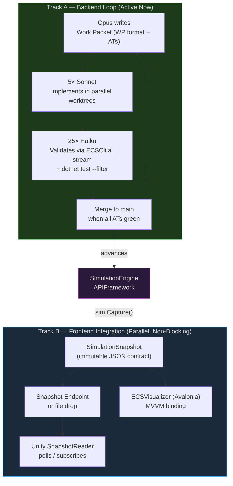
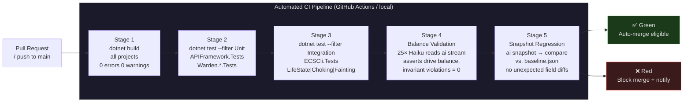
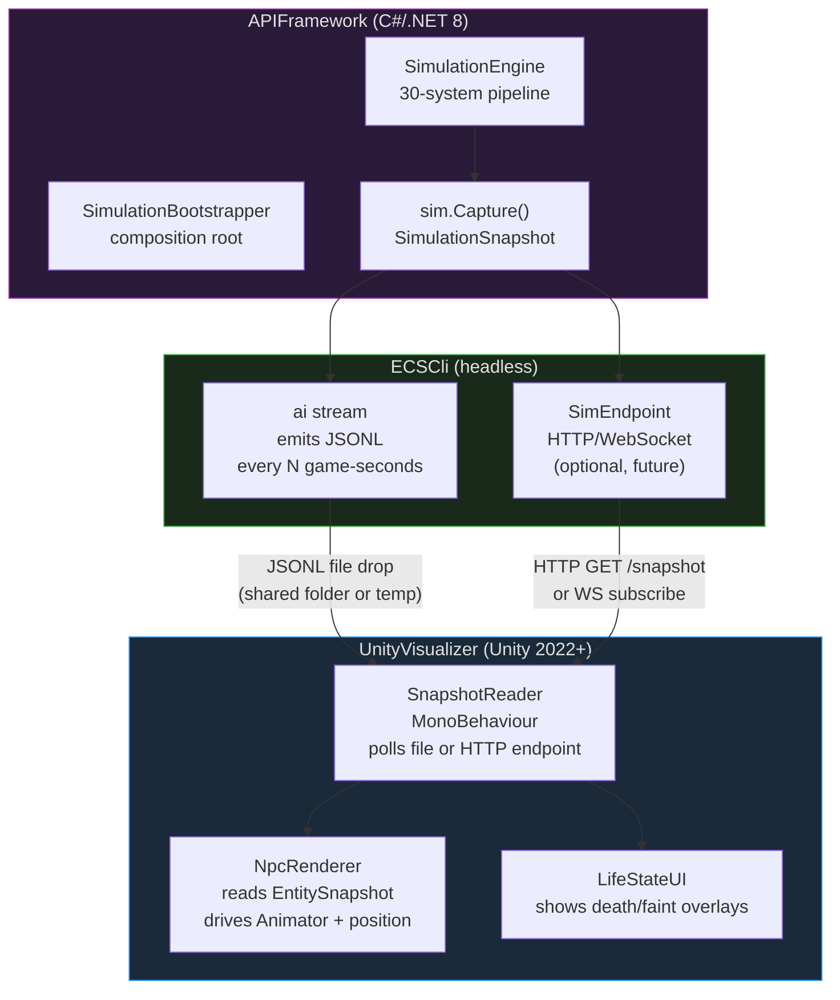
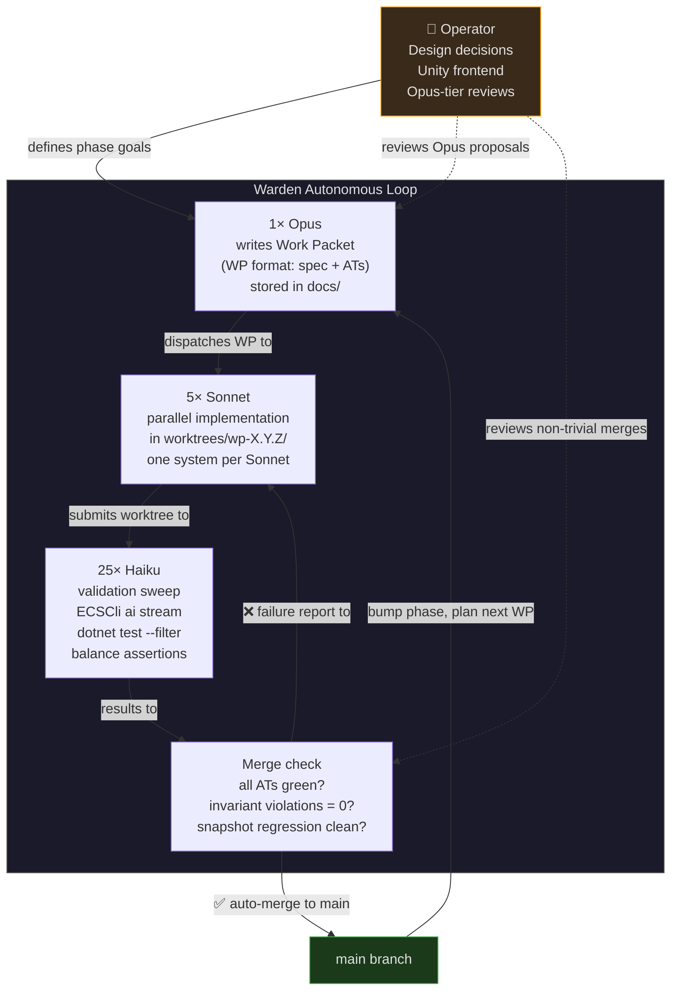

# Phase 3 Path Forward
## Unblocking Development from a Unity Integration Failure

**Document version:** 1.0  
**Date:** 2026-04-29  
**Engine version:** 0.7.3  
**Project:** Office Social Simulation — ECS Engine  
**Status:** Decision document — pending operator review

---

## Executive Summary

The simulation engine has reached Phase 3 (life-state systems: choking, fainting, death, corpse spawning, bereavement) in an exceptionally strong technical position: 948 tests pass across all six projects, the 30-system pipeline runs deterministically, and the Warden 1-5-25 autonomous development loop has already delivered all six Phase 3.0.x work packets without requiring human intervention on any implementation task. The blocker is a Unity frontend integration failure that has elevated the human operator to a required link in every validation cycle — a structural problem, not a technical one. The Unity build is broken, visual confirmation of simulation output is unavailable, and because no automated substitute for visual feedback has been established, Phase 3.1.x work is stalled waiting for a frontend that does not need to exist yet.

The recommended path forward is a two-track strategy: **Track A** continues Phase 3.x backend development immediately, using the existing `ECSCli` headless runner and AI commands (`ai stream`, `ai snapshot`, `ai narrative-stream`) as the complete validation loop — Unity is not required and must not gate any merge. **Track B** treats Unity integration as an isolated, parallel workstream that follows a SnapshotReader architecture: Unity reads `SimulationSnapshot` JSON from a file or endpoint, renders whatever it finds, and carries no simulation logic. A Unity failure is then a rendering problem, not a simulation correctness problem. Development should resume on Track A this week. Track B can be worked at whatever pace the operator chooses without ever pausing Track A.

---

## Table of Contents

1. [Root Cause Analysis](#1-root-cause-analysis)
2. [Immediate Unblocking Recommendation](#2-immediate-unblocking-recommendation)
3. [Proposed Frontend Strategy — Two-Track](#3-proposed-frontend-strategy--two-track)
4. [CI/CD Pipeline Proposal](#4-cicd-pipeline-proposal)
5. [Unity Integration Re-Architecture](#5-unity-integration-re-architecture)
6. [Phase 3 Work Packet Backlog](#6-phase-3-work-packet-backlog)
7. [The 1-5-25 Autonomous Development Loop](#7-the-1-5-25-autonomous-development-loop)
8. [Recommended 6-Week Schedule](#8-recommended-6-week-schedule)
9. [Success Criteria](#9-success-criteria)

---

## 1. Root Cause Analysis

### Why the human is the bottleneck

The simulation engine and its Warden infrastructure were designed from the start to support autonomous development: `SimulationBootstrapper` is a pure composition root with no UI dependencies, `SimulationSnapshot.Capture()` produces a complete, immutable per-frame capture of all engine state, and the `ai stream` command emits that state as structured JSONL that a Haiku agent can read, parse, and validate without human involvement. The Warden 1-5-25 loop — one Opus writing work packets, five Sonnet instances implementing them in parallel worktrees, twenty-five Haiku instances validating via CLI — proved this out completely during Phase 3.0.x: all six work packets were dispatched, implemented, and merged to `staging` with 948/948 tests passing and no human in the implementation or testing loop at all.

The human became the bottleneck at exactly one point: when the requirement emerged that visual output in Unity must be confirmed before a Phase 3.x work packet can be considered "done." No automated test can look at a Unity viewport and report whether NPCs are rendering correctly. That requirement — reasonable as a final QA step — was implicitly elevated to a gate on every development cycle, not just final integration. Because the Unity build is currently broken, the gate is permanently closed, and the entire Phase 3.1.x backlog is blocked.

### What "visual integration testing" requires from a human that automated tests do not

Automated tests (`dotnet test --filter LifeState`) can verify:

- Every `LifeStateComponent` transition fires the correct `NarrativeEventKind`
- `CorpseSpawnerSystem` attaches `CorpseTag` and `CorpseComponent` on death events
- `BereavementSystem` applies correct stress/mood deltas to witnesses
- `FaintingDetectionSystem` detects `Fear >= threshold` and enqueues an `Incapacitated` transition
- `FaintingRecoverySystem` queues the `Alive` recovery at `RecoveryTick`
- `ChokingDetectionSystem` correctly couples bolus size and NPC mental state to incapacitation
- `LifeStateTransitionSystem` drains the request queue in correct Cleanup phase order
- Invariants hold on all components across a 10,000-tick run

What automated tests cannot verify is the *rendered experience*: whether a fainting NPC's sprite plays the correct animation, whether a corpse tile is visually distinct, whether the bereavement UI panel updates correctly. This is important — but it is a narrow visual concern, not a simulation correctness concern. The simulation either produces the correct state (testable) or it does not. The rendering of that state is a separate, separable problem.

### Why Unity specifically is a fragile integration point at this stage

Unity is the most complex and fragile integration point in the project because:

1. **Separate toolchain.** Unity has its own build pipeline, version-locked package dependencies, and a .NET runtime that does not match the `net8.0` target of `APIFramework`. The `build-unity-dll.bat` and `build-unity-dll.sh` scripts (repo root) reflect that a manual DLL drop into `UnityVisualizer/Assets/Plugins/` is required — there is no automated dependency resolution.

2. **Dual failure modes.** A Unity integration failure can be a Unity build error, a Unity runtime error, or an integration error between the DLL and the Unity C# layer. These three modes are diagnostically distinct but all produce the same observable symptom: "Unity won't run." Without isolating which mode is active, any fix attempt is blind.

3. **No contract enforcement.** Without a defined boundary between the simulation and Unity, Unity code can reach into `APIFramework` types directly. Any breaking change in the engine (adding a field to `SimulationSnapshot`, refactoring a component) can silently break the Unity layer and not be detected until a human notices that the viewport looks wrong.

4. **No test surface.** There is no mechanism for a Haiku agent to verify Unity output. Every verification cycle requires a human with eyes on the Unity Editor.

Until the Unity integration is re-architected around `SimulationSnapshot` as the explicit contract boundary, it will remain fragile and human-gated by definition.

---

## 2. Immediate Unblocking Recommendation

### The principle

> **The backend must be fully shippable and fully testable without any frontend.** A frontend failure is a rendering problem. It is never a reason to stop writing simulation code.

This is not a workaround. It is the correct architecture for a headless simulation engine. `APIFramework` has no reference to any UI assembly. `SimulationBootstrapper` is explicitly documented: *"Any frontend — Avalonia GUI, CLI, Unity, test harness — creates one instance of this class and drives it by calling Engine.Update(deltaTime) in its own loop. APIFramework never knows a frontend exists."* This architecture is already in place. The only thing missing is the explicit policy that it entails: **no Phase 3.x merge is ever gated on any frontend.**

### What the AI CLI already provides

The `ECSCli` `ai` command group already provides a complete substitute for visual feedback during development:

| Command | What it produces | What it replaces |
|---|---|---|
| `ai snapshot --out snap.json` | Full `SimulationSnapshot` as pretty-printed JSON | Single-frame visual inspection in Unity |
| `ai stream --out sim.jsonl --interval 60 --duration 86400` | JSONL stream of telemetry frames at 60-game-second intervals | Live viewport in Unity |
| `ai narrative-stream --out events.jsonl` | Structured narrative events as they occur (deaths, bereavement, faints) | Watching Unity for event confirmation |
| `ai inject --event choke --entity "Human 1"` | Directly triggers a scenario event | Manually staging a Unity test scenario |
| `ai describe` | Natural-language description of current sim state via Claude | Visual "what am I looking at" in Unity |
| `ai replay --input sim.jsonl` | Re-runs a recorded session deterministically | Re-running a Unity session |

A Haiku agent tailing the output of `ai stream` can verify every Phase 3.x behavioral assertion without any human involvement, without any frontend running.

### Concrete steps to take this week

**Day 1 — Resolve the merge conflict and merge `staging` to `main`.**

`SimulationBootstrapper.cs` currently has an unresolved merge conflict (lines 328–539) between the `HEAD` branch (which has `FaintingDetectionSystem`, `FaintingRecoverySystem`, `FaintingCleanupSystem`, and the full Cleanup phase ordering) and commit `086c7c82` (an earlier branch that has `SlipAndFallSystem` and `LockoutDetectionSystem` but not the fainting systems). Resolve this by keeping the `HEAD` version — it is the more complete implementation. All six Phase 3.0.x work packets are confirmed complete on `staging` (948/948 tests, 2026-04-27). Once the conflict is resolved:

```bash
git checkout main
git merge staging
dotnet test
```

**Day 2 — Establish the CI/CD pipeline (see Section 4).**

Add a GitHub Actions workflow that runs `dotnet build` and `dotnet test` on every push. This takes 30 minutes to configure and means the human never needs to run tests manually again.

**Day 3 — Write the Phase 3.1.x work packet brief (Opus task).**

Phase 3.1.x likely covers fainting scenario hardening and the bereavement-by-proximity system. Assign Opus to produce a work packet brief in the established WP format (acceptance tests first). Phase 3.1.x development begins on Track A immediately. No Unity required.

**Day 4–5 — Begin Unity diagnosis (Track B, parallel, non-blocking).**

Isolate whether the Unity failure is a build error, runtime error, or integration error (see Section 5). Do not block Track A on this.

---

## 3. Proposed Frontend Strategy — Two-Track

### Overview



### Track A: Continue backend development unblocked

Track A is the primary development track. It is active now and must never be paused for frontend reasons.

**Validation loop for every Phase 3.x work packet:**

1. Opus writes the work packet (`.md` in `docs/` or `_completed/`) with formal acceptance tests (ATs) expressed as `dotnet test` filter predicates and `ai stream` output assertions.
2. Sonnet implements the work packet in a dedicated worktree (e.g., `worktrees/wp-3.1.0/`).
3. Haiku validates by running:
   ```bash
   dotnet test --filter "LifeState|Fainting|Bereavement|Choking" --verbosity normal
   dotnet run --project ECSCli -- ai stream --out /tmp/wp-3.1.0.jsonl --interval 60 --duration 28800
   dotnet run --project ECSCli -- ai snapshot --out /tmp/snap.json
   ```
   Haiku reads the JSONL output and asserts all ATs.
4. If all ATs pass, the worktree is merged to `main`. No human review required for Phase 3.x implementation merges unless the work packet is Opus-tier complexity.

**What Track A explicitly does not need:**

- Unity running
- ECSVisualizer running
- Any human visual confirmation of any kind

### Track B: Frontend integration (deferred and isolated)

Track B runs in parallel with Track A and has no blocking relationship to it. A broken Unity build on Track B does not slow Track A by one commit.

**Track B rules:**

1. Unity (and ECSVisualizer) reads from `SimulationSnapshot` only. It never calls `Engine.Update()`, never holds a reference to `SimulationBootstrapper`, and never accesses any ECS component type directly except as deserialized JSON.
2. The contract is the snapshot JSON schema. Breaking changes to the schema require a snapshot version bump. Unity adapts to the versioned schema.
3. Track B has its own milestone: "Unity can connect to a live simulation endpoint and render NPC states without crashing." This milestone is tracked separately and never appears on a Phase 3.x merge checklist.
4. Track B work is assigned to the operator directly, assisted by Sonnet. It is not dispatched through the Warden 1-5-25 loop because it requires visual human feedback.

### The `SimulationSnapshot` as the contract

`SimulationSnapshot` (captured via `SimulationBootstrapper.Capture()` → `SimulationSnapshot.Capture(bootstrapper)`) is the single, immutable serialization of engine state. It already contains every field a frontend needs:

- Per-entity: `LifeState`, `LifeStateComponent`, `CorpseTag` presence, all drive urgencies, all biological fill levels, all emotion intensities, all tags, position, facing, room membership, narrative events
- World: `ClockSnapshot` (game time, day/night, circadian), system phase layout, invariant violations
- Chronicle: persistent narrative entries for bereavement, death, fainting events

`TelemetryProjector.Project()` in `Warden.Telemetry` converts a snapshot to a wire-format DTO for JSONL emission. Any frontend — Unity, a web dashboard, a mobile app — that can parse JSON can consume this. The frontend has zero dependency on the simulation's internal types.

---

## 4. CI/CD Pipeline Proposal

### Pipeline architecture



### Stage definitions

**Stage 1 — Build**

```bash
dotnet build ECSSimulation.sln --configuration Release --no-incremental
```

All six projects must build with zero errors and zero warnings. Warnings-as-errors is the correct policy for a project at this maturity level.

**Stage 2 — Unit Tests**

```bash
dotnet test --filter "Category=Unit" --verbosity normal
```

Covers all 948 current tests. Runtime: approximately 15–30 seconds. Must be 100% green. No flaky tests are acceptable.

**Stage 3 — Integration / Life-State Tests**

```bash
dotnet test --filter "LifeState|Choking|Fainting|Bereavement|Corpse|SlipAndFall" --verbosity normal
```

This is the Phase 3.x quality gate. Every new Phase 3.x work packet adds ATs to this filter. Any AT failure blocks the merge.

**Stage 4 — Balance Validation (Haiku sweep)**

Run a 1-game-day simulation (86,400 game-seconds) and dispatch the JSONL output to a Haiku agent for balance assertions:

```bash
dotnet run --project ECSCli -- ai stream \
  --out /tmp/ci-balance.jsonl \
  --interval 600 \
  --duration 86400

# Haiku reads /tmp/ci-balance.jsonl and asserts:
# - No entity's Satiation stuck at 0 for > 2 game-hours
# - No entity's Hydration stuck at 0 for > 1 game-hour
# - InvariantSystem.Violations == 0 across the run
# - At least one Sleep cycle per entity per game-day
# - No LifeState.Deceased entities unless a scenario system triggered the transition
```

This stage replaces the human "does it look right" check during development.

**Stage 5 — Snapshot Regression**

Capture a snapshot with a fixed seed and compare field-for-field against a committed baseline:

```bash
dotnet run --project ECSCli -- ai snapshot \
  --seed 0 --ticks 1000 \
  --out /tmp/snap-candidate.json

diff /tmp/snap-candidate.json tests/baseline/snap-seed0-t1000.json
```

On first run per work packet, generate a new baseline. On subsequent runs, any unexpected field change (new fields are acceptable; value changes without a corresponding implementation change are not) fails the stage and forces a human review. This detects silent regressions.

### PR checklist before merging any Phase 3.x work packet

Before any Phase 3.x branch is eligible to merge to `main`:

- [ ] `dotnet build` exits 0 with 0 warnings
- [ ] `dotnet test` 100% passing (all existing + new ATs)
- [ ] `dotnet test --filter "LifeState|Fainting|Choking|Bereavement"` 100% passing
- [ ] Balance validation: Haiku sweep reports no stuck resources and 0 invariant violations
- [ ] Snapshot regression: no unexpected value changes vs. baseline
- [ ] CHANGELOG.md updated with the new work packet's changes
- [ ] Work packet completion note committed to `_completed/WP-3.x.x.md`
- [ ] **No Unity build status required**

---

## 5. Unity Integration Re-Architecture

### The current problem

The `build-unity-dll.bat` / `build-unity-dll.sh` scripts compile `APIFramework` to a DLL and drop it into `UnityVisualizer/Assets/Plugins/`. This approach tightly couples the Unity project to the internal types of `APIFramework`: Unity C# scripts can directly instantiate `SimulationBootstrapper`, call `Engine.Update()`, and read component data from `EntityManager`. This creates three classes of problems:

1. **Any internal refactor in `APIFramework` breaks Unity.** The `ComponentStore<T>` refactor in WP-3.0.5 was a pure performance improvement. Under the current architecture, it could silently break Unity's component access patterns.
2. **Unity failures are indistinguishable from engine failures.** When Unity crashes, it is not obvious whether the bug is in Unity, in the DLL binding, or in the simulation itself.
3. **The Cleanup-phase merge conflict in `SimulationBootstrapper.cs`** (lines 328–539, `HEAD` vs `086c7c82`) means Unity is currently building against an unresolved source file. This alone likely accounts for some of the current build failures.

### The correct architecture: SnapshotReader pattern



Under this architecture:

- **Unity has zero dependency on `APIFramework.dll`.** It reads JSON. Any JSON-capable Unity script can be the reader. `Newtonsoft.Json` or `System.Text.Json` via a compatibility shim is sufficient.
- **A Unity crash is a Unity problem.** The simulation is still running. The JSONL file is still being written. Track A is unaffected.
- **The contract is versioned JSON.** `SimulationSnapshot` already serializes to a stable schema. Add a `SchemaVersion` field to the snapshot root. Unity checks the version on each frame and skips rendering if the version is incompatible, rather than crashing.

### Thin Unity integration layer

The `SnapshotReader` is a single `MonoBehaviour`:

```csharp
// UnityVisualizer/Assets/Scripts/SnapshotReader.cs
public class SnapshotReader : MonoBehaviour
{
    [SerializeField] private string snapshotFilePath = "C:/tmp/sim-live.json";
    [SerializeField] private float pollIntervalSeconds = 0.1f;

    public event Action<SimulationSnapshotDto> OnSnapshotReceived;

    private float _timer;

    void Update()
    {
        _timer += Time.deltaTime;
        if (_timer < pollIntervalSeconds) return;
        _timer = 0f;

        if (!File.Exists(snapshotFilePath)) return;

        try
        {
            var json = File.ReadAllText(snapshotFilePath);
            var dto  = JsonConvert.DeserializeObject<SimulationSnapshotDto>(json);
            OnSnapshotReceived?.Invoke(dto);
        }
        catch (Exception ex)
        {
            Debug.LogWarning($"[SnapshotReader] Parse error: {ex.Message}");
            // Never crash — just skip this frame
        }
    }
}
```

`SimulationSnapshotDto` is a plain C# class with only the fields Unity needs (position, life state, emotion tags, name). It does not reference any `APIFramework` namespace. It is maintained in `Warden.Contracts` as a shared schema type that both the CLI emitter and the Unity reader agree on.

### Steps to get Unity building

Diagnose the current failure before attempting any fix. The three failure modes are distinct:

**Mode A — Build errors (compiler):**

Open `UnityVisualizer` in Unity Editor and read the Console for `CS####` errors. If errors reference `APIFramework` namespaces, the DLL drop is stale or incompatible. Resolve by removing the DLL dependency entirely and migrating to SnapshotReader before doing anything else.

**Mode B — Runtime errors (NullReference, MissingMethod):**

The DLL loads but a type or method has changed. Check for `MissingMethodException` in the Unity Console. This is the `ComponentStore<T>` refactor making previously-accessible internal APIs unreachable. Resolve by migrating to SnapshotReader.

**Mode C — Integration errors (sim runs but output is wrong):**

The engine is producing correct state (verified by `ai snapshot`) but Unity is rendering it incorrectly. This is a rendering bug. It does not block Track A. Fix it on Track B.

**Immediate action:** Resolve the merge conflict in `SimulationBootstrapper.cs` first. A project with an unresolved merge conflict cannot produce a compilable DLL regardless of anything else.

---

## 6. Phase 3 Work Packet Backlog

### Current state

As of 2026-04-27, all Phase 3.0.x work packets are complete on `staging`:

| Work Packet | Description | Status |
|---|---|---|
| WP-3.0.0 | `LifeStateComponent` + cause-of-death events | ✅ Complete |
| WP-3.0.1 | Choking-on-food scenario | ✅ Complete |
| WP-3.0.2 | Corpse spawning + bereavement cascade | ✅ Complete |
| WP-3.0.3 | Slip-and-fall + locked-in-and-starved | ✅ Complete |
| WP-3.0.4 | Live-mutation hardening | ✅ Complete |
| WP-3.0.5 | `ComponentStore<T>` typed-array refactor | ✅ Complete |

The `staging` branch has 948/948 tests passing. The only reason it has not been merged to `main` is the unresolved merge conflict in `SimulationBootstrapper.cs` and (implicitly) the assumption that Unity must be green before merging. Both blockers are invalid. Merge `staging` → `main` this week.

### Phase 3.1.x — Proposed next work packets

Based on the Phase 3 kickoff brief (`docs/PHASE-3-KICKOFF-BRIEF.md`) and the current system pipeline, the following Phase 3.1.x work packets are the natural next steps:

| Work Packet | Description | Prerequisite |
|---|---|---|
| WP-3.1.0 | `FaintingByProximitySystem` — NPCs faint when entering a room with a fresh corpse | WP-3.0.2 ✅ |
| WP-3.1.1 | Bereavement long-arc: `GriefComponent` persistence beyond immediate tick | WP-3.0.2 ✅ |
| WP-3.1.2 | CPR / revival interaction: `ResuscitationSystem`, `ResuscitationComponent` | WP-3.0.1 ✅ |
| WP-3.1.3 | Medical response NPC archetype: auto-routes to incapacitated entities | WP-3.0.0 ✅ |
| WP-3.1.4 | Death narrative enrichment: witness accounts, relationship-weighted grief depth | WP-3.0.2 ✅ |

These are proposals. Opus should be tasked to produce the formal work packet briefs, including ATs, before implementation begins.

### Branch strategy going forward

- `main` is always green (all tests pass, no merge conflicts).
- Each work packet gets a dedicated worktree: `worktrees/wp-3.1.0/`, `worktrees/wp-3.1.1/`, etc.
- Worktrees are merged to `main` when all ATs pass. Frontend integration never gates a merge.
- `staging` is used for multi-packet integration testing before merging a batch to `main` (as was done for Phase 3.0.x).
- No long-lived feature branches. A work packet branch that is not merged within one week is considered stalled and escalated to Opus for diagnosis.
- The `ecs-dispatch-work-p3` branch should be audited: if it contains work not on `staging`, identify what it has and either merge it or archive it. If it is a stale branch from an earlier dispatch cycle, delete it.

---

## 7. The 1-5-25 Autonomous Development Loop

### Architecture



### How the loop works

**Opus** is the architect. Its job is to produce formal work packet documents (following the established WP format in `_completed/`) that include: a precise scope statement, a list of new files and types to create, a list of existing files to modify, formal acceptance tests expressed as `dotnet test` predicates and `ai stream` output assertions, and explicit non-goals. Opus does not write implementation code. Its output is a specification that Sonnet can implement without asking questions.

**Sonnet (×5)** is the implementer. Each Sonnet instance receives one work packet and works in its own worktree. It has full access to `ECSSimulation.sln`, reads the existing systems for conventions (phases, constructor injection, guard patterns, `IWorldMutationApi` for mutations), implements the spec, and runs `dotnet test` locally before submitting. Five Sonnet instances can work on independent work packets in parallel — as Phase 3.0.x demonstrated, a batch of three parallel packets (WP-3.0.1, WP-3.0.2, WP-3.0.3) completed in the same wall-clock time as one.

**Haiku (×25)** is the validator. Haiku receives the JSONL output of `ai stream --duration 86400` and the `dotnet test` output and asserts all ATs from the work packet brief. Twenty-five Haiku instances can each evaluate a different 1-game-day window with different seeds, covering a much larger behavioral state space than a single run. Haiku also performs the balance check: no stuck resources, no invariant violations, correct life-state transition counts. Haiku's report is binary: pass or fail with specific failing assertion.

### The human's role in this loop

The operator's role is high-leverage and narrow:

| Task | Owner |
|---|---|
| Define phase goals and overall game design | Human |
| Review and approve Opus work packet briefs (optional for Phase 3.x) | Human |
| Debug Unity frontend rendering | Human |
| Review non-trivial architectural changes (new service, new bus, new phase) | Human |
| All implementation | Sonnet |
| All testing and validation | Haiku |
| All balance analysis | Haiku |
| All merge decisions for Phase 3.x work packets | Warden loop (auto) |

The human should not be writing `SimulationBootstrapper.cs` system registration code, running `dotnet test` manually, or reviewing individual Phase 3.x PRs unless the work packet is architectural in nature.

### Getting to "backend complete" before worrying about frontend

Phase 3 "backend complete" means: all life-state systems (choking, fainting, corpse, bereavement, slip-and-fall, medical response) are implemented, all ATs pass, the Haiku balance sweep is green for a 100-NPC world running 7 game-days, and the CHANGELOG is current. At that point the backend is shippable. The frontend can be integrated at any time — it does not change what the backend is.

Targeting backend-complete before doing any serious Unity work is the correct priority ordering. A fully-tested backend with no frontend is a solid product in progress. A frontend that renders a broken or incomplete simulation is noise.

---

## 8. Recommended 6-Week Schedule

| Week | Track A (Backend) | Track B (Frontend) | Human tasks |
|:---:|---|---|---|
| **1** | Resolve `SimulationBootstrapper.cs` merge conflict. Merge `staging` → `main`. Establish CI/CD pipeline (GitHub Actions). Audit `ecs-dispatch-work-p3` branch. Assign Opus to write Phase 3.1.x work packet briefs. | Diagnose Unity failure mode (build error vs. runtime vs. integration). Do not attempt fixes yet. | Resolve merge conflict. Set up GitHub Actions. Run Unity Editor and classify the failure mode. |
| **2** | Dispatch WP-3.1.0 and WP-3.1.1 in parallel (Sonnet ×2). Haiku validates. Merge to `main` when green. | Begin SnapshotReader refactor: create `SimulationSnapshotDto` in `Warden.Contracts`. Remove `APIFramework.dll` from `UnityVisualizer/Assets/Plugins/`. | None required. Review merged WPs if desired. |
| **3** | Dispatch WP-3.1.2 (CPR/revival system). Begin WP-3.1.3 (medical response NPC). | `SnapshotReader.cs` in Unity: reads a static snapshot JSON file and logs to Console. No rendering yet. Unity must not crash on load. | Confirm Unity loads without errors with static JSON file. |
| **4** | Dispatch WP-3.1.3 and WP-3.1.4 in parallel. Haiku balance sweep across all Phase 3.1.x systems simultaneously. | Unity milestone: `SnapshotReader` reads live JSONL output from `ai stream --out /tmp/sim-live.jsonl`. `NpcRenderer` moves NPC GameObjects to positions from snapshot. No life-state rendering yet. | Confirm NPC positions update in Unity viewport. |
| **5** | Phase 3 feature complete target. All Phase 3.0.x + 3.1.x ATs passing. 100-NPC 7-game-day Haiku sweep green. CHANGELOG current. | Unity milestone: `LifeStateUI` renders Deceased NPCs as distinct (greyed-out, no movement). Fainted NPCs play idle-down animation. Bereavement mood panel updates. | Visually confirm life-state rendering. Approve Track B milestone. |
| **6** | Integration hardening. Opus conducts a full Phase 3 retrospective. Snapshot regression baselines updated. v0.8 planning begins. | Unity integration hardening. Connect to live `SimulationBootstrapper` instance via snapshot endpoint rather than file drop. End-to-end smoke test: start sim, watch 3 NPCs live and die in Unity. | End-to-end visual sign-off. Approve Phase 3 complete. |

---

## 9. Success Criteria

### Phase 3 backend complete

Phase 3 is complete when all of the following are true:

- [ ] `dotnet test` exits 0 with 0 failures across all projects
- [ ] `dotnet test --filter "LifeState|Choking|Fainting|Bereavement|Corpse|SlipAndFall|Lockout"` exits 0
- [ ] All Phase 3.0.x and Phase 3.1.x work packet ATs passing
- [ ] `ai stream --duration 604800` (7 game-days, seed 0, 100 NPCs) produces at least: 1 choking event, 1 fainting event, 1 slip-and-fall event, and corresponding bereavement cascade entries in the chronicle
- [ ] Haiku balance sweep: 0 invariant violations, no resource stuck at 0 for more than 2 game-hours across any entity in the 7-day run
- [ ] Snapshot regression: `ai snapshot --seed 0 --ticks 5000` matches committed baseline within tolerance
- [ ] CHANGELOG.md updated through all Phase 3.1.x work packets
- [ ] All Phase 3.x completion notes committed to `_completed/`
- [ ] **Unity status: irrelevant to this checklist**

### Unity integration unblocked

Unity integration is unblocked when all of the following are true:

- [ ] Unity Editor opens `UnityVisualizer` with 0 build errors and 0 build warnings
- [ ] `SnapshotReader` successfully reads and deserializes a snapshot JSON file produced by `ai snapshot`
- [ ] NPC GameObjects move to correct positions as `ai stream` advances the simulation
- [ ] `LifeStateUI` correctly shows Deceased and Incapacitated NPC states
- [ ] Unity session runs for 5 real-minutes connected to a live `ai stream` feed without a runtime exception
- [ ] **No `APIFramework.dll` in `UnityVisualizer/Assets/Plugins/`** (SnapshotReader architecture only)

### What the human must do vs. what can be delegated

| Action | Owner |
|---|---|
| Resolve `SimulationBootstrapper.cs` merge conflict | **Human (one-time, Day 1)** |
| Set up GitHub Actions CI | **Human (one-time, Day 2)** |
| Classify Unity failure mode | **Human (Track B, Week 1)** |
| Visual confirmation at Track B milestones (Weeks 3, 4, 5) | **Human (3 check-ins total)** |
| Phase 3 complete sign-off (Week 6) | **Human (one-time)** |
| Write Phase 3.1.x work packet briefs | Opus |
| Implement all Phase 3.1.x systems | Sonnet |
| Validate all Phase 3.1.x ATs and balance | Haiku |
| Merge Phase 3.1.x work packets | Warden loop |
| Build `SnapshotReader.cs` in Unity | Sonnet (with human visual feedback) |
| All `dotnet test` runs | CI pipeline |
| All balance sweeps | Haiku |

The human's total required investment to reach Phase 3 backend complete is approximately **5 focused sessions** across 6 weeks, plus as much or as little Unity work as they choose to invest in Track B. Backend development proceeds at autonomous speed regardless.

---

*Document prepared 2026-04-29. All file references and system names are grounded in the live codebase at commit HEAD on `staging`. Recommendations take effect immediately and require no new infrastructure beyond a GitHub Actions workflow file.*
