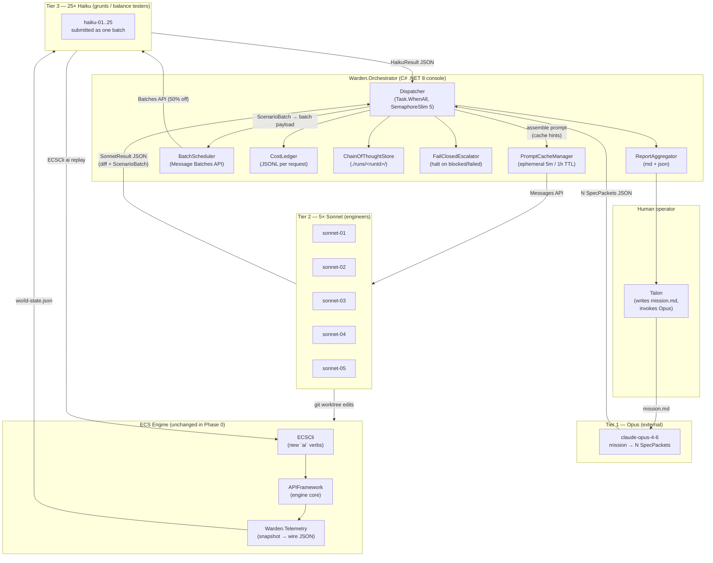

# Architecture — 1-5-25 Topology with Data Flows

This document is the visual companion to `00-SRD.md`. If the SRD is the legal text, this is the wiring diagram. Read the SRD first.

---

## Component map



---

## Request lifecycle — one mission, narrated

1. **Mission drop.** Talon writes `./missions/increase-agent-boredom.md` and invokes Opus (outside the orchestrator). Opus returns N SpecPackets (1 ≤ N ≤ 5). Talon feeds them to the orchestrator: `Warden.Orchestrator run --mission ./missions/increase-agent-boredom.md --specs ./specs/*.json`.

2. **Cache prime.** The orchestrator assembles the shared prefix: role frame, engine fact sheet (`ECSCli ai describe --out`), engineering guide, architecture guide, current `SimConfig.json`, the four JSON schemas. It marks this ~30k-token block with `cache_control: {"type": "ephemeral"}`. First Sonnet call pays cache-write price (1.25×); subsequent four pay cache-read price (0.1×).

3. **Sonnet fan-out.** `Task.WhenAll` over a `SemaphoreSlim(5)`. Each Sonnet receives the cached prefix plus its own SpecPacket in the user turn. Each writes to an isolated git worktree so diffs don't step on each other.

4. **Sonnet result validation.** Every Sonnet response is parsed against `sonnet-result.schema.json`. If parse fails: `outcome=blocked, reason=malformed-output`. No retry.

5. **Haiku batch build.** For every Sonnet that asks for validation, its `ScenarioBatch` is merged into a single batch-API submission (up to 25 scenarios total across all Sonnets). Each scenario carries a seed, a `SimConfig` delta, an optional command log, and its assertions.

6. **Haiku runtime.** Each Haiku's prompt tells it to call `ECSCli ai replay --seed <n> --commands <log> --duration <gs> --out telemetry.jsonl` on the worktree its Sonnet produced, then evaluate the assertions against the resulting telemetry. Haikus do not modify the engine. They read telemetry and return a verdict.

7. **Batch poll.** The orchestrator polls `/v1/messages/batches/{id}` every 60 seconds until state is `ended`. It does not hold 25 long-lived connections.

8. **Aggregation.** Haiku results roll up per-Sonnet, Sonnet results roll up per-mission. The ReportAggregator emits `report.md` (human) and `report.json` (machine).

9. **Ledger close.** CostLedger flushes. Final usd total is printed and written to the report header.

---

## Data contracts at each arrow

| Arrow | Schema | Notes |
|:---|:---|:---|
| mission.md → Opus | free-form Markdown | The only unstructured boundary in the system. That is fine because Opus is outside the loop. |
| Opus → Orchestrator | `opus-to-sonnet.schema.json` (array, 1–5 items) | Talon hand-carries these from the Opus conversation. |
| Orchestrator → Sonnet | Messages API payload, `cache_control` on slabs 1–3 | The orchestrator is the only thing that knows the key. |
| Sonnet → Orchestrator | `sonnet-result.schema.json` | One result per SpecPacket. |
| Orchestrator → Haiku batch | `sonnet-to-haiku.schema.json` wrapped in Batches API `requests[]` | At most 25 per mission. |
| Haiku → Orchestrator | `haiku-result.schema.json` | One result per scenario. |
| ECSCli → Haiku | `world-state.schema.json` (JSONL for stream, JSON for snapshot) | File artifact, not a network hop. |

Every arrow carrying JSON validates **on both ends**. The producer's serialiser and the consumer's deserialiser read the same schema file. This is the handshake.

---

## Process boundaries and who holds what

```
┌─ Machine-local filesystem ──────────────────────────────────────────────┐
│                                                                         │
│  ./runs/<runId>/           ← orchestrator writes, everyone reads        │
│  ./missions/*.md           ← human writes                                │
│  ./specs/*.json            ← Opus output, human curates                  │
│  ./docs/c2-infrastructure/ ← this folder; cached prefix source          │
│  SimConfig.json            ← engine config; delta-patched per scenario   │
│                                                                         │
├─ Processes ────────────────────────────────────────────────────────────┤
│                                                                         │
│  1× Warden.Orchestrator (long-lived, one per mission)                   │
│  N× ECSCli (short-lived, one per scenario replay)                       │
│  0× Anthropic key anywhere except the orchestrator's env                │
│                                                                         │
├─ Network ──────────────────────────────────────────────────────────────┤
│                                                                         │
│  Orchestrator → api.anthropic.com (HTTPS, persistent HttpClient)        │
│  Nobody else talks to Anthropic, ever.                                  │
│                                                                         │
└────────────────────────────────────────────────────────────────────────┘
```

The one-key-one-process invariant is what makes this safe to leave running overnight. Key leakage is impossible at the architectural level.
