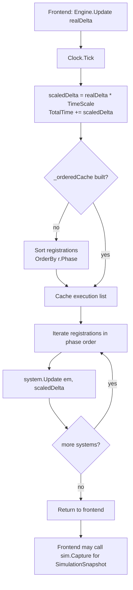
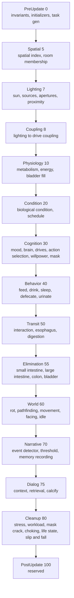
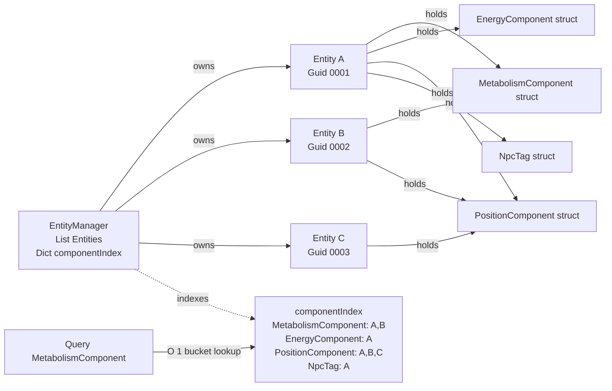
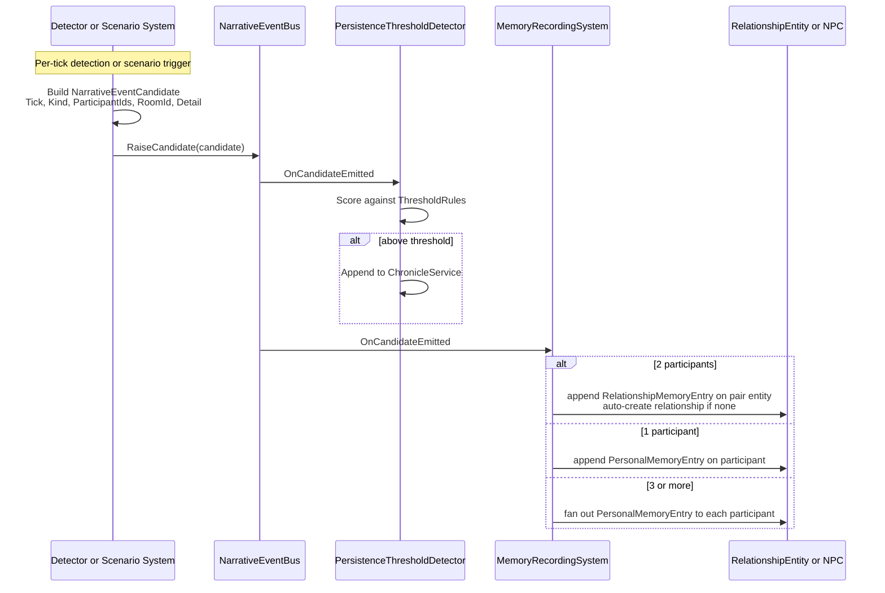
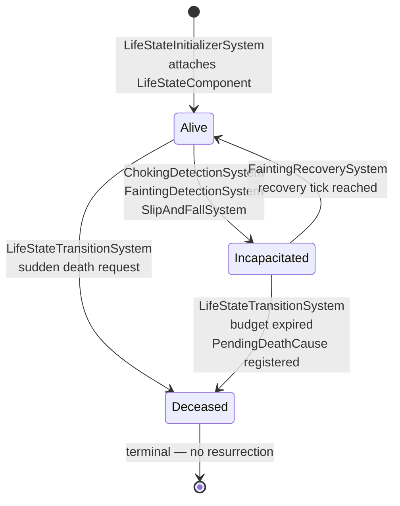

# Core Game Loop

This page is the single authoritative description of how the simulation runs. It explains every step of one tick — from the moment a frontend calls `Engine.Update(realDelta)` to the moment a snapshot is captured for the UI — and defines every contract that systems live by: the phase pipeline, the entity-component model, the narrative bus, the life-state state machine, and the snapshot boundary.

If anything in this page disagrees with the code, the code is right and this page is wrong. Source files referenced in each section are the ground truth:

- `APIFramework/Core/SimulationEngine.cs`
- `APIFramework/Core/SimulationBootstrapper.cs`
- `APIFramework/Core/SystemPhase.cs`
- `APIFramework/Core/SimulationClock.cs`
- `APIFramework/Core/ISystem.cs`
- `APIFramework/Core/Entity.cs`
- `APIFramework/Core/EntityManager.cs`
- `APIFramework/Core/SimulationSnapshot.cs`
- `APIFramework/Systems/Narrative/NarrativeEventBus.cs`

---

## 1. The Tick Loop

There is exactly one entry point that drives the simulation forward: `SimulationEngine.Update(float realDeltaTime)`.

A frontend (CLI loop, Avalonia DispatcherTimer, Unity `Update()`, test harness) calls this once per frame with the elapsed real-time seconds since the previous call. Inside `Update`:

1. `Clock.Tick(realDeltaTime)` advances `SimulationClock.TotalTime` by `realDeltaTime * TimeScale` (default `TimeScale` = 120, so 1 real second = 2 game minutes). The scaled (game-time) delta is returned and passed to every system, so system code never has to think about `TimeScale`.
2. The phase-sorted execution list is built lazily from `_registrations` on the first tick after any `AddSystem` call (`OrderBy(r => (int)r.Phase)`), then cached. Subsequent ticks reuse the cache; calling `AddSystem` invalidates it.
3. For each `SystemRegistration` in phase order, `registration.System.Update(EntityManager, scaledDelta)` is invoked. Systems within the same phase still run sequentially in registration order; the phase boundary is the synchronization point that future parallelism will exploit.

That is the entire tick. There is no implicit work: every state change observed in a snapshot was produced by a system's `Update` method during this loop.



A frontend that wants to render a frame calls `sim.Capture()` AFTER `Engine.Update` returns. `Capture` walks the entity manager and produces an immutable `SimulationSnapshot` (see Section 7). The capture is read-only — the snapshot cannot be used to mutate anything.

---

## 2. Phase Execution Order

`SystemPhase` is the numeric ordering primitive. Every system declares one phase via `Engine.AddSystem(system, phase)`. Phases run in ascending numeric order.

| Phase value | Phase | What runs here |
|---:|---|---|
| `0` | `PreUpdate` | `InvariantSystem`, `StructuralTaggingSystem`, `ScheduleSpawnerSystem`, `StressInitializerSystem`, `MaskInitializerSystem`, `WorkloadInitializerSystem`, `LifeStateInitializerSystem`, `TaskGeneratorSystem`, `LockoutDetectionSystem` |
| `5` | `Spatial` | `SpatialIndexSyncSystem`, `RoomMembershipSystem`, `PathfindingCacheInvalidationSystem` |
| `7` | `Lighting` | `SunSystem`, `LightSourceStateSystem`, `ApertureBeamSystem`, `IlluminationAccumulationSystem`, `ProximityEventSystem` |
| `8` | `Coupling` | `LightingToDriveCouplingSystem` |
| `10` | `Physiology` | `MetabolismSystem`, `EnergySystem`, `BladderFillSystem` |
| `20` | `Condition` | `BiologicalConditionSystem`, `ScheduleSystem` |
| `30` | `Cognition` | `MoodSystem`, `BrainSystem`, `PhysiologyGateSystem`, `DriveDynamicsSystem`, `ActionSelectionSystem`, `WillpowerSystem`, `RelationshipLifecycleSystem`, `SocialMaskSystem` |
| `40` | `Behavior` | `FeedingSystem`, `DrinkingSystem`, `SleepSystem`, `DefecationSystem`, `UrinationSystem` |
| `50` | `Transit` | `InteractionSystem`, `EsophagusSystem`, `DigestionSystem` |
| `55` | `Elimination` | `SmallIntestineSystem`, `LargeIntestineSystem`, `ColonSystem`, `BladderSystem` |
| `60` | `World` | `RotSystem`, `PathfindingTriggerSystem`, `MovementSpeedModifierSystem`, `StepAsideSystem`, `MovementSystem`, `FacingSystem`, `IdleMovementSystem` |
| `70` | `Narrative` | `NarrativeEventDetector`, `PersistenceThresholdDetector`, `MemoryRecordingSystem` |
| `75` | `Dialog` | `DialogContextDecisionSystem`, `DialogFragmentRetrievalSystem`, `DialogCalcifySystem` |
| `80` | `Cleanup` | `StressSystem`, `WorkloadSystem`, `MaskCrackSystem`, `ChokingDetectionSystem`, `LifeStateTransitionSystem`, `ChokingCleanupSystem`, `SlipAndFallSystem` |
| `100` | `PostUpdate` | (reserved; nothing in v0.7.x uses it) |

The numeric gaps between phases are intentional: they leave room to insert a new phase without renumbering the world. `Spatial = 5` was inserted between `PreUpdate` and the original `Physiology = 10` exactly this way.



The class summary on `SimulationBootstrapper.RegisterSystems` is the line-by-line authoritative pipeline list and includes one-sentence purpose notes for every system.

---

## 3. How a System Slots In

A system is anything that implements `ISystem`:

```csharp
namespace APIFramework.Core;

public interface ISystem
{
    void Update(EntityManager em, float deltaTime);
}
```

Three steps to add one:

1. **Pick a phase.** Ask: which data does this system READ, and which does it WRITE? Place it in the earliest phase whose predecessors produce all its reads. For example: `RotSystem` reads `BolusComponent` (created in `Transit`) and writes `RotTag` (read by no one this tick), so it sits in `World`.
2. **Implement `ISystem.Update`.** Query entities through `em.Query<T>()` (O(1) bucket lookup), read the components, write back via `entity.Add(...)`. Use the `deltaTime` argument as game-seconds — the engine has already scaled it.
3. **Register it.** Add a line to `SimulationBootstrapper.RegisterSystems`. The constructor takes the per-system config struct from `SimConfig` and any cross-system services (RNG, buses, spatial indexes) it needs.

A minimal example:

```csharp
namespace APIFramework.Systems;

using APIFramework.Components;
using APIFramework.Core;

/// <summary>Drains BoredomComponent.Boredom toward 0 at a fixed rate.</summary>
public sealed class BoredomRelaxationSystem : ISystem
{
    public void Update(EntityManager em, float deltaTime)
    {
        foreach (var npc in em.Query<BoredomComponent>())
        {
            var b = npc.Get<BoredomComponent>();
            b.Boredom = Math.Max(0f, b.Boredom - 0.5f * deltaTime);
            npc.Add(b);
        }
    }
}
```

```csharp
// In SimulationBootstrapper.RegisterSystems():
Engine.AddSystem(new BoredomRelaxationSystem(), SystemPhase.Physiology);
```

That is the entire ceremony. There is no DI container, no attribute, no auto-discovery — registration is explicit and visible.

---

## 4. The Entity-Component Model

The data model is three classes. There is no archetype, no bitmask, no chunk store.

- `Entity` is a `Guid`-keyed bag of struct components, stored in a private `Dictionary<Type, object>`. Components are value types (`struct`), boxed into the dictionary. Entities fire an `onChange` callback when a component type is added or removed; that callback is what keeps the component index up to date.
- `EntityManager` owns every entity in a `List<Entity>` and maintains `Dictionary<Type, HashSet<Entity>> _componentIndex`. `Query<T>()` returns the pre-built bucket — O(1), not a scan.
- Component instances are plain `struct` types in `APIFramework/Components`. Tags (presence-only signals) are zero-field structs; data components carry value-type fields.

The `EntityManager._idCounter` is the basis of the deterministic-replay guarantee: entity IDs are assigned from a counter, so the same bootstrapper code path always assigns the same `Guid` to the same logical entity. Combined with `Entity.GetHashCode() => Id.GetHashCode()`, this ensures `HashSet<Entity>` bucket layout is reproducible across runs, so `Query<T>()` iteration order is reproducible too.



### The single-writer rule

For every component type, exactly one system is the canonical writer. Other systems may read the component, but only the canonical writer is permitted to call `entity.Add<TComponent>(...)` on it. Examples:

- `LifeStateTransitionSystem` is the single writer of `LifeStateComponent` (the initializer attaches it once, the transition system writes every change after that).
- `WillpowerSystem` is the single drain/apply path for `WillpowerEventQueue`. Other systems push events into the queue; only `WillpowerSystem` reads and applies them.
- `MetabolismSystem` is the single writer of `MetabolismComponent.Satiation` and `Hydration`.

Single-writer is the discipline that makes phases work: when two systems share a write target, they cannot coexist in the same phase, because their effective order is undefined.

---

## 5. The Narrative Pipeline

Narrative is the engine's mechanism for converting a piece of simulation state into something a chronicle, a memory buffer, or an AI prompt can consume. Two pieces of code are central:

- `NarrativeEventCandidate` — an immutable record carrying `(Tick, Kind, ParticipantIds, RoomId, Detail)`.
- `NarrativeEventBus` — an in-process bus exposing `event Action<NarrativeEventCandidate>? OnCandidateEmitted` and a single `RaiseCandidate(candidate)` publish method.

There are two kinds of producers:

1. **`NarrativeEventDetector`** runs at `Narrative` phase (70) and scans this tick's state for emergent moments (conversation started, willpower collapse, etc.).
2. **Scenario systems** (choking, fainting, life-state transitions, bereavement) raise candidates synchronously when they detect a discrete event, and they raise BEFORE flipping any state that would invalidate participant guards. This is the WP-3.0.0 narrative-emit contract: the detector and the deceased's `LifeStateComponent.State == Alive` must still hold when the candidate is published, so subscribers can read participant state coherently.

Three subscribers consume candidates:

1. `PersistenceThresholdDetector` promotes high-significance candidates into the durable `ChronicleService`.
2. `MemoryRecordingSystem` routes candidates by participant count: 1 → `PersonalMemoryComponent`; 2 → `RelationshipMemoryComponent`; 3+ → fan out to every participant's personal buffer. It auto-creates a relationship entity when a pair candidate arrives without one.
3. Telemetry projection picks them up after the tick for downstream display.



Subscribers run synchronously on the publisher's thread inside `RaiseCandidate`. Handlers must be side-effect-only and must not block — they are the narrative phase's real-time path.

---

## 6. The Life-State Pipeline (Phase 3)

Phase 3 introduced a three-state lifecycle on every NPC: `Alive → Incapacitated → Deceased`, with `Incapacitated → Alive` as the fainting recovery branch. The state lives in `LifeStateComponent`:

- `State` — `Alive`, `Incapacitated`, or `Deceased`.
- `LastTransitionTick` — `SimulationClock.TotalTime` at the most recent transition.
- `IncapacitatedTickBudget` — countdown that drives auto-promotion to `Deceased` if recovery never arrives.
- `PendingDeathCause` — the `CauseOfDeath` to register if the budget expires.

All transitions flow through `LifeStateTransitionSystem`. It is the **single writer** of `LifeStateComponent.State` and the only attacher of `CauseOfDeathComponent`. Producers do not flip state directly — they call `RequestTransition(npcId, targetState, cause)` and the transition system drains the queue every `Cleanup` tick in ascending `NpcId` order (deterministic).

The Cleanup phase chain in registration order:

| Order in Cleanup | System | Role |
|---:|---|---|
| 1 | `StressSystem` | accumulates stress; reads willpower drains, narrative events |
| 2 | `WorkloadSystem` | advances task progress, detects completion / overdue |
| 3 | `MaskCrackSystem` | emits `MaskCrack` when pressure exceeds threshold |
| 4 | `ChokingDetectionSystem` | bolus + distraction → enqueues `Incapacitated` |
| 5 | `LifeStateTransitionSystem` | drains queue: `Alive → Incapacitated → Deceased` |
| 6 | `ChokingCleanupSystem` | clears `IsChokingTag` / `ChokingComponent` after death |
| 7 | `SlipAndFallSystem` | rolls fall-risk hazards on settled positions |

Fainting (WP-3.0.6) is currently registered through the same Cleanup phase: `FaintingDetectionSystem` runs BEFORE `LifeStateTransitionSystem` so the incapacitation request is drained the same tick; `FaintingRecoverySystem` runs BEFORE the transition system too so the `Alive` recovery is drained in the same tick the recovery tick is reached; `FaintingCleanupSystem` runs AFTER the transition system to strip `IsFaintingTag` once the NPC is back to `Alive`. The `+1` budget on the incapacitation request guarantees recovery cannot race with the auto-`Deceased` budget-expiry path.



Two helper APIs are used everywhere a system needs to skip dead or knocked-out entities:

- `LifeStateGuard.IsAlive(entity)` — true only for `State == Alive`. Used by cognitive and volitional systems (action selection, willpower).
- `LifeStateGuard.IsBiologicallyTicking(entity)` — true for `Alive` or `Incapacitated`. Used by physiology systems that legitimately keep ticking after incapacitation (metabolism, energy, digestion).

Non-NPC entities lacking `LifeStateComponent` pass through both checks (return `true`) so systems that iterate everything stay agnostic to NPC-ness.

---

## 7. The SimulationSnapshot

`SimulationSnapshot` is the immutable boundary between the engine and any frontend. The engine PRODUCES a snapshot once per frame; frontends READ only from the snapshot.

Why it exists: without the snapshot, every frontend reaches into `SimulationBootstrapper.Clock`, `EntityManager.Query<T>()`, `Invariants.Violations` directly. That couples every frontend to engine internals — the Avalonia GUI, the CLI, Unity, a future replay tool would all have to change every time a private field moves. The snapshot decouples them: the engine can refactor its internals freely as long as `Capture` keeps producing the same shape.

What is in it (see `SimulationSnapshot.cs` for the canonical definition):

- `ClockSnapshot` — `TimeDisplay`, `DayNumber`, `IsDaytime`, `CircadianFactor`, `TimeScale`.
- `LivingEntities : IReadOnlyList<EntitySnapshot>` — every entity with a `MetabolismComponent`, with its drives, energy, sleep, GI fills, bladder state, and spatial position.
- `WorldItems : IReadOnlyList<WorldItemSnapshot>` — boluses and liquids in the world.
- `TransitItems : IReadOnlyList<TransitItemSnapshot>` — items currently in the esophagus pipeline.
- `WorldObjects : IReadOnlyList<WorldObjectSnapshot>` — fixed objects (fridge, sink, toilet, bed) and their stock counts.
- `ViolationCount` — total invariant violations recorded since boot.

All collections are `IReadOnlyList<T>`; all value types are copies. The snapshot is a point-in-time view. Mutating it does not mutate the simulation — it cannot, because the records are `sealed record` types with `init`-only properties.

Frontends call `sim.Capture()` after `Engine.Update()` returns and pass the snapshot to whichever rendering or logging code needs a view of the world.

---

## 8. A Full End-to-End Example

NPC Marcus's `MoodComponent.Fear` is climbing through the day. Here is one tick where it crosses the fainting threshold.

1. **Frontend.** The Avalonia GUI's `DispatcherTimer` ticks. It calls `sim.Engine.Update(realDelta)` with `realDelta = 0.0167s` (60 FPS).
2. **Clock.** `Clock.Tick(0.0167)` advances `TotalTime` by `0.0167 * 120 = 2.004` game-seconds. The scaled delta is returned and threaded through every system below.
3. **PreUpdate (0).** `InvariantSystem` confirms last tick's outputs sit inside legal ranges. `LifeStateInitializerSystem` is a no-op — Marcus already has `LifeStateComponent { State = Alive }`.
4. **Spatial → Lighting → Coupling.** Marcus's room membership is recomputed; the kitchen's illumination drops because dusk is approaching; his social drives accumulate the lighting delta.
5. **Physiology (10) → Condition (20) → Cognition (30).** Metabolism drains; condition tags are derived; `MoodSystem` carries forward Fear at 92 (above this run's threshold of 90); `BrainSystem` scores drives.
6. **Behavior (40) → Transit (50) → Elimination (55) → World (60).** Marcus has no dominant behavior to act on while frightened; movement systems leave him in place.
7. **Narrative (70).** `NarrativeEventDetector` sees nothing detector-emergent this tick. No candidate yet.
8. **Cleanup (80) — `FaintingDetectionSystem`.** Iterates `NpcTag` entities in ascending `EntityIntId` order. Marcus is `Alive`, has no `IsFaintingTag`, and his `Fear (92) >= FearThreshold (90)`. The fainting pipeline fires:
   - `IsFaintingTag` is attached.
   - `FaintingComponent { FaintStartTick = 18_400, RecoveryTick = 18_460 }` is attached.
   - A `NarrativeEventCandidate { Tick = 18_400, Kind = Fainted, ParticipantIds = [Marcus, witness], RoomId = "kitchen", Detail = "NPC ... fainted from extreme fear (Fear=92)." }` is raised on `NarrativeEventBus` — BEFORE the state flip, so subscribers see Marcus while he is still `Alive`.
   - `LifeStateTransitionSystem.RequestTransition(Marcus.Id, Incapacitated, CauseOfDeath.Unknown, FaintDurationTicks + 1)` enqueues the transition.
9. **Cleanup (80) — `MemoryRecordingSystem` (subscriber).** The `Fainted` candidate has 2 participants, so it appends a `RelationshipMemoryEntry` on the (Marcus, witness) relationship entity.
10. **Cleanup (80) — `LifeStateTransitionSystem`.** Drains the queue. Marcus's `LifeStateComponent` is overwritten: `{ State = Incapacitated, LastTransitionTick = 18_400, IncapacitatedTickBudget = FaintDurationTicks + 1, PendingDeathCause = Unknown }`.
11. **Cleanup (80) — `FaintingCleanupSystem`.** Runs after the transition, but Marcus is now `Incapacitated`, not `Alive`. The cleanup correctly leaves the tag in place; it will only strip when he recovers.
12. **Engine returns to frontend.** The Avalonia loop calls `sim.Capture()`. `SimulationSnapshot.Capture` walks `Query<MetabolismComponent>()`; Marcus appears in `LivingEntities` with `Energy`, `Sleepiness`, drive urgencies, GI fills, bladder, and his current position. The snapshot is handed to the renderer; the UI updates.
13. **ECSCli streaming (parallel path).** A telemetry projector running off the same per-tick state transforms the snapshot + chronicle delta into the JSONL stream consumed by the AI layer (`ECSCli` AI verbs). The `Fainted` event is now visible to Sonnet/Haiku missions for the next prompt.

`FaintDurationTicks` ticks later, `FaintingRecoverySystem` will see `clock.CurrentTick >= RecoveryTick` for Marcus, raise a `RegainedConsciousness` candidate, and call `RequestTransition(Alive, Unknown)`. `LifeStateTransitionSystem` flips him back to `Alive`; `FaintingCleanupSystem` strips `IsFaintingTag` and `FaintingComponent`. The simulation is whole again.

---

## See also

- [01 — Overview & Architecture](01-overview-and-architecture.md) — high-level architecture, project structure
- [02 — System Pipeline Reference](02-system-pipeline-reference.md) — every system in phase order
- [03 — Component & Tag Reference](03-component-and-tag-reference.md) — all components and tags
- [05 — Testing Guide](05-testing-guide.md) — phase-3 acceptance test commands
