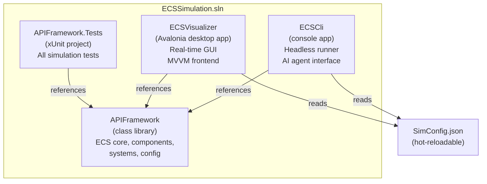
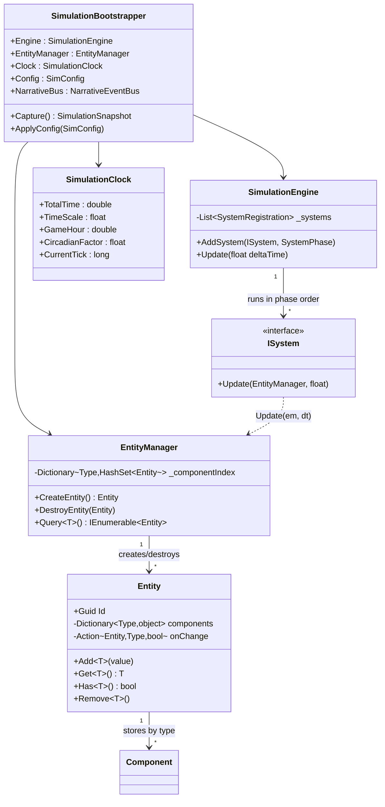
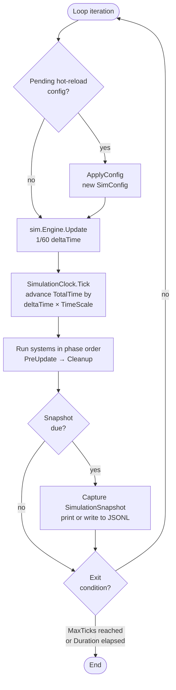

# 01 — Overview and Architecture

## Project and Dependency Diagram



---

## What This Project Is

This is a hand-rolled Entity-Component-System (ECS) simulation engine for an **office social simulation game**. The simulation models a populated office building: NPCs eat, drink, sleep, feel emotions, form relationships, carry social masks, faint from fear, choke on food, grieve over colleagues' deaths, and gossip. Every biological, psychological, and social system is implemented as an ECS system ticking in a fixed phase pipeline.

The engine is written in **C#/.NET 8** with zero third-party ECS dependencies — no Unity ECS, no Arch, no DefaultEcs. The ECS is small, explicit, and purpose-built for this simulation.

Three projects ship in the solution:

| Project | Role |
|:--------|:-----|
| `APIFramework` | Core library: ECS primitives, all components, all systems, config |
| `ECSCli` | Headless CLI runner; drives the engine at max speed for balance testing and AI analysis |
| `ECSVisualizer` | Avalonia MVVM desktop frontend; real-time rendering with DispatcherTimer |

The AI agent toolchain (`ECSCli/Ai/`) is a structured interface for the 1-5-25 AI architecture. See [08-ai-prompting-guide-1-5-25.md](08-ai-prompting-guide-1-5-25.md) for the full model.

---

## Design Philosophy

### Determinism

Every random number in the simulation flows through a single `SeededRandom` instance seeded at boot. Systems that need randomness receive this instance via constructor injection, so every random call is part of the same seeded sequence. Given the same seed, the same `SimConfig.json`, and the same command log, two runs produce byte-identical telemetry output.

Entity IDs are counter-based `Guid` values generated in spawn order, not random UUIDs. Systems that must iterate entities in a stable order use the `EntityIntId` helper to extract a 32-bit integer from the first four bytes of the `Guid`:

```csharp
static int EntityIntId(Entity e)
{
    var b = e.Id.ToByteArray();
    return b[0] | (b[1] << 8) | (b[2] << 16) | (b[3] << 24);
}
```

This guarantees that identical entity sets always sort identically, making multi-NPC interactions (e.g., two NPCs fainting in the same tick) fully deterministic.

### Single-Writer Rule

Each component field is owned by exactly one system. Only that system may write to it. All other systems read the field but never mutate it. This invariant prevents race conditions, makes causality explicit, and makes debugging trivial: if `MetabolismComponent.Satiation` has a wrong value, the only place to look is `MetabolismSystem`.

The single-writer table is enumerated in [02-system-pipeline-reference.md](02-system-pipeline-reference.md).

### Composition Over Inheritance

Entities are bare `Guid` containers. Behaviour is fully determined by which components they carry. A "human" is an entity with `HumanTag` + `MetabolismComponent` + `EnergyComponent` + `MoodComponent` + … A "banana" is an entity with `BolusTag` + `BolusComponent` + `RotComponent`. There is no class hierarchy, no virtual dispatch, no inheritance. New behaviour is adding a new component type and a new system.

### Hot-Reload Config

All tuning values live in `SimConfig.json` at the repository root. The CLI and GUI both watch this file with a `FileSystemWatcher`. When a change is detected, the new config is applied at the start of the next tick via `SimulationBootstrapper.ApplyConfig(SimConfig)`. The sim never restarts; thresholds, drain rates, drive score ceilings, and emotion gains all update live. This is the primary game balance workflow.

---

## Project Structure

```
_ecs-simulation-engine/
├── APIFramework/
│   ├── Core/                    ← ECS primitives
│   │   ├── Entity.cs            ← Guid + Dictionary<Type, object>
│   │   ├── EntityManager.cs     ← lifecycle + O(1) Query<T>() index
│   │   ├── ISystem.cs           ← Update(EntityManager, float)
│   │   ├── SimulationEngine.cs  ← phase-sorted system runner
│   │   ├── SimulationClock.cs   ← TotalTime, TimeScale, circadian math
│   │   ├── SimulationSnapshot.cs← immutable capture for frontends
│   │   └── SimulationBootstrapper.cs ← composition root
│   ├── Components/              ← all component structs + tags
│   ├── Systems/                 ← all ISystem implementations
│   │   ├── LifeState/           ← choking, fainting, bereavement, corpse
│   │   ├── Narrative/           ← NarrativeEventBus, detector, chronicle
│   │   ├── Movement/            ← pathfinding, step-aside, idle jitter
│   │   ├── Lighting/            ← sun, apertures, illumination, drive coupling
│   │   ├── Spatial/             ← grid index, room membership, proximity
│   │   ├── Coupling/            ← lighting-to-drive coupling table
│   │   ├── Chronicle/           ← persistence threshold detector
│   │   └── Dialog/              ← phrase retrieval, calcification, context decision
│   └── Config/
│       └── SimConfig.cs         ← typed config loader + all config classes
├── APIFramework.Tests/          ← xUnit test project
├── ECSCli/
│   ├── Program.cs               ← main loop, hot-reload watcher
│   ├── CliOptions.cs            ← arg parser
│   └── Ai/                      ← ai subcommand group
│       ├── AiCommand.cs
│       ├── AiDescribeCommand.cs
│       ├── AiSnapshotCommand.cs
│       ├── AiStreamCommand.cs
│       ├── AiNarrativeStreamCommand.cs
│       ├── AiInjectCommand.cs
│       └── AiReplayCommand.cs
├── ECSVisualizer/               ← Avalonia MVVM desktop app
├── SimConfig.json               ← all tuning values (hot-reloadable)
└── CHANGELOG.md
```

---

## ECS Core Type Relationships



---

## ECS Pattern Explanation

### Entity

An `Entity` is a `Guid` ID paired with a `Dictionary<Type, object>` component store. The ID is created by `EntityManager.CreateEntity()` in counter order. APIs:

```csharp
entity.Add<MetabolismComponent>(new MetabolismComponent { Satiation = 90f });
entity.Get<MetabolismComponent>();   // throws if absent
entity.Has<SleepingTag>();           // returns bool
entity.Remove<SleepingTag>();
entity.Id                            // Guid
```

Adding a component fires an `onChange(entity, type, added: true)` callback that `EntityManager` uses to update the `Query<T>()` index. Overwriting an existing component via `Add<T>()` does not fire the callback.

### Component

Components are `struct` values stored by type in the entity's dictionary. Two kinds exist:

- **Data components**: structs with fields. Example: `MetabolismComponent { Satiation, Hydration, BodyTemp }`.
- **Tag components**: zero-field structs. Example: `SleepingTag { }`. Presence/absence is the signal; no data needed.

### System

A system implements `ISystem`:

```csharp
public interface ISystem
{
    void Update(EntityManager em, float deltaTime);
}
```

Systems are stateless with respect to entity data. They may hold injected services (clocks, buses, spatial indexes, config objects). They call `em.Query<T>()` to iterate entities.

### EntityManager

`EntityManager` maintains a `Dictionary<Type, HashSet<Entity>>` component index updated on every `Add<T>()` and `Remove<T>()` call. `Query<T>()` returns the pre-built bucket in **O(1)** — no entity scan. `DestroyEntity(entity)` removes the entity from every bucket.

```csharp
foreach (var npc in em.Query<NpcTag>())
{
    var metabolism = npc.Get<MetabolismComponent>();
    // ...
}
```

### SimulationEngine

`SimulationEngine` holds a list of `SystemRegistration` records pairing an `ISystem` with a `SystemPhase`. On each `Update(float deltaTime)` call, systems execute in ascending phase order. Systems within the same phase execute in registration order (the order they were added via `AddSystem`). The sorted execution list is cached and rebuilt only when a new system is added.

```csharp
sim.Engine.Update(1f / 60f);  // one tick, 60 FPS timestep
```

---

## Tick Loop Flow



---

## How the Tick Loop Works

The CLI main loop is the canonical implementation:

```csharp
const float dt = 1f / 60f;

while (running)
{
    // Apply hot-reload config if pending
    SimConfig? pending;
    lock (_pendingLock) { pending = _pendingConfig; _pendingConfig = null; }
    if (pending != null) sim.ApplyConfig(pending);

    // Advance simulation
    sim.Engine.Update(dt);
    tick++;

    // Snapshot / exit checks
    if (!options.Quiet && sim.Clock.TotalTime >= nextSnapshot)
        CliRenderer.PrintSnapshot(sim, tick, wallStart);

    if (options.MaxTicks.HasValue && tick >= options.MaxTicks.Value) break;
    if (options.Duration.HasValue && sim.Clock.TotalTime >= options.Duration.Value) break;
}
```

Inside `Engine.Update(dt)`:

1. `SimulationClock.Tick(dt)` — advances `TotalTime` by `dt × TimeScale` game-seconds.
2. Systems in phase `PreUpdate (0)` run — invariant checks, initializers, structural tagging, schedule spawning, task generation.
3. Systems in phase `Spatial (5)` run — grid index sync, room membership, pathfinding cache invalidation.
4. Systems in phase `Lighting (7)` run — sun position, light source state machines, aperture beams, illumination accumulation, proximity events.
5. Systems in phase `Coupling (8)` run — lighting-to-drive coupling.
6. Systems in phase `Physiology (10)` run — metabolism drain, energy drain/restore, bladder fill.
7. Systems in phase `Condition (20)` run — biological condition tags, schedule resolution.
8. Systems in phase `Cognition (30)` run — mood decay/gain, drive scoring, physiology gate, drive dynamics, action selection, willpower, relationship lifecycle, social mask.
9. Systems in phase `Behavior (40)` run — feeding, drinking, sleep toggle, defecation, urination.
10. Systems in phase `Transit (50)` run — bite-to-bolus conversion, esophagus advance, digestion.
11. Systems in phase `Elimination (55)` run — small intestine, large intestine, colon, bladder tag management.
12. Systems in phase `World (60)` run — food rot, pathfinding trigger, movement speed modifiers, step-aside, movement, facing, idle jitter.
13. Systems in phase `Narrative (70)` run — narrative event detection, chronicle persistence, memory recording, corpse spawning, bereavement.
14. Systems in phase `Dialog (75)` run — dialog context decision, fragment retrieval, calcification.
15. Systems in phase `Cleanup (80)` run — stress accumulation, workload progress, mask crack detection, bereavement by proximity, fainting detection, fainting recovery, choking detection, life-state transitions, choking cleanup, fainting cleanup.
16. Phase `PostUpdate (100)` — reserved for future use.

The `SimulationClock.TimeScale` defaults to **120** (from `SimConfig.json`). At this scale, 1 real second of simulation time advances 120 game-seconds (2 game-minutes). A full game-day (86 400 game-seconds) takes about 12 real minutes at 60 FPS. Use `--timescale 1200` for faster-than-realtime balance sweeps.

---

## SimulationClock

`SimulationClock` tracks game time and derived quantities:

| Property | Type | Description |
|:---------|:-----|:------------|
| `TotalTime` | `double` | Total elapsed game-seconds |
| `TimeScale` | `float` | Game-seconds per real-second. Default 120 |
| `GameTimeOfDay` | `double` | Fractional day position (0.0 = midnight, 0.25 = 6 AM, 0.5 = noon) |
| `GameHour` | `double` | Hour of day (0–24) |
| `CircadianFactor` | `float` | Day/night modulation multiplier for sleep urgency |
| `DayTimeDisplay` | `string` | Human-readable time e.g. "Day 3 — 10:45 AM" |
| `CurrentTick` | `long` | Monotonic tick counter (on `ecs-cleanup-post-wp-pass` branch) |
| `Advance(int n)` | method | Advance tick counter by n (used in tests) |

The circadian factor is a piecewise function: morning (0.40 — suppresses sleep) rising through the day to night (1.20–1.40 — strongly amplifies sleep urge). No external event scripting is needed to produce the ~16-hour awake / ~8-hour sleep rhythm.

---

## Immutable Snapshot Pattern

No frontend ever reads component data directly during rendering. The GUI and AI CLI both call `SimulationBootstrapper.Capture()` once per frame to get an **immutable `SimulationSnapshot`**, then read exclusively from that snapshot for the remainder of the frame.

```csharp
// In any frontend:
var snap = sim.Capture();
// snap is a plain C# object graph — safe to read from any thread.
// The engine can continue ticking while snap is being rendered.
```

`SimulationSnapshot` contains:

- `Clock` — clock state at capture time (TotalTime, GameHour, etc.)
- `Entities` — `IReadOnlyList<EntitySnapshot>` — one per NPC with all observable fields
- `ViolationCount` — number of invariant violations this tick
- Chronicle summary — recent narrative events

`EntitySnapshot` fields (as of v0.7.3):

```
Satiation, Hydration, BodyTemp, Energy, Sleepiness, IsSleeping, Dominant (drive),
EatUrgency, DrinkUrgency, SleepUrgency, DefecateUrgency, PeeUrgency,
SiFill, LiFill, ColonFill, BladderFill, PosX/Y/Z, IsMoving, MoveTarget
```

This decoupling means the Avalonia GUI, the CLI renderer, and all AI telemetry tools consume a single consistent type, and adding a new frontend requires zero changes to the simulation layer.

---

## NarrativeEventBus

The `NarrativeEventBus` is a lightweight pub/sub bus for notable simulation moments. Any system may call `RaiseCandidate(candidate)` to publish an event. Any subscriber may subscribe to `OnCandidateEmitted` to receive it.

```csharp
public class NarrativeEventBus
{
    public event Action<NarrativeEventCandidate>? OnCandidateEmitted;
    public void RaiseCandidate(NarrativeEventCandidate candidate);
}
```

A `NarrativeEventCandidate` is an immutable record:

```csharp
record NarrativeEventCandidate(
    long                    Tick,
    NarrativeEventKind      Kind,
    IReadOnlyList<int>      ParticipantIds,   // EntityIntId values
    string?                 RoomId,
    string                  Detail);
```

`NarrativeEventKind` values (master branch):

| Kind | Emitted by |
|:-----|:-----------|
| `DriveSpike` | `NarrativeEventDetector` |
| `WillpowerCollapse` | `NarrativeEventDetector` |
| `WillpowerLow` | `NarrativeEventDetector` |
| `ConversationStarted` | `NarrativeEventDetector` |
| `LeftRoomAbruptly` | `NarrativeEventDetector` |
| `MaskSlip` | `MaskCrackSystem` |
| `OverdueTask` | `WorkloadSystem` |
| `TaskCompleted` | `WorkloadSystem` |
| `Fainted` | `FaintingDetectionSystem` (pending merge on `ecs-cleanup-post-wp-pass`) |
| `RegainedConsciousness` | `FaintingRecoverySystem` (pending merge) |

The bus is synchronous — subscribers fire immediately on the thread that called `RaiseCandidate`. This is by design: systems that subscribe to the bus (e.g., `CorpseSpawnerSystem`, `BereavementSystem`) need their callback to run during the tick so state is consistent before the next system runs.

---

## Single-Writer Rule

The single-writer rule is a **hard architectural constraint**. Every component field is owned by exactly one system. A violation of this rule — two systems writing the same field in the same tick — produces undefined ordering semantics and is a bug.

Example enforcement: `IsSleeping` on `EnergyComponent` is written only by `SleepSystem`. `MetabolismSystem` reads it but never writes it (to apply the `SleepMetabolismMultiplier`). `BrainSystem` reads it but never writes it.

Tag components follow the same rule. `SleepingTag` is added and removed only by `SleepSystem`. `BrainSystem` reads the presence of `SleepingTag` to influence scoring but does not touch the tag itself.

The complete single-writer table is documented in [02-system-pipeline-reference.md](02-system-pipeline-reference.md).

---

## Determinism Guarantees

A full determinism guarantee means: given the same seed, the same `SimConfig.json`, and the same command log, two runs from cold boot produce byte-identical telemetry output. The guarantees rest on four pillars:

**Counter-based entity IDs.** Entities are created in spawn order. The same boot sequence always produces the same `Guid` values for the same entities. No random entropy enters the ID generation path.

**Single seeded RNG.** `SeededRandom` wraps `System.Random` initialized with a fixed seed. All systems share this single instance, so the sequence of random calls is fully determined by the execution order of systems — which is itself deterministic by the phase model.

**EntityIntId ordering.** When a system must process multiple entities and the order matters (e.g., two NPCs competing for the same resource), they are sorted by `EntityIntId(e)`. This produces a stable ordering derived from entity ID bytes, not from `HashSet<Entity>` iteration order (which is insertion-order dependent in .NET but not guaranteed to be seed-stable across runs without this step).

**Deterministic `capturedAt` in replay mode.** `AiReplayCommand` derives `capturedAt` from simulation game time (`Epoch + gameTime`), not from wall-clock `DateTimeOffset.UtcNow`. This eliminates the only remaining source of non-determinism in the telemetry output, making replay files byte-identical.

---

## Version History Summary

| Version | Date | Key Addition |
|:--------|:-----|:-------------|
| 0.1.0 | — | Hand-rolled ECS core: Entity, EntityManager, ISystem, SimulationEngine, SimulationClock; MetabolismSystem, BiologicalConditionSystem, FeedingSystem, InteractionSystem |
| 0.2.0 | 2026-04-14 | StomachComponent, DigestionSystem, LiquidComponent; Avalonia MVVM frontend |
| 0.3.0 | 2026-04-15 | BrainSystem (proper drive scoring), DrinkingSystem, SimConfig.json externalisation, ECSCli headless runner |
| 0.4.0 | 2026-04-15 | EnergyComponent, EnergySystem, SleepSystem; day/night cycle and circadian factor |
| 0.5.0 | 2026-04-16 | Hot-reload (SimConfigWatcher + ApplyConfig), InvariantSystem, SimMetrics, end-of-run balance report |
| 0.6.0 | 2026-04-16 | MoodSystem fully wired (all 8 Plutchik emotions with real inputs), RotSystem, minimum urgency floor |
| 0.7.0 | 2026-04-16 | NutrientProfile struct (real-biology nutrients), DigestionSystem rewrite, stomach nutrient queue |
| 0.7.2 | 2026-04-17 | ISpatialIndex interface, SystemPhase enum (8 phases), O(1) Query index, ARCHITECTURE.md |
| 0.7.3 | 2026-04-17 | Full GI elimination pipeline (SmallIntestine, LargeIntestine, Colon, DefecationSystem), Elimination phase (55) |

**Unreleased / branch work (ecs-cleanup-post-wp-pass):**

- WP-3.0.1: Choking system (ChokingDetectionSystem, ChokingCleanupSystem, LifeStateTransitionSystem)
- WP-3.0.2: Bereavement + corpse handling (BereavementSystem, CorpseSpawnerSystem, CorpseTag)
- WP-3.0.3: Slip-and-fall (SlipAndFallSystem, FallRiskComponent, LockoutDetectionSystem)
- WP-3.0.6: Fainting system (FaintingDetectionSystem, FaintingRecoverySystem, FaintingCleanupSystem, FaintingComponent, FaintingConfig)
- Life-state enum (Alive / Incapacitated / Deceased), LifeStateComponent, LifeStateTransitionSystem
- Social layer: SocialDrivesComponent, WillpowerComponent, ActionSelectionSystem, DriveDynamicsSystem, StressSystem, MaskCrackSystem, SocialMaskSystem, PhysiologyGateSystem
- Spatial layer: GridSpatialIndex, ProximityEventSystem, RoomMembershipSystem, MovementSystem, PathfindingService
- Dialog layer: DialogContextDecisionSystem, DialogFragmentRetrievalSystem, DialogCalcifySystem
- AI CLI layer: AiDescribeCommand, AiSnapshotCommand, AiStreamCommand, AiNarrativeStreamCommand, AiInjectCommand, AiReplayCommand (WP-04)

---

*Next: [02-system-pipeline-reference.md](02-system-pipeline-reference.md)*
