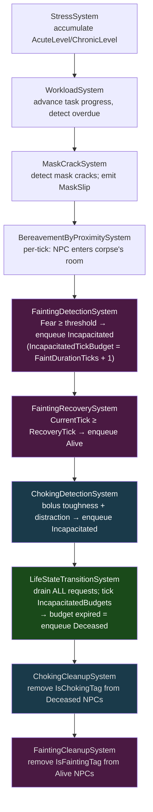

# 02 — System Pipeline Reference

## Phase Table

Systems execute in ascending numeric phase order. Within a phase, systems execute in the order they were registered in `SimulationBootstrapper.RegisterSystems()`.

| Phase | Value | Purpose |
|:------|------:|:--------|
| `PreUpdate` | 0 | Invariant enforcement, component initialization, structural tagging, schedule spawning, task generation |
| `Spatial` | 5 | Spatial index sync, room membership, pathfinding cache invalidation |
| `Lighting` | 7 | Sun position, light source state machines, aperture beams, illumination accumulation, proximity events |
| `Coupling` | 8 | Lighting-to-social-drive coupling |
| `Physiology` | 10 | Raw biological resource drain/restore, bladder fill |
| `Condition` | 20 | Biological condition tags derived from physiology values, schedule resolution |
| `Cognition` | 30 | Emotion processing, drive scoring, physiology gate, action selection, willpower, social mask state |
| `Behavior` | 40 | Act on dominant drive (eat, drink, sleep, defecate, urinate) |
| `Transit` | 50 | Upper digestive pipeline: bite-to-bolus, esophagus advance, digestion |
| `Elimination` | 55 | Lower digestive pipeline: small intestine → large intestine → colon/bladder tag management |
| `World` | 60 | Food rot, pathfinding trigger, movement speed modifiers, step-aside, movement, facing, idle jitter |
| `Narrative` | 70 | Narrative event detection, chronicle persistence, memory recording, corpse spawning, bereavement |
| `Dialog` | 75 | Dialog context decision, fragment retrieval, calcification |
| `Cleanup` | 80 | Stress accumulation, workload progress, mask cracks, bereavement proximity, fainting/choking detection & recovery, life-state transitions, post-transition cleanup |
| `PostUpdate` | 100 | Reserved |

---

## Phase Pipeline Flowchart

```mermaid
flowchart TD
    PRE["**PreUpdate (0)**\nInvariantSystem · StructuralTaggingSystem\nScheduleSpawnerSystem · StressInitializerSystem\nMaskInitializerSystem · WorkloadInitializerSystem\nLifeStateInitializerSystem · TaskGeneratorSystem\nLockoutDetectionSystem"]
    SPA["**Spatial (5)**\nSpatialIndexSyncSystem\nRoomMembershipSystem\nPathfindingCacheInvalidationSystem"]
    LIT["**Lighting (7)**\nSunSystem · LightSourceStateSystem\nApertureBeamSystem · IlluminationAccumulationSystem\nProximityEventSystem"]
    COU["**Coupling (8)**\nLightingToDriveCouplingSystem"]
    PHY["**Physiology (10)**\nMetabolismSystem · EnergySystem\nBladderFillSystem"]
    CON["**Condition (20)**\nBiologicalConditionSystem · ScheduleSystem"]
    COG["**Cognition (30)**\nMoodSystem · BrainSystem\nPhysiologyGateSystem · DriveDynamicsSystem\nActionSelectionSystem · WillpowerSystem\nRelationshipLifecycleSystem · SocialMaskSystem"]
    BEH["**Behavior (40)**\nFeedingSystem · DrinkingSystem · SleepSystem\nDefecationSystem · UrinationSystem"]
    TRA["**Transit (50)**\nInteractionSystem · EsophagusSystem\nDigestionSystem"]
    ELI["**Elimination (55)**\nSmallIntestineSystem · LargeIntestineSystem\nColonSystem · BladderSystem"]
    WLD["**World (60)**\nRotSystem · PathfindingTriggerSystem\nMovementSpeedModifierSystem · StepAsideSystem\nMovementSystem · FacingSystem · IdleMovementSystem"]
    NAR["**Narrative (70)**\nNarrativeEventDetector · PersistenceThresholdDetector\nMemoryRecordingSystem · CorpseSpawnerSystem\nBereavementSystem"]
    DIA["**Dialog (75)**\nDialogContextDecisionSystem\nDialogFragmentRetrievalSystem · DialogCalcifySystem"]
    CLN["**Cleanup (80)**\n(see sub-ordering diagram below)"]
    POST["**PostUpdate (100)**\n(reserved)"]

    PRE --> SPA --> LIT --> COU --> PHY --> CON --> COG --> BEH --> TRA --> ELI --> WLD --> NAR --> DIA --> CLN --> POST
```



---

## Cleanup Phase Sub-Ordering



> **Key ordering invariant:** FaintingDetectionSystem and FaintingRecoverySystem must both run BEFORE LifeStateTransitionSystem so that in the tick fainting triggers, the recovery is already queued and the budget (FaintDurationTicks + 1) cannot expire into a death before recovery fires.

---

## Pipeline Execution Diagram (ASCII)

```
tick start
    │
    ▼
┌─────────────── PreUpdate (0) ───────────────────────────────────────────┐
│  InvariantSystem           clamp impossible values, record violations   │
│  StructuralTaggingSystem   one-shot: attach StructuralTag to obstacles  │
│  ScheduleSpawnerSystem     attach schedules to NPCs that lack one       │
│  StressInitializerSystem   attach StressComponent to new NPCs           │
│  MaskInitializerSystem     attach SocialMaskComponent to new NPCs       │
│  WorkloadInitializerSystem attach WorkloadComponent to new NPCs         │
│  LifeStateInitializerSystem attach LifeStateComponent(Alive) to new NPC │
│  TaskGeneratorSystem       once/game-day: spawn task entities           │
│  LockoutDetectionSystem    once/game-day: reachability + starvation     │
└─────────────────────────────────────────────────────────────────────────┘
    │
    ▼
┌─────────────── Spatial (5) ─────────────────────────────────────────────┐
│  SpatialIndexSyncSystem       update grid index for moved entities      │
│  RoomMembershipSystem         update room membership from proximity bus  │
│  PathfindingCacheInvalidation invalidate cache on topology change       │
└─────────────────────────────────────────────────────────────────────────┘
    │
    ▼
┌─────────────── Lighting (7) ────────────────────────────────────────────┐
│  SunSystem                  advance sun position + update SunStateService│
│  LightSourceStateSystem     tick flickering/dying/off light states      │
│  ApertureBeamSystem         compute daylight beams through windows      │
│  IlluminationAccumulationSystem accumulate room illumination level      │
│  ProximityEventSystem       fire proximity events (sees current light)  │
└─────────────────────────────────────────────────────────────────────────┘
    │
    ▼
┌─────────────── Coupling (8) ────────────────────────────────────────────┐
│  LightingToDriveCouplingSystem  ambient light → social drive nudges     │
└─────────────────────────────────────────────────────────────────────────┘
    │
    ▼
┌─────────────── Physiology (10) ─────────────────────────────────────────┐
│  MetabolismSystem    drain Satiation/Hydration; apply sleep multiplier  │
│  EnergySystem        drain Energy; build Sleepiness; restore during sleep│
│  BladderFillSystem   fill bladder at constant rate                      │
└─────────────────────────────────────────────────────────────────────────┘
    │
    ▼
┌─────────────── Condition (20) ──────────────────────────────────────────┐
│  BiologicalConditionSystem  set HungerTag/ThirstTag/IrritableTag        │
│  ScheduleSystem             resolve active schedule block (AtDesk etc.) │
└─────────────────────────────────────────────────────────────────────────┘
    │
    ▼
┌─────────────── Cognition (30) ──────────────────────────────────────────┐
│  MoodSystem              decay emotions; apply Plutchik intensity tags   │
│  BrainSystem             score drives; pick Dominant; circadian modulation│
│  PhysiologyGateSystem    write BlockedActionsComponent for social vetoes │
│  DriveDynamicsSystem     social drives: baseline/current, circadian, noise│
│  ActionSelectionSystem   pick concrete action; consume willpower on veto │
│  WillpowerSystem         regenerate/drain willpower from event queue     │
│  RelationshipLifecycleSystem  decay/grow relationship intensity          │
│  SocialMaskSystem        update mask delta; expose raw drives in low-exp │
└─────────────────────────────────────────────────────────────────────────┘
    │
    ▼
┌─────────────── Behavior (40) ───────────────────────────────────────────┐
│  FeedingSystem      act if Dominant == Eat (spawns food bolus)          │
│  DrinkingSystem     act if Dominant == Drink (spawns water gulp)        │
│  SleepSystem        toggle IsSleeping based on dominant + threshold      │
│  DefecationSystem   empty colon if Dominant == Defecate                 │
│  UrinationSystem    empty bladder if Dominant == Pee                    │
└─────────────────────────────────────────────────────────────────────────┘
    │
    ▼
┌─────────────── Transit (50) ────────────────────────────────────────────┐
│  InteractionSystem   convert held food entity → esophagus bolus         │
│  EsophagusSystem     advance bolus/liquid progress toward stomach       │
│  DigestionSystem     release nutrients; deposit chyme to SI             │
└─────────────────────────────────────────────────────────────────────────┘
    │
    ▼
┌─────────────── Elimination (55) ────────────────────────────────────────┐
│  SmallIntestineSystem   drain chyme; pass residue to large intestine    │
│  LargeIntestineSystem   reabsorb water; form stool into colon           │
│  ColonSystem            apply/remove DefecationUrgeTag / BowelCriticalTag│
│  BladderSystem          apply/remove UrinationUrgeTag / BladderCriticalTag│
└─────────────────────────────────────────────────────────────────────────┘
    │
    ▼
┌─────────────── World (60) ──────────────────────────────────────────────┐
│  RotSystem                age food entities; apply RotTag at threshold  │
│  PathfindingTriggerSystem compute A* paths for NPCs that need new routes│
│  MovementSpeedModifierSystem scale speed by stress/affection/energy     │
│  StepAsideSystem          lateral repositioning to avoid NPC collisions │
│  MovementSystem           advance position along path (seeded random)   │
│  FacingSystem             update facing direction from proximity events │
│  IdleMovementSystem       idle jitter + posture shifts                  │
└─────────────────────────────────────────────────────────────────────────┘
    │
    ▼
┌─────────────── Narrative (70) ──────────────────────────────────────────┐
│  NarrativeEventDetector      emit DriveSpike/WillpowerLow/MaskSlip etc. │
│  PersistenceThresholdDetector evaluate candidates; persist to Chronicle │
│  MemoryRecordingSystem        route candidates to per-NPC memory buffers│
│  CorpseSpawnerSystem          attach CorpseTag+Component on death events│
│  BereavementSystem            witness + colleague grief cascade         │
└─────────────────────────────────────────────────────────────────────────┘
    │
    ▼
┌─────────────── Dialog (75) ─────────────────────────────────────────────┐
│  DialogContextDecisionSystem  gate+pair NPCs; enqueue pending dialogs   │
│  DialogFragmentRetrievalSystem select best corpus fragment per context  │
│  DialogCalcifySystem          promote frequently-used fragments         │
└─────────────────────────────────────────────────────────────────────────┘
    │
    ▼
┌─────────────── Cleanup (80) ────────────────────────────────────────────┐
│  StressSystem                 accumulate AcuteLevel / ChronicLevel       │
│  WorkloadSystem               advance task progress; detect completion   │
│  MaskCrackSystem              detect mask cracks; emit MaskSlip candidate│
│  BereavementByProximitySystem per-tick: NPC enters corpse's room         │
│  FaintingDetectionSystem      detect Fear>=threshold; enqueue Incapacitated│
│  FaintingRecoverySystem       queue Alive recovery at RecoveryTick       │
│  ChokingDetectionSystem       detect choke conditions; enqueue Incapacitated│
│  LifeStateTransitionSystem    drain queue; tick IncapacitatedTickBudgets │
│  ChokingCleanupSystem         remove IsChokingTag from Deceased NPCs     │
│  FaintingCleanupSystem        remove IsFaintingTag from recovered Alive  │
└─────────────────────────────────────────────────────────────────────────┘
    │
    ▼
tick end
```

---

## Per-System Reference

### PreUpdate Phase (0)

**InvariantSystem**
- **Phase**: PreUpdate (runs first every tick)
- **Reads**: MetabolismComponent, EnergyComponent, StomachComponent, DriveComponent, EsophagusTransitComponent, SmallIntestineComponent, LargeIntestineComponent, ColonComponent
- **Writes**: nothing (clamps in-place to valid range, records violations)
- **Description**: Validates every known component field against its documented range. Out-of-range values are clamped so the simulation continues. Violations are recorded in `InvariantSystem.Violations` and printed live when `--live-violations` is active. Exit code 2 from `ai snapshot` if `ViolationCount > 0` after tick 1.

**StructuralTaggingSystem**
- **Phase**: PreUpdate (one-shot at boot)
- **Reads**: entities with obstacle/wall/door properties
- **Writes**: `StructuralTag`, `MutableTopologyTag`
- **Description**: Attaches `StructuralTag` to immovable topology entities so `StructuralChangeBus` can track them. Idempotent.

**ScheduleSpawnerSystem**
- **Phase**: PreUpdate (runs every tick, idempotent)
- **Reads**: `NpcTag` entities
- **Writes**: `ScheduleComponent`
- **Description**: Attaches schedule routines to NPCs that lack one. Schedules define when an NPC should be at their desk vs. in break rooms vs. sleeping.

**StressInitializerSystem**
- **Phase**: PreUpdate
- **Reads**: `NpcTag` entities
- **Writes**: `StressComponent`
- **Description**: Attaches `StressComponent` with archetype-derived baselines to newly-spawned NPCs. Baselines are loaded from `data/archetypes/stress-baselines.json`.

**MaskInitializerSystem**
- **Phase**: PreUpdate
- **Reads**: `NpcTag` entities, `PersonalityComponent`
- **Writes**: `SocialMaskComponent`
- **Description**: Attaches `SocialMaskComponent` with a personality-derived baseline mask level.

**WorkloadInitializerSystem**
- **Phase**: PreUpdate
- **Reads**: `NpcTag` entities
- **Writes**: `WorkloadComponent`
- **Description**: Attaches `WorkloadComponent` with per-archetype task capacity loaded from `data/archetypes/workload-capacity.json`.

**LifeStateInitializerSystem**
- **Phase**: PreUpdate (runs last among initializers)
- **Reads**: `NpcTag` entities
- **Writes**: `LifeStateComponent { State = LifeState.Alive }`
- **Description**: Attaches `LifeStateComponent` to newly-spawned NPCs. All NPCs start `Alive`.

**TaskGeneratorSystem**
- **Phase**: PreUpdate
- **Reads**: `SimulationClock`, `WorkloadConfig`
- **Writes**: spawns `TaskTag` entities with `TaskComponent`
- **Description**: Fires once per game-day at `WorkloadConfig.TaskGenerationHourOfDay` (default 8 AM). Spawns `TaskGenerationCountPerDay` task entities and assigns them to NPCs with available capacity slots.

**LockoutDetectionSystem** *(branch: ecs-cleanup-post-wp-pass)*
- **Phase**: PreUpdate
- **Reads**: NPC positions, door entities with `LockedTag`, `LockedInComponent`, `MetabolismComponent`
- **Writes**: `LockedInComponent`, enqueues starvation deaths via `LifeStateTransitionSystem`
- **Description**: Fires once per game-day at `LockoutConfig.LockoutCheckHour` (default 18:00). Checks if NPCs can reach outdoor exits. NPCs who are locked in have their `StarvationTickBudget` decremented; at zero they die.

---

### Spatial Phase (5)

**SpatialIndexSyncSystem**
- **Phase**: Spatial
- **Reads**: `PositionComponent` changes (entity onChange callback)
- **Writes**: `ISpatialIndex` (GridSpatialIndex)
- **Description**: Keeps the grid spatial index in sync with entity positions. Subscribes to `EntityManager.EntityDestroyed` to remove destroyed entities from the index.

**RoomMembershipSystem**
- **Phase**: Spatial
- **Reads**: `ISpatialIndex`, `ProximityEventBus`, `StructuralChangeBus`
- **Writes**: `EntityRoomMembership` (GetRoom/SetRoom/Remove)
- **Description**: Updates which room each entity is in. Room membership is used by narrative detection, bereavement-by-proximity, lighting coupling, and dialog systems.

**PathfindingCacheInvalidationSystem**
- **Phase**: Spatial
- **Reads**: `StructuralChangeBus` events
- **Writes**: `PathfindingCache` (flush on topology change)
- **Description**: Listens for structural change events and evicts the pathfinding cache when topology changes. Uses LRU eviction with a configurable max size.

---

### Lighting Phase (7)

**SunSystem**
- **Phase**: Lighting
- **Reads**: `SimulationClock`, `LightingConfig.DayPhaseBoundaries`
- **Writes**: `SunStateService` (sun position, day phase, intensity)
- **Description**: Advances sun position based on game time. Updates `SunStateService` with current sun intensity and phase (EarlyMorning / MidMorning / Afternoon / Evening / Dusk / Night).

**LightSourceStateSystem**
- **Phase**: Lighting
- **Reads**: `LightSourceComponent`, `LightingConfig`
- **Writes**: `LightSourceComponent.CurrentState`, `LightSourceComponent.CurrentIntensity`
- **Description**: Ticks state machines for Flickering (probabilistic on/off) and Dying (probabilistic intensity loss) light sources.

**ApertureBeamSystem**
- **Phase**: Lighting
- **Reads**: `LightApertureComponent`, `SunStateService`, `SimulationClock`
- **Writes**: `LightApertureComponent.CurrentBeamIntensity`
- **Description**: Computes how much sunlight passes through each window/skylight aperture based on sun position and aperture facing.

**IlluminationAccumulationSystem**
- **Phase**: Lighting
- **Reads**: `LightSourceStateSystem` output, `ApertureBeamSystem` output, `LightingConfig`
- **Writes**: `RoomIllumination` per room
- **Description**: Accumulates light contributions from all sources and apertures into a per-room illumination level used by drive coupling and mood systems.

**ProximityEventSystem**
- **Phase**: Lighting (runs after illumination is current)
- **Reads**: `ISpatialIndex`, `ProximityComponent`, `EntityRoomMembership`
- **Writes**: `ProximityEventBus`
- **Description**: Fires proximity events (entered/left range) for awareness, conversation, and sight ranges. Runs after illumination so events carry current light levels.

---

### Coupling Phase (8)

**LightingToDriveCouplingSystem**
- **Phase**: Coupling
- **Reads**: `LightingDriveCouplingTable`, `RoomIllumination`, `EntityRoomMembership`, `ApertureBeamSystem`, `SunStateService`
- **Writes**: `SocialDriveAccumulator` (fractional drive nudges per tick)
- **Description**: Applies ambient light conditions to social drives. The coupling table (loaded from `SimConfig.json lighting.driveCouplings`) maps illumination ranges and day phases to signed drive deltas. Example: high afternoon sun boosts `status` drive.

---

### Physiology Phase (10)

**MetabolismSystem**
- **Phase**: Physiology
- **Reads**: `MetabolismComponent`, `SleepingTag` (for sleep multiplier), `AngryTag`/`RagingTag` (for cortisol drain boost)
- **Writes**: `MetabolismComponent.Satiation`, `MetabolismComponent.Hydration`
- **Description**: Drains `Satiation` by `SatiationDrainRate × dt × (SleepMetabolismMultiplier if sleeping)`. Drains `Hydration` similarly. When `AngryTag` or `RagingTag` is present, drain rates increase 25% to simulate cortisol stress response.

**EnergySystem**
- **Phase**: Physiology
- **Reads**: `EnergyComponent`, `EnergySystemConfig`
- **Writes**: `EnergyComponent.Energy`, `EnergyComponent.Sleepiness`, `EnergyComponent.IsSleeping`, `TiredTag`, `ExhaustedTag`, `SleepingTag`
- **Description**: Drains `Energy` and accumulates `Sleepiness` while awake. Restores both while sleeping. Applies `TiredTag` below `TiredThreshold`, `ExhaustedTag` below `ExhaustedThreshold`.

**BladderFillSystem**
- **Phase**: Physiology
- **Reads**: `BladderComponent`, entity config `BladderEntityConfig`
- **Writes**: `BladderComponent.VolumeML`
- **Description**: Fills the bladder at `FillRate` per game-second. At `TimeScale 120`, default `FillRate = 0.010 ml/s` produces urge threshold (70 ml) in ~2 game-hours.

---

### Condition Phase (20)

**BiologicalConditionSystem**
- **Phase**: Condition
- **Reads**: `MetabolismComponent`, `BiologicalConditionSystemConfig`
- **Writes**: `HungerTag`, `ThirstTag`, `StarvingTag`, `DehydratedTag`, `IrritableTag`
- **Description**: Derives condition tags from resource levels. Applies `HungerTag` when `Satiation <= (100 - HungerTagThreshold)`. Same pattern for thirst. `IrritableTag` when either hunger or thirst exceeds `IrritableThreshold`.

**ScheduleSystem**
- **Phase**: Condition
- **Reads**: `ScheduleComponent`, `SimulationClock`
- **Writes**: `ScheduleComponent.ActiveBlock` (the current schedule activity: AtDesk, OnBreak, Sleeping, etc.)
- **Description**: Resolves the current schedule block for each NPC. The active block is read by `ActionSelectionSystem` to weight schedule-anchored candidates.

---

### Cognition Phase (30)

**MoodSystem**
- **Phase**: Cognition
- **Reads**: `MoodComponent`, `MetabolismComponent`, `EnergyComponent`, `DriveComponent`, `ConsumedRottenFoodTag`, `MoodSystemConfig`
- **Writes**: `MoodComponent` (all 8 emotion float values), Plutchik tag set (SereneTag through VigilantTag), `ConsumedRottenFoodTag` (removes after spiking Disgust)
- **Description**: Decays all emotions toward 0 at per-emotion rates. Accumulates Joy when all resources are above `JoyComfortThreshold`; Anger from `IrritableTag`; Sadness from `HungerTag`/`ThirstTag`; Disgust (boredom) when `Dominant == None`; Disgust spike on `ConsumedRottenFoodTag`; Anticipation when drive is rising but not dominant. Applies Plutchik intensity tags at `LowThreshold` / `MidThreshold` / `HighThreshold`.

**BrainSystem**
- **Phase**: Cognition
- **Reads**: `MetabolismComponent`, `EnergyComponent`, `DriveComponent`, `ColonComponent`, `BladderComponent`, `SimulationClock`, `BrainSystemConfig`, `SadTag`/`GriefTag`/`BoredTag`
- **Writes**: `DriveComponent.EatUrgency`, `DriveComponent.DrinkUrgency`, `DriveComponent.SleepUrgency`, `DriveComponent.DefecateUrgency`, `DriveComponent.PeeUrgency`, `DriveComponent.Dominant`
- **Description**: Scores each drive (0–1). Applies circadian factor to sleep. Applies mood modifiers (Sadness multiplies all scores; Bored bonus breaks idle). Picks `Dominant` drive. If all scores fall below `MinUrgencyThreshold`, sets `Dominant = None` (idle state from which boredom accumulates).

**PhysiologyGateSystem**
- **Phase**: Cognition
- **Reads**: `SocialDrivesComponent` (inhibitions), `StressComponent`, `WillpowerComponent`, `PhysiologyGateConfig`
- **Writes**: `BlockedActionsComponent`
- **Description**: Computes which physiology action classes are vetoed by social inhibitions. Low willpower weakens the veto (leakage). High acute stress further relaxes the veto. Writes `BlockedActionsComponent` before Behavior systems run.

**DriveDynamicsSystem**
- **Phase**: Cognition
- **Reads**: `SocialDrivesComponent`, `SimulationClock`, `SeededRandom`, `SocialSystemConfig`, `StressConfig`
- **Writes**: `SocialDrivesComponent.*.Current` (advances drives toward/away from baseline with circadian and noise)
- **Description**: Applies circadian amplitude/phase modulation and neuroticism-scaled volatility noise to each social drive.

**ActionSelectionSystem**
- **Phase**: Cognition
- **Reads**: `SocialDrivesComponent`, `ISpatialIndex`, `EntityRoomMembership`, `ScheduleComponent`, `WorkloadComponent`, `ActionSelectionConfig`, `ScheduleConfig`, `WorkloadConfig`
- **Writes**: `IntendedActionComponent`, enqueues willpower suppression events to `WillpowerEventQueue`
- **Description**: Enumerates candidate actions for each NPC, applies approach/avoidance inversion, checks social inhibitions vs. willpower, applies personality tie-breaking, and selects a winner. Suppressed candidates generate willpower cost events.

**WillpowerSystem**
- **Phase**: Cognition
- **Reads**: `WillpowerEventQueue`, `SocialSystemConfig`
- **Writes**: `WillpowerComponent.Current`, regenerates during sleep via `WillpowerSleepRegenPerTick`
- **Description**: Drains willpower for each suppression event; regenerates during sleep. Willpower collapse (drop ≥ `WillpowerDropThreshold`) and low willpower (below `WillpowerLowThreshold`) trigger narrative candidates.

**RelationshipLifecycleSystem**
- **Phase**: Cognition
- **Reads**: `RelationshipComponent`, `ProximityEventBus`, `SocialSystemConfig`
- **Writes**: `RelationshipComponent.Intensity`
- **Description**: Decays relationship intensity at `RelationshipIntensityDecayPerTick` when no proximity interaction signals are present.

**SocialMaskSystem**
- **Phase**: Cognition
- **Reads**: `SocialDrivesComponent`, `SocialMaskComponent`, `EntityRoomMembership`, `PersonalityComponent`, `SocialMaskConfig`
- **Writes**: `SocialMaskComponent.Delta`
- **Description**: Updates social mask delta based on drive elevation and exposure context. In low-exposure contexts, the mask decays. Personality (Conscientiousness, Extraversion) scales mask gain.

---

### Behavior Phase (40)

**FeedingSystem**
- **Phase**: Behavior
- **Reads**: `DriveComponent.Dominant == Eat`, `MetabolismComponent.Satiation`, `BlockedActionsComponent`, `FeedingSystemConfig`
- **Writes**: spawns food bolus entity with `BolusComponent` + `RotComponent`
- **Description**: When Eat is dominant and feeding is not blocked, checks for world food entities (preferring fresh over rotten). If none exist, conjures a banana bolus. Skipped entirely if `BlockedActionsComponent` vetoes eating.

**DrinkingSystem**
- **Phase**: Behavior
- **Reads**: `DriveComponent.Dominant == Drink`, `StomachComponent.NutrientsQueued.Water`, `BlockedActionsComponent`, `DrinkingSystemConfig`
- **Writes**: spawns water gulp entity with `LiquidComponent`
- **Description**: When Drink is dominant and not blocked, spawns a water gulp capped by `HydrationQueueCap` (raised to `HydrationQueueCapDehydrated` when `DehydratedTag` is present).

**SleepSystem**
- **Phase**: Behavior
- **Reads**: `DriveComponent.Dominant`, `EnergyComponent.Sleepiness`, `SleepSystemConfig`
- **Writes**: `EnergyComponent.IsSleeping`, `SleepingTag`
- **Description**: Toggles `IsSleeping` when Sleep is dominant. Enforces `WakeThreshold` (Sleepiness ≤ 20) so NPCs don't snap awake immediately after falling asleep.

**DefecationSystem**
- **Phase**: Behavior
- **Reads**: `DriveComponent.Dominant == Defecate`, `ColonComponent`
- **Writes**: `ColonComponent.StoolVolumeMl = 0`
- **Description**: When Defecate is dominant, empties the colon. Entities without `ColonComponent` are silently skipped.

**UrinationSystem**
- **Phase**: Behavior
- **Reads**: `DriveComponent.Dominant == Pee`, `BladderComponent`
- **Writes**: `BladderComponent.VolumeML = 0`
- **Description**: When Pee is dominant, empties the bladder. Respects `LifeState.IsAlive` guard — Incapacitated NPCs do not trigger voluntarily, but BladderSystem may still fill and void passively per `LifeStateConfig.IncapacitatedAllowsBladderVoid`.

---

### Transit Phase (50)

**InteractionSystem**
- **Phase**: Transit
- **Reads**: held food/liquid entities, `InteractionSystemConfig`
- **Writes**: `EsophagusTransitComponent` (adds bolus/liquid to esophagus pipeline)
- **Description**: Converts a held food entity into an esophagus transit entity by attaching `EsophagusTransitComponent` with the configured bite volume and esophagus speed.

**EsophagusSystem**
- **Phase**: Transit
- **Reads**: `EsophagusTransitComponent`, `BolusComponent`/`LiquidComponent`
- **Writes**: `EsophagusTransitComponent.Progress`; on arrival: `StomachComponent.NutrientsQueued` += bolus nutrients
- **Description**: Advances bolus/liquid progress toward the stomach. On `Progress >= 1.0`, releases the full `NutrientProfile` into `StomachComponent.NutrientsQueued` and destroys the transit entity.

**DigestionSystem**
- **Phase**: Transit
- **Reads**: `StomachComponent`, `DigestionSystemConfig`
- **Writes**: `StomachComponent.CurrentVolumeMl`, `MetabolismComponent.Satiation`, `MetabolismComponent.Hydration`, `MetabolismComponent.NutrientStores`, `SmallIntestineComponent.ChymeVolumeMl` (residue fraction)
- **Description**: Releases a proportional fraction of queued nutrients each tick. Derives Satiation from absorbed Calories (`SatiationPerCalorie`) and Hydration from absorbed Water (`HydrationPerMl`). Deposits `ResidueFraction` of digested volume as chyme into the small intestine.

---

### Elimination Phase (55)

**SmallIntestineSystem**
- **Phase**: Elimination
- **Reads**: `SmallIntestineComponent`
- **Writes**: `SmallIntestineComponent.ChymeVolumeMl`, `LargeIntestineComponent.ContentVolumeMl` (residue passthrough)
- **Description**: Drains chyme at `AbsorptionRate` per game-second. Passes `ResidueToLargeFraction` of each processed batch to the large intestine.

**LargeIntestineSystem**
- **Phase**: Elimination
- **Reads**: `LargeIntestineComponent`, `MetabolismComponent`
- **Writes**: `LargeIntestineComponent.ContentVolumeMl`, `MetabolismComponent.Hydration` (secondary source), `ColonComponent.StoolVolumeMl`
- **Description**: Two processes per tick: water reabsorption from LI content into hydration; stool formation — advances content at `MobilityRate`, deposits `StoolFraction` into the colon.

**ColonSystem**
- **Phase**: Elimination
- **Reads**: `ColonComponent`
- **Writes**: `DefecationUrgeTag`, `BowelCriticalTag`
- **Description**: Pure tag manager. Applies `DefecationUrgeTag` when `StoolVolumeMl >= UrgeThresholdMl`. Applies `BowelCriticalTag` when `StoolVolumeMl >= CapacityMl`. Removes tags when levels drop.

**BladderSystem**
- **Phase**: Elimination
- **Reads**: `BladderComponent`, entity config `BladderEntityConfig`
- **Writes**: `UrinationUrgeTag`, `BladderCriticalTag`
- **Description**: Applies `UrinationUrgeTag` when `VolumeML >= UrgeThresholdMl`. Applies `BladderCriticalTag` when `VolumeML >= CapacityMl`. Also handles passive void for Incapacitated NPCs when `LifeStateConfig.IncapacitatedAllowsBladderVoid` is true.

---

### World Phase (60)

**RotSystem**
- **Phase**: World
- **Reads**: `RotComponent`, `RotSystemConfig`
- **Writes**: `RotComponent.AgeSeconds`, `RotComponent.RotLevel`, `RotTag`
- **Description**: Ages all food entities. Once `AgeSeconds >= RotStartAge`, `RotLevel` climbs at `RotRate`. Applies `RotTag` at `RotTagThreshold` (30% by default). `FeedingSystem` checks `RotTag` before an NPC eats.

**PathfindingTriggerSystem**
- **Phase**: World
- **Reads**: `MovementTargetComponent`, `PathComponent`, `ISpatialIndex`
- **Writes**: `PathComponent.Waypoints` (via `PathfindingService.ComputePath`)
- **Description**: Triggers A* pathfinding for NPCs that have a `MovementTargetComponent` but no current valid `PathComponent`. Results are cached by `PathfindingCache` keyed on `(from, to, seed, topologyVersion)`.

**MovementSpeedModifierSystem**
- **Phase**: World
- **Reads**: `SocialDrivesComponent.Irritation.Current`, `SocialDrivesComponent.Affection.Current`, `EnergyComponent.Energy`, `MovementConfig.SpeedModifier`
- **Writes**: `MovementComponent.SpeedMultiplier`
- **Description**: Scales movement speed. Irritation adds speed (agitated NPCs move faster); affection and low energy reduce speed. Clamped to `[MinMultiplier, MaxMultiplier]`.

**StepAsideSystem**
- **Phase**: World
- **Reads**: `ISpatialIndex`, `PositionComponent`, `MovementConfig`
- **Writes**: `PositionComponent.X`/`Z` (lateral jitter to avoid collisions)
- **Description**: When two NPCs are within `StepAsideRadius` tiles and approaching, applies `StepAsideShift` perpendicular offset to both.

**MovementSystem**
- **Phase**: World
- **Reads**: `PathComponent.Waypoints`, `MovementComponent.SpeedMultiplier`, `SeededRandom`
- **Writes**: `PositionComponent.X`/`Y`/`Z`, `MovementComponent.IsMoving`
- **Description**: Advances NPCs along their waypoint paths. Uses seeded random for wander. Sets `IsMoving = false` when the waypoint list is exhausted.

**FacingSystem**
- **Phase**: World
- **Reads**: `ProximityEventBus` (entered conversation range events)
- **Writes**: `FacingComponent.Direction`
- **Description**: Updates NPC facing toward entities that entered conversation range. Produces coherent body orientation for the visual layer.

**IdleMovementSystem**
- **Phase**: World
- **Reads**: `MovementComponent.IsMoving`, `SeededRandom`, `MovementConfig`
- **Writes**: `PositionComponent.X`/`Z` (idle jitter), `FacingComponent` (posture shifts)
- **Description**: Applies small random position jitter to idle NPCs (not currently moving). Periodically triggers posture shift (facing change) at `IdlePostureShiftProb` probability.

---

### Narrative Phase (70)

**NarrativeEventDetector**
- **Phase**: Narrative
- **Reads**: `SocialDrivesComponent`, `WillpowerComponent`, `ProximityEventBus`, `EntityRoomMembership`, `NarrativeConfig`
- **Writes**: `NarrativeEventBus` (raises candidates: DriveSpike, WillpowerCollapse, WillpowerLow, ConversationStarted, LeftRoomAbruptly, MaskSlip)
- **Description**: Detects notable moments from this tick's state transitions and emits `NarrativeEventCandidate` values. Thresholds from `NarrativeConfig` gate which moments are worth reporting.

**PersistenceThresholdDetector**
- **Phase**: Narrative (runs after NarrativeEventDetector)
- **Reads**: `NarrativeEventBus` (subscribed), `ChronicleConfig`, `EntityManager`, `SimulationClock`
- **Writes**: `ChronicleService` (persists candidates that pass threshold rules)
- **Description**: Evaluates each candidate against persistence rules (intensity change minimums, drive-return windows, talk-about thresholds). Candidates that pass are written to the global chronicle.

**MemoryRecordingSystem**
- **Phase**: Narrative
- **Reads**: `NarrativeEventBus` (subscribed), `MemoryConfig`
- **Writes**: `RelationshipMemoryComponent`, `PersonalMemoryComponent`
- **Description**: Routes narrative candidates to per-NPC memory buffers. Relationship memories are per-pair (entity A remembers event with entity B). Personal memories are per-NPC (entity A remembers event involving themselves).

**CorpseSpawnerSystem** *(WP-3.0.2)*
- **Phase**: Narrative
- **Reads**: `NarrativeEventBus` (subscribed — death events)
- **Writes**: `CorpseTag`, `CorpseComponent` on deceased entity
- **Description**: Listens for death narrative events. When one fires, attaches `CorpseTag` and `CorpseComponent` to the entity so it becomes a persistent corpse in the world.

**BereavementSystem** *(WP-3.0.2)*
- **Phase**: Narrative
- **Reads**: `NarrativeEventBus` (subscribed — death events), `RelationshipComponent`, `BereavementConfig`
- **Writes**: `MoodComponent.GriefLevel` (witness and colleague tiers), `StressComponent.WitnessedDeathEventsToday`, `StressComponent.BereavementEventsToday`
- **Description**: Immediate cascade on death. Witnesses (NPCs in the same room) get `WitnessGriefIntensity` grief. Colleagues with `Intensity >= BereavementMinIntensity` get scaled grief. Stress counters are incremented for `StressSystem` to consume next tick.

---

### Dialog Phase (75)

**DialogContextDecisionSystem**
- **Phase**: Dialog
- **Reads**: `ProximityEventBus` (NPC pairs in conversation range), `SocialDrivesComponent`, `DialogConfig`
- **Writes**: `PendingDialogQueue` (enqueues pairs needing fragment selection)
- **Description**: At `DialogAttemptProbability` per tick, gates NPC pairs that are in conversation range and have a sufficiently elevated drive context. Enqueues them for fragment retrieval.

**DialogFragmentRetrievalSystem**
- **Phase**: Dialog
- **Reads**: `PendingDialogQueue`, `DialogCorpusService`, `DialogHistoryComponent`, `SocialDrivesComponent`, `DialogConfig`
- **Writes**: `DialogHistoryComponent` (updates per-speaker, per-listener usage counts)
- **Description**: Selects the best corpus fragment for each pending dialog pair based on drive-context valence matching, recency penalty, calcification bias, and per-listener bias.

**DialogCalcifySystem**
- **Phase**: Dialog
- **Reads**: `DialogHistoryComponent`, `DialogConfig`
- **Writes**: `DialogHistoryComponent.CalcifiedFragments`
- **Description**: Promotes fragments that exceed `CalcifyThreshold` uses with `CalcifyContextDominanceMin` context dominance to calcified status. Calcified fragments are a character's verbal tics.

---

### Cleanup Phase (80)

**StressSystem**
- **Phase**: Cleanup
- **Reads**: `WillpowerEventQueue` (suppression events), `SocialDrivesComponent` (drive spikes), `NarrativeEventBus` (social conflict events), `StressComponent`, `PersonalityComponent.Neuroticism`, `StressConfig`, `WorkloadConfig`, `BereavementConfig`
- **Writes**: `StressComponent.AcuteLevel`, `StressComponent.ChronicLevel`, `StressedTag`, `OverwhelmedTag`, `BurningOutTag`
- **Description**: Accumulates `AcuteLevel` from suppression events, drive spikes, social conflicts, and bereavement. Decays at `AcuteDecayPerTick`. Neuroticism scales all gains. Applies stress tags at configured thresholds. `BurningOutTag` has a `BurningOutCooldownDays` stickiness.

**WorkloadSystem**
- **Phase**: Cleanup
- **Reads**: `WorkloadComponent`, `TaskComponent`, `TaskTag`, `StressComponent`, `PersonalityComponent.Conscientiousness`, `WorkloadConfig`, `SimulationClock`
- **Writes**: `TaskComponent.Progress`, `TaskComponent.QualityLevel`, `OverdueTag`, narrative candidates (TaskCompleted, OverdueTask) via `NarrativeBus`
- **Description**: Advances task progress for NPCs currently working. Decays quality under stress. Detects task completion and deadline expiry. Emits narrative candidates for both.

**MaskCrackSystem**
- **Phase**: Cleanup (after ActionSelectionSystem writes intent)
- **Reads**: `SocialMaskComponent`, `SocialDrivesComponent`, `StressComponent`, `WillpowerComponent`, `EntityRoomMembership`, `SocialMaskConfig`
- **Writes**: `SocialMaskComponent.LastSlipTick`, narrative candidates (MaskSlip) via `NarrativeBus`
- **Description**: Detects mask crack conditions (crack pressure ≥ `CrackThreshold`, not in slip cooldown). Emits a `MaskSlip` candidate with the masked drive as detail. The crack override can affect the following dialog selection.

**BereavementByProximitySystem** *(WP-3.0.2)*
- **Phase**: Cleanup
- **Reads**: `EntityRoomMembership`, `CorpseTag` entities, `RelationshipComponent`, `BereavementConfig`
- **Writes**: `StressComponent.AcuteLevel` (one-shot per NPC-corpse pair)
- **Description**: Per-tick check: when an NPC enters a room containing a corpse of someone they had `Intensity >= ProximityBereavementMinIntensity` with, applies `ProximityBereavementStressGain`. One-shot per pair.

**FaintingDetectionSystem** *(WP-3.0.6)*
- **Phase**: Cleanup (before LifeStateTransitions)
- **Reads**: `NpcTag`, `LifeStateComponent { State == Alive }`, `MoodComponent.Fear`, `FaintingConfig`, `SimulationClock`
- **Writes**: `IsFaintingTag`, `FaintingComponent { FaintStartTick, RecoveryTick }`, enqueues Incapacitated request via `LifeStateTransitionSystem`, emits `Fainted` narrative candidate
- **Description**: Iterates all Alive NPCs. When `Fear >= FearThreshold`, attaches `IsFaintingTag` + `FaintingComponent`, and enqueues an incapacitation request with `IncapacitatedTickBudget = FaintDurationTicks + 1`. The +1 ensures the budget-expiry death check cannot fire before `FaintingRecoverySystem` acts. Idempotent — already-fainting NPCs are skipped.

**FaintingRecoverySystem** *(WP-3.0.6)*
- **Phase**: Cleanup (before LifeStateTransitions, after FaintingDetectionSystem)
- **Reads**: `IsFaintingTag`, `FaintingComponent.RecoveryTick`, `SimulationClock`, `FaintingConfig`
- **Writes**: enqueues Alive recovery request via `LifeStateTransitionSystem`, emits `RegainedConsciousness` narrative candidate
- **Description**: Watches NPCs with `IsFaintingTag`. When `CurrentTick >= RecoveryTick`, enqueues an Alive recovery request. Must run before `LifeStateTransitions` so the recovery and the budget-expiry check run in the same tick.

**ChokingDetectionSystem** *(WP-3.0.1)*
- **Phase**: Cleanup (before LifeStateTransitions)
- **Reads**: `EsophagusTransitComponent`, `EnergyComponent`, `StressComponent`, `SocialDrivesComponent.Irritation`, `ChokingConfig`, `SimulationClock`
- **Writes**: `IsChokingTag`, `ChokingComponent`, enqueues Incapacitated request via `LifeStateTransitionSystem`, emits `ChokeStarted` narrative candidate
- **Description**: Iterates esophageal transit boluses. When bolus toughness ≥ `BolusSizeThreshold` AND the NPC is distracted (low energy OR high stress OR high irritation), triggers a choke. Sets `PanicMoodIntensity` on `MoodComponent`.

**LifeStateTransitionSystem**
- **Phase**: Cleanup (runs after all scenario detection systems)
- **Reads**: pending transition request queue
- **Writes**: `LifeStateComponent.State`, `LifeStateComponent.IncapacitatedTickBudget`, `CauseOfDeathComponent`, emits death narrative candidates
- **Description**: Drains the transition request queue built up by fainting, choking, and other scenario systems. Ticks down `IncapacitatedTickBudget` for all Incapacitated NPCs; when budget expires, transitions to Deceased. This is the **single writer** for `LifeStateComponent.State`.

**ChokingCleanupSystem** *(WP-3.0.1)*
- **Phase**: Cleanup (after LifeStateTransitions)
- **Reads**: `IsChokingTag`, `LifeStateComponent.State == Deceased`
- **Writes**: removes `IsChokingTag`, `ChokingComponent` from Deceased NPCs
- **Description**: Strips choke-related tags from NPCs that just died. Must run after `LifeStateTransitions` so the Deceased state is set before cleanup fires.

**FaintingCleanupSystem** *(WP-3.0.6)*
- **Phase**: Cleanup (after LifeStateTransitions)
- **Reads**: `IsFaintingTag`, `LifeStateComponent.State == Alive`
- **Writes**: removes `IsFaintingTag`, `FaintingComponent` from recovered Alive NPCs
- **Description**: Strips fainting-related tags from NPCs that just recovered. Leaves tags on still-Incapacitated NPCs. Must run after `LifeStateTransitions` so the Alive state is set before cleanup fires.

---

## Single-Writer Table

| Component / Field | Owner System |
|:------------------|:-------------|
| `MetabolismComponent.Satiation` | `MetabolismSystem` |
| `MetabolismComponent.Hydration` | `MetabolismSystem`, `LargeIntestineSystem` (secondary) |
| `MetabolismComponent.NutrientStores` | `DigestionSystem` |
| `EnergyComponent.Energy` | `EnergySystem` |
| `EnergyComponent.Sleepiness` | `EnergySystem` |
| `EnergyComponent.IsSleeping` | `SleepSystem` |
| `StomachComponent.NutrientsQueued` | `EsophagusSystem` (add), `DigestionSystem` (drain) |
| `StomachComponent.CurrentVolumeMl` | `DigestionSystem` |
| `SmallIntestineComponent.ChymeVolumeMl` | `DigestionSystem` (add), `SmallIntestineSystem` (drain) |
| `LargeIntestineComponent.ContentVolumeMl` | `SmallIntestineSystem` (add), `LargeIntestineSystem` (drain) |
| `ColonComponent.StoolVolumeMl` | `LargeIntestineSystem` (add), `DefecationSystem` (empty) |
| `BladderComponent.VolumeML` | `BladderFillSystem` (add), `UrinationSystem` (empty) |
| `DriveComponent.EatUrgency` | `BrainSystem` |
| `DriveComponent.DrinkUrgency` | `BrainSystem` |
| `DriveComponent.SleepUrgency` | `BrainSystem` |
| `DriveComponent.DefecateUrgency` | `BrainSystem` |
| `DriveComponent.PeeUrgency` | `BrainSystem` |
| `DriveComponent.Dominant` | `BrainSystem` |
| `MoodComponent` (all emotion floats) | `MoodSystem` |
| Plutchik tags (SereneTag … VigilantTag) | `MoodSystem` |
| `HungerTag`, `ThirstTag`, `IrritableTag` | `BiologicalConditionSystem` |
| `TiredTag`, `ExhaustedTag`, `SleepingTag` | `EnergySystem` |
| `DefecationUrgeTag`, `BowelCriticalTag` | `ColonSystem` |
| `UrinationUrgeTag`, `BladderCriticalTag` | `BladderSystem` |
| `RotTag` | `RotSystem` |
| `ConsumedRottenFoodTag` | `FeedingSystem` (add), `MoodSystem` (remove) |
| `IsFaintingTag`, `FaintingComponent` | `FaintingDetectionSystem` (add), `FaintingCleanupSystem` (remove) |
| `IsChokingTag`, `ChokingComponent` | `ChokingDetectionSystem` (add), `ChokingCleanupSystem` (remove) |
| `LifeStateComponent.State` | `LifeStateTransitionSystem` (only writer) |
| `CorpseTag`, `CorpseComponent` | `CorpseSpawnerSystem` |
| `StressComponent.AcuteLevel` | `StressSystem` |
| `StressComponent.ChronicLevel` | `StressSystem` |
| `StressedTag`, `OverwhelmedTag`, `BurningOutTag` | `StressSystem` |
| `SocialDrivesComponent.*.Current` | `DriveDynamicsSystem` |
| `WillpowerComponent.Current` | `WillpowerSystem` |
| `BlockedActionsComponent` | `PhysiologyGateSystem` |
| `IntendedActionComponent` | `ActionSelectionSystem` |
| `SocialMaskComponent.Delta` | `SocialMaskSystem` |
| `PositionComponent.X/Y/Z` | `MovementSystem`, `IdleMovementSystem`, `StepAsideSystem` |
| `MovementComponent.IsMoving` | `MovementSystem` |
| `MovementComponent.SpeedMultiplier` | `MovementSpeedModifierSystem` |
| `FacingComponent.Direction` | `FacingSystem`, `IdleMovementSystem` |
| `SunStateService` | `SunSystem` |
| `RoomIllumination` | `IlluminationAccumulationSystem` |
| `EntityRoomMembership` | `RoomMembershipSystem` |
| `PathComponent.Waypoints` | `PathfindingTriggerSystem` |

---

## How to Add a New System

1. **Create the system class** in `APIFramework/Systems/` (or a subdirectory for a logical group):

```csharp
using APIFramework.Components;
using APIFramework.Core;

public class MyNewSystem : ISystem
{
    private readonly MyNewSystemConfig _cfg;

    public MyNewSystem(MyNewSystemConfig cfg)
    {
        _cfg = cfg;
    }

    public void Update(EntityManager em, float deltaTime)
    {
        foreach (var entity in em.Query<NpcTag>())
        {
            if (!entity.Has<MyComponent>()) continue;
            var c = entity.Get<MyComponent>();
            // mutate c
            entity.Add(c); // struct — re-add to persist the mutation
        }
    }
}
```

2. **Add a config class** in `APIFramework/Config/SimConfig.cs` if the system has tuning values:

```csharp
public class MyNewSystemConfig
{
    public float MyThreshold { get; set; } = 50f;
}
```

Add the property to `SimConfig`:

```csharp
public MyNewSystemConfig MyNewSystem { get; set; } = new();
```

3. **Register the system** in `SimulationBootstrapper.RegisterSystems()` at the appropriate phase. Choose the phase based on what the system reads and writes:

```csharp
Engine.AddSystem(new MyNewSystem(Config.MyNewSystem), SystemPhase.Cleanup);
```

4. **Add to `ApplyConfig`** if the system config has value-type properties that should hot-reload:

```csharp
MergeFlat(newCfg.MyNewSystem, Config.MyNewSystem, changes);
```

5. **Write tests** in `APIFramework.Tests/Systems/` following the `AT-##` naming convention.

---

## The Cleanup Phase in Detail

The Cleanup phase is the most ordering-sensitive phase in the pipeline. The ordering within it is:

```
StressSystem
WorkloadSystem
MaskCrackSystem
BereavementByProximitySystem
FaintingDetectionSystem      ← enqueues Incapacitated requests
FaintingRecoverySystem       ← enqueues Alive recovery requests
ChokingDetectionSystem       ← enqueues Incapacitated requests
LifeStateTransitionSystem    ← drains ALL requests, ticks budgets
ChokingCleanupSystem         ← runs AFTER transition; removes IsChokingTag from Deceased
FaintingCleanupSystem        ← runs AFTER transition; removes IsFaintingTag from Alive
```

The critical invariant: **all scenario detection systems must enqueue their requests before `LifeStateTransitionSystem` runs**. If a detection system ran after transitions, its requests would not be drained until the next tick, creating a one-tick delay and breaking the budget guarantee for fainting (FaintDurationTicks + 1 budget must not expire before recovery is queued in the same tick).

The cleanup systems (`ChokingCleanupSystem`, `FaintingCleanupSystem`) run after transitions because they must see the final state — they only strip tags from entities whose state has already changed this tick.

---

*See also: [03-component-and-tag-reference.md](03-component-and-tag-reference.md) | [01-overview-and-architecture.md](01-overview-and-architecture.md)*
