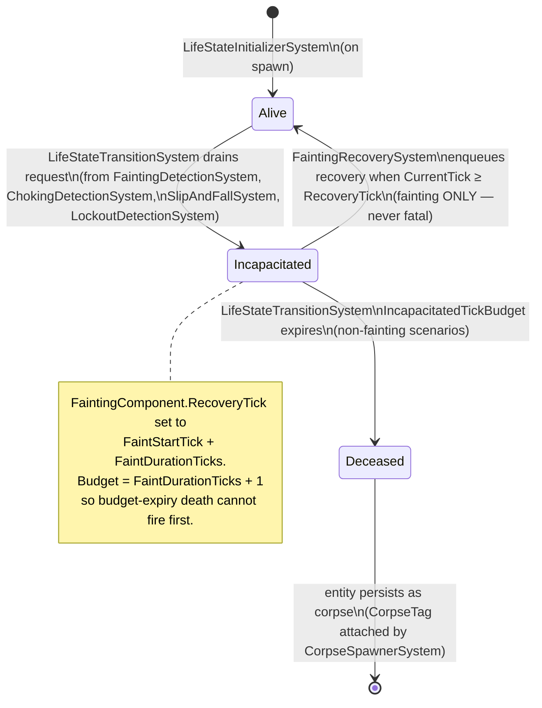

# 03 — Component and Tag Reference

This file documents every component struct and every tag struct in `APIFramework/Components/`. Components are divided into data components (have fields) and tag components (zero fields — presence/absence is the signal).

---

## Component Lifecycle Conventions

Every component follows the same lifecycle pattern:

- **Added by**: the system or template that first creates the component on an entity.
- **Written by**: the single owner system (single-writer rule).
- **Read by**: any system; no restriction on readers.
- **Removed by**: the system responsible for the component's lifecycle end.

When a system mutates a struct component, it must re-add the value:

```csharp
var c = entity.Get<MetabolismComponent>();
c.Satiation -= drainRate * deltaTime;
entity.Add(c); // persist the struct mutation
```

---

## Data Components

### MetabolismComponent

**File**: `MetabolismComponent.cs`  
**Added by**: `EntityTemplates.SpawnHuman`, `EntityTemplates.SpawnCat`  
**Written by**: `MetabolismSystem` (drain); `DigestionSystem` (nutrition absorption); `LargeIntestineSystem` (secondary hydration)  
**Read by**: `BiologicalConditionSystem`, `BrainSystem`, `MoodSystem`, `InvariantSystem`, `SimulationSnapshot`

| Field | Type | Range | Description |
|:------|:-----|:------|:------------|
| `Satiation` | `float` | 0–100 | How fed the entity is. 100 = fully fed. Drains at `SatiationDrainRate` per game-second. |
| `Hydration` | `float` | 0–100 | How hydrated the entity is. 100 = fully hydrated. |
| `BodyTemp` | `float` | ~36–39 | Body temperature in Celsius. Not yet driven by systems; set at spawn. |
| `NutrientStores` | `NutrientProfile` | — | Real-biology nutrient accumulator. `DigestionSystem` pools absorbed macros, water, vitamins, minerals here. Future organ systems drain from this pool. |

Human defaults: `SatiationStart = 90`, `HydrationStart = 90`, `BodyTemp = 37.0`.  
Sleep metabolism multiplier applies: while `SleepingTag` is present, drain rates are multiplied by `SleepMetabolismMultiplier` (default 0.10 — only 10% of awake drain during sleep).

---

### EnergyComponent

**File**: `EnergyComponent.cs`  
**Added by**: `EntityTemplates.SpawnHuman`, `EntityTemplates.SpawnCat`  
**Written by**: `EnergySystem`  
**Read by**: `BrainSystem`, `MoodSystem`, `ChokingDetectionSystem`, `InvariantSystem`, `SimulationSnapshot`

| Field | Type | Range | Description |
|:------|:-----|:------|:------------|
| `Energy` | `float` | 0–100 | Wakefulness energy. Drains while awake; restores during sleep. |
| `Sleepiness` | `float` | 0–100 | Sleep pressure. Accumulates while awake; drains during sleep. |
| `IsSleeping` | `bool` | — | Written by `SleepSystem`. Read by `MetabolismSystem` for sleep multiplier. |

Human defaults: `EnergyStart = 90`, `SleepinessStart = 5` (just woke up, well rested).

---

### StomachComponent

**File**: `StomachComponent.cs` (inferred from SimConfig and CHANGELOG)  
**Added by**: `EntityTemplates.SpawnHuman`, `EntityTemplates.SpawnCat`  
**Written by**: `EsophagusSystem` (adds to NutrientsQueued), `DigestionSystem` (drains volume)  
**Read by**: `DrinkingSystem` (queue cap check), `DigestionSystem`, `InvariantSystem`

| Field | Type | Description |
|:------|:-----|:------------|
| `CurrentVolumeMl` | `float` | Current stomach content in ml. Maximum 500 ml. |
| `NutrientsQueued` | `NutrientProfile` | Full nutrient breakdown of queued stomach content. `EsophagusSystem` adds bolus/liquid profiles; `DigestionSystem` releases a ratio-proportional slice each tick. |
| `DigestionRate` | `float` | ml of volume digested per game-second. |

---

### SmallIntestineComponent

**File**: `SmallIntestineComponent.cs`  
**Added by**: `EntityTemplates.SpawnHuman` (v0.7.3+)  
**Written by**: `DigestionSystem` (adds chyme), `SmallIntestineSystem` (drains)  
**Read by**: `SmallIntestineSystem`, `InvariantSystem`, `SimulationSnapshot`

| Field | Type | Description |
|:------|:-----|:------------|
| `ChymeVolumeMl` | `float` | Semi-digested chyme volume from the stomach. Capacity: 250 ml. |
| `AbsorptionRate` | `float` | ml processed (absorbed) per game-second. Default 0.008 ml/s. |
| `Chyme` | `NutrientProfile` | Nutrient profile of chyme in transit (decremented proportionally for display). |
| `ResidueToLargeFraction` | `float` | Fraction of processed SI volume sent to LargeIntestineComponent as residue. Default 0.4. |

Computed properties: `Fill` (0–1 relative to 250 ml capacity), `IsEmpty`.

---

### LargeIntestineComponent

**File**: `LargeIntestineComponent.cs`  
**Added by**: `EntityTemplates.SpawnHuman` (v0.7.3+)  
**Written by**: `SmallIntestineSystem` (adds residue), `LargeIntestineSystem` (processes)  
**Read by**: `LargeIntestineSystem`, `InvariantSystem`, `SimulationSnapshot`

| Field | Type | Description |
|:------|:-----|:------------|
| `ContentVolumeMl` | `float` | Indigestible residue volume. Capacity: 300 ml. |
| `WaterReabsorptionRate` | `float` | ml of water recovered per game-second → added to `Hydration`. |
| `MobilityRate` | `float` | ml advanced toward colon per game-second. |
| `StoolFraction` | `float` | Fraction of processed volume that becomes formed stool in ColonComponent. Default 0.6. |

---

### ColonComponent

**File**: `ColonComponent.cs`  
**Added by**: `EntityTemplates.SpawnHuman` (v0.7.3+)  
**Written by**: `LargeIntestineSystem` (adds stool), `DefecationSystem` (empties)  
**Read by**: `ColonSystem`, `BrainSystem`, `InvariantSystem`, `SimulationSnapshot`

| Field | Type | Description |
|:------|:-----|:------------|
| `StoolVolumeMl` | `float` | Terminal stool holding volume. |
| `UrgeThresholdMl` | `float` | `DefecationUrgeTag` applied at or above this. Human default: 100 ml. |
| `CapacityMl` | `float` | `BowelCriticalTag` applied at or above this. Human default: 200 ml. |

Computed properties: `Fill` (0–1 relative to capacity), `HasUrge`, `IsCritical`, `IsEmpty`.

---

### BladderComponent

**File**: `BladderComponent.cs`  
**Added by**: `EntityTemplates.SpawnHuman`  
**Written by**: `BladderFillSystem` (adds volume), `UrinationSystem` (empties)  
**Read by**: `BladderSystem`, `BrainSystem`, `InvariantSystem`, `SimulationSnapshot`

| Field | Type | Description |
|:------|:-----|:------------|
| `VolumeML` | `float` | Current urine volume. |
| `FillRate` | `float` | ml produced per game-second. Human default: 0.010 ml/s → urge threshold in ~2 game-hours at TimeScale 120. |
| `UrgeThresholdMl` | `float` | `UrinationUrgeTag` applied at or above. Human default: 70 ml. |
| `CapacityMl` | `float` | `BladderCriticalTag` applied at or above. Human default: 100 ml. |

---

### DriveComponent

**File**: `DriveComponent.cs`  
**Added by**: `EntityTemplates.SpawnHuman`  
**Written by**: `BrainSystem` (all urgency scores and Dominant)  
**Read by**: `FeedingSystem`, `DrinkingSystem`, `SleepSystem`, `DefecationSystem`, `UrinationSystem`, `MoodSystem`, `InvariantSystem`, `SimulationSnapshot`

| Field | Type | Range | Description |
|:------|:-----|:------|:------------|
| `EatUrgency` | `float` | 0–1 | Eat drive score. |
| `DrinkUrgency` | `float` | 0–1 | Drink drive score. |
| `SleepUrgency` | `float` | 0–1 | Sleep drive score. Circadian-modulated. |
| `DefecateUrgency` | `float` | 0–1 | Defecate drive score. `BowelCriticalTag` overrides to 1.0. |
| `PeeUrgency` | `float` | 0–1 | Pee drive score. `BladderCriticalTag` overrides to 1.0. |
| `Dominant` | `DriveType` | enum | Winning drive this tick. Values: `None`, `Eat`, `Drink`, `Sleep`, `Defecate`, `Pee`. |

---

### MoodComponent

**File**: `MoodComponent.cs`  
**Added by**: `EntityTemplates.SpawnHuman`  
**Written by**: `MoodSystem` (all emotion floats, PanicLevel); `ChokingDetectionSystem` (PanicMoodIntensity at choke)  
**Read by**: `BrainSystem`, `FaintingDetectionSystem`, `InvariantSystem`, `SimulationSnapshot`

| Field | Type | Range | Description |
|:------|:-----|:------|:------------|
| `Joy` | `float` | 0–100 | Plutchik joy axis. Gain: all resources > JoyComfortThreshold. |
| `Trust` | `float` | 0–100 | Plutchik trust axis. Gain: stable/safe environment. |
| `Fear` | `float` | 0–100 | Plutchik fear axis. **FaintingDetectionSystem uses this.** |
| `Surprise` | `float` | 0–100 | Plutchik surprise axis. |
| `Sadness` | `float` | 0–100 | Plutchik sadness axis. Gain: HungerTag or ThirstTag present. |
| `Disgust` | `float` | 0–100 | Plutchik disgust axis. Boredom at low intensity; spiked by rotten food. |
| `Anger` | `float` | 0–100 | Plutchik anger axis. Gain: IrritableTag present. |
| `Anticipation` | `float` | 0–100 | Plutchik anticipation axis. Gain: drive rising but not dominant. |
| `GriefLevel` | `float` | 0–100 | Extended grief field set by BereavementSystem. Suppresses all drives at GriefTag tier. |
| `PanicLevel` | `float` | 0–1 | Acute panic (0–1 scale, NOT 0–100). Set by ChokingDetectionSystem at choke onset. |

---

### SocialDrivesComponent

**File**: `SocialDrivesComponent.cs`  
**Added by**: `EntityTemplates.WithSocial(entity)` (cast generator, narrative-stream)  
**Written by**: `DriveDynamicsSystem`, `LightingToDriveCouplingSystem`, `ActionSelectionSystem` (suppression events)  
**Read by**: `ActionSelectionSystem`, `PhysiologyGateSystem`, `NarrativeEventDetector`, `MaskCrackSystem`, `MovementSpeedModifierSystem`

Contains 8 social drives, each a `SocialDrive` record with:

| Sub-field | Type | Description |
|:----------|:-----|:------------|
| `Baseline` | `double` | Resting/target level for this drive (archetype-specific). |
| `Current` | `double` | Current level, modulated by circadian + noise. |

Social drive names: `Belonging`, `Status`, `Affection`, `Irritation`, `Attraction`, `Trust`, `Suspicion`, `Loneliness`.

---

### WillpowerComponent

**File**: `WillpowerComponent.cs`  
**Added by**: `EntityTemplates.WithSocial(entity)`  
**Written by**: `WillpowerSystem`  
**Read by**: `ActionSelectionSystem`, `PhysiologyGateSystem`, `SocialMaskSystem`, `NarrativeEventDetector`

| Field | Type | Range | Description |
|:------|:-----|:------|:------------|
| `Current` | `int` | 0–100 | Current willpower reserve. Drains on suppression events; regenerates during sleep at `WillpowerSleepRegenPerTick`. |
| `Maximum` | `int` | — | Personality-derived maximum willpower. |

---

### StressComponent

**File**: `StressComponent.cs`  
**Added by**: `StressInitializerSystem`  
**Written by**: `StressSystem`  
**Read by**: `PhysiologyGateSystem`, `MaskCrackSystem`, `ChokingDetectionSystem`, `WorkloadSystem`, `MovementSpeedModifierSystem`, `SocialMaskSystem`

| Field | Type | Description |
|:------|:-----|:------------|
| `AcuteLevel` | `double` | Short-term stress (cortisol). Accumulates from suppression events, drive spikes, social conflicts, bereavement. Decays at `AcuteDecayPerTick`. |
| `ChronicLevel` | `double` | Long-term burnout accumulation. |
| `WitnessedDeathEventsToday` | `int` | Counter incremented by `BereavementSystem`; consumed by `StressSystem`. |
| `BereavementEventsToday` | `int` | Counter for non-witness colleague deaths. |

---

## LifeState Transition Diagram



---

### LifeStateComponent

**File**: `LifeStateComponent.cs`  
**Added by**: `LifeStateInitializerSystem`  
**Written by**: `LifeStateTransitionSystem` (**single writer for State**)  
**Read by**: all scenario detection systems, `FaintingCleanupSystem`, `ChokingCleanupSystem`, `MovementSystem`, `UrinationSystem`, `BladderSystem`

| Field | Type | Description |
|:------|:-----|:------------|
| `State` | `LifeState` | Current life state. Values: `Alive`, `Incapacitated`, `Deceased`. |
| `IncapacitatedTickBudget` | `int` | Ticks remaining before forced Deceased transition. Set by scenario systems at incapacitation. |
| `PendingDeathCause` | `CauseOfDeath` | Cause enqueued with the incapacitation request. |

**LifeState enum values:**

| Value | Meaning |
|:------|:--------|
| `Alive` | Normal operating state. All systems run on this entity. |
| `Incapacitated` | Temporarily non-functional (fainting, choking, etc.). Tick budget counts down. |
| `Deceased` | Entity is dead. Position frozen. CorpseTag attached by CorpseSpawnerSystem. |

---

### FaintingComponent

**File**: `FaintingComponent.cs`  
**Added by**: `FaintingDetectionSystem`  
**Written by**: `FaintingDetectionSystem` (set at faint onset)  
**Removed by**: `FaintingCleanupSystem`  
**Read by**: `FaintingRecoverySystem`

| Field | Type | Description |
|:------|:-----|:------------|
| `FaintStartTick` | `long` | `SimulationClock.CurrentTick` when the faint was triggered. |
| `RecoveryTick` | `long` | `FaintStartTick + FaintingConfig.FaintDurationTicks`. When `CurrentTick >= RecoveryTick`, `FaintingRecoverySystem` queues the Alive recovery. |

Fainting is never fatal. `IncapacitatedTickBudget = FaintDurationTicks + 1` guarantees the budget-expiry death check cannot fire before recovery.

---

### ChokingComponent

**File**: `ChokingComponent.cs`  
**Added by**: `ChokingDetectionSystem`  
**Removed by**: `ChokingCleanupSystem`  
**Read by**: `ChokingCleanupSystem`

Holds detailed choke state. Fields include choke onset tick and the offending bolus entity ID. Exact field set in source; removed on Deceased transition by cleanup system.

---

### PersonalityComponent

**File**: `PersonalityComponent.cs`  
**Added by**: `CastGenerator.SpawnAll`  
**Written by**: never (set at spawn, immutable)  
**Read by**: `StressSystem`, `WorkloadSystem`, `SocialMaskSystem`, `ActionSelectionSystem`, `MaskInitializerSystem`

Big Five personality traits (each as a signed integer, typically –2 to +2):

| Field | Description |
|:------|:------------|
| `Openness` | Creativity, curiosity. Affects action selection tie-breaking. |
| `Conscientiousness` | Self-discipline. Scales task progress rate and mask gain. |
| `Extraversion` | Sociability. Scales mask gain (introverts build mask faster). |
| `Agreeableness` | Cooperation. Affects social drive baselines. |
| `Neuroticism` | Emotional instability. Scales stress gain from all sources. |

---

### SocialMaskComponent

**File**: `SocialMaskComponent.cs`  
**Added by**: `MaskInitializerSystem`  
**Written by**: `SocialMaskSystem` (Delta), `MaskCrackSystem` (LastSlipTick)  
**Read by**: `ActionSelectionSystem`, `PhysiologyGateSystem`, `MaskCrackSystem`

| Field | Type | Description |
|:------|:-----|:------------|
| `Delta` | `double` | Current mask deviation from baseline (positive = suppressing more than usual). |
| `LastSlipTick` | `long` | Tick of the most recent mask crack. Used for `SlipCooldownTicks` enforcement. |

---

### WorkloadComponent

**File**: `WorkloadComponent.cs`  
**Added by**: `WorkloadInitializerSystem`  
**Written by**: `WorkloadSystem`  
**Read by**: `ActionSelectionSystem`, `StressSystem`

| Field | Type | Description |
|:------|:-----|:------------|
| `TaskCapacity` | `int` | Maximum concurrent tasks this NPC can hold. Archetype-specific. |
| `AssignedTaskIds` | `List<Guid>` | Currently assigned task entity IDs. |

---

### TaskComponent

**File**: `TaskComponent.cs`  
**Added by**: `TaskGeneratorSystem`  
**Written by**: `WorkloadSystem`  
**Read by**: `WorkloadSystem`, `ActionSelectionSystem`

| Field | Type | Description |
|:------|:-----|:------------|
| `EffortHours` | `float` | Total effort required in game-hours. |
| `DeadlineTick` | `long` | Tick at which the task becomes overdue. |
| `Priority` | `int` | 0–100 priority score for action selection weighting. |
| `Progress` | `float` | 0.0–1.0 completion fraction. |
| `QualityLevel` | `float` | 0.0–1.0 quality decay under stress. |
| `AssignedToEntityId` | `Guid` | Entity this task belongs to. |

---

### PositionComponent

**File**: `PositionComponent.cs`  
**Added by**: `EntityTemplates.SpawnHuman`, `SimulationBootstrapper.SpawnWorldObject`  
**Written by**: `MovementSystem`, `IdleMovementSystem`, `StepAsideSystem`  
**Read by**: `SpatialIndexSyncSystem`, `ProximityEventSystem`, `RoomMembershipSystem`, `SimulationSnapshot`

| Field | Type | Description |
|:------|:-----|:------------|
| `X` | `float` | World X position in tiles. |
| `Y` | `float` | World Y position (floor level). |
| `Z` | `float` | World Z position in tiles. |

---

### MovementComponent

**File**: `MovementComponent.cs`  
**Added by**: `EntityTemplates.SpawnHuman`  
**Written by**: `MovementSystem` (IsMoving), `MovementSpeedModifierSystem` (SpeedMultiplier)  
**Read by**: `SimulationSnapshot`, `IdleMovementSystem`

| Field | Type | Description |
|:------|:-----|:------------|
| `IsMoving` | `bool` | True when entity has remaining waypoints. |
| `SpeedMultiplier` | `float` | Speed scale applied by MovementSpeedModifierSystem. Clamped to [MinMultiplier, MaxMultiplier]. |
| `BaseSpeed` | `float` | Tiles per game-second at multiplier 1.0. |

---

### ProximityComponent

**File**: `ProximityComponent.cs`  
**Added by**: `EntityTemplates.WithProximity(entity)`, `EntityTemplates.SpawnHuman`  
**Read by**: `ProximityEventSystem`

| Field | Type | Description |
|:------|:-----|:------------|
| `ConversationTiles` | `int` | Radius within which conversation is possible. Default 2. |
| `AwarenessTiles` | `int` | Radius within which the NPC is aware of others. Default 8. |
| `SightTiles` | `int` | Radius within which the NPC can see others. Default 32. |

---

### NutrientProfile

**File**: `NutrientProfile.cs`  
**Used in**: `BolusComponent.Nutrients`, `LiquidComponent.Nutrients`, `StomachComponent.NutrientsQueued`, `MetabolismComponent.NutrientStores`, `SmallIntestineComponent.Chyme`

Struct with 16 fields. Supports `+`, `-`, and scalar `*` operator overloads.

| Field | Type | Unit |
|:------|:-----|:-----|
| `Carbohydrates` | `float` | grams |
| `Proteins` | `float` | grams |
| `Fats` | `float` | grams |
| `Fiber` | `float` | grams |
| `Water` | `float` | ml |
| `VitaminA` | `float` | mg |
| `VitaminB` | `float` | mg (primarily B6) |
| `VitaminC` | `float` | mg |
| `VitaminD` | `float` | mg |
| `VitaminE` | `float` | mg |
| `VitaminK` | `float` | mg |
| `Sodium` | `float` | mg |
| `Potassium` | `float` | mg |
| `Calcium` | `float` | mg |
| `Iron` | `float` | mg |
| `Magnesium` | `float` | mg |

`Calories` is a computed property: `4×Carbohydrates + 4×Proteins + 9×Fats` (Atwater factors).

---

### Other Notable Components

| Component | Description |
|:----------|:------------|
| `IdentityComponent` | `Name: string` — human-readable entity name. |
| `BolusComponent` | `Nutrients: NutrientProfile`, `Toughness: float` (0–1 choke risk), `EsophagusSpeed: float`. |
| `LiquidComponent` | `Nutrients: NutrientProfile`, `VolumeMl: float`, `LiquidType: enum`. |
| `RotComponent` | `AgeSeconds`, `RotLevel`, `RotStartAge`, `RotRate`. Computed: `IsDecaying`, `Freshness`. |
| `EsophagusTransitComponent` | `Progress: float` (0–1), `TargetEntityId: Guid`, `BolusEntityId: Guid`. |
| `FoodObjectComponent` | `NutrientsPerBite: NutrientProfile`, `Toughness: float`. |
| `RelationshipComponent` | `PartyA/PartyB: Guid`, `Kind: RelationshipKind`, `Intensity: float` (0–100). |
| `ScheduleComponent` | `Blocks: List<ScheduleBlock>`, `ActiveBlock: ScheduleBlock?`. |
| `CorpseComponent` | `DeathTick: long`, `CauseOfDeath: CauseOfDeath`, `OriginalEntityId: Guid`. |
| `RoomComponent` | `RoomId: string`, `Bounds: BoundsRect`, `Category: RoomCategory`. |
| `LightSourceComponent` | `Kind: LightKind`, `State: LightState`, `CurrentIntensity: float`. |
| `LightApertureComponent` | `Facing: ApertureFacing`, `CurrentBeamIntensity: float`. |
| `FallRiskComponent` | `RiskLevel: float` (0–1). Placed on stain/broken-item entities. |
| `PathComponent` | `Waypoints: Queue<Vector2>`. Computed by PathfindingTriggerSystem. |
| `BlockedActionsComponent` | `BlockedClasses: HashSet<ActionClass>`. Written by PhysiologyGateSystem. |
| `IntendedActionComponent` | `Action: CandidateAction`, `TargetEntityId: Guid?`. Written by ActionSelectionSystem. |
| `LockedInComponent` | `StarvationTickBudget: int`. Applied by LockoutDetectionSystem. |

---

## Tag Reference

Tags are zero-field structs. Their presence on an entity is the signal.

### Biological Urge Tags

| Tag | Applied by | Removed by | Meaning |
|:----|:-----------|:-----------|:--------|
| `HungerTag` | `BiologicalConditionSystem` | same | Satiation below HungerTagThreshold |
| `HungryTag` | (alias) | — | Older alias, same semantics as HungerTag |
| `ThirstTag` | `BiologicalConditionSystem` | same | Hydration below ThirstTagThreshold |
| `ThirstyTag` | (alias) | — | Older alias |
| `StarvingTag` | `BiologicalConditionSystem` | same | Satiation below StarvingTagThreshold (severe) |
| `DehydratedTag` | `BiologicalConditionSystem` | same | Hydration below DehydratedTagThreshold (severe) |
| `IrritableTag` | `BiologicalConditionSystem` | same | Hunger OR thirst above IrritableThreshold |
| `DefecationUrgeTag` | `ColonSystem` | same | StoolVolumeMl >= UrgeThresholdMl |
| `BowelCriticalTag` | `ColonSystem` | same | StoolVolumeMl >= CapacityMl — overrides all drives |
| `UrinationUrgeTag` | `BladderSystem` | same | BladderVolumeML >= UrgeThresholdMl |
| `BladderCriticalTag` | `BladderSystem` | same | BladderVolumeML >= CapacityMl — overrides all drives |

### Vital State Tags

| Tag | Applied by | Removed by | Meaning |
|:----|:-----------|:-----------|:--------|
| `TiredTag` | `EnergySystem` | same | Energy < TiredThreshold |
| `ExhaustedTag` | `EnergySystem` | same | Energy < ExhaustedThreshold (severe) |
| `SleepingTag` | `EnergySystem` | same | Entity is actively sleeping |
| `IrritableTag` | `BiologicalConditionSystem` | same | Hunger or thirst is elevated |

### Stress Tags

| Tag | Applied by | Removed by | Meaning |
|:----|:-----------|:-----------|:--------|
| `StressedTag` | `StressSystem` | same | AcuteLevel >= StressedTagThreshold (60) |
| `OverwhelmedTag` | `StressSystem` | same | AcuteLevel >= OverwhelmedTagThreshold (85) |
| `BurningOutTag` | `StressSystem` | same after cooldown | ChronicLevel >= BurningOutTagThreshold; sticky for BurningOutCooldownDays |

### Workload Tags

| Tag | Applied by | Removed by | Meaning |
|:----|:-----------|:-----------|:--------|
| `TaskTag` | `TaskGeneratorSystem` | never (destroyed with entity) | Marks a task entity |
| `OverdueTag` | `WorkloadSystem` | on completion/destruction | Task's DeadlineTick has passed |
| `BurnedOutFromWorkloadTag` | `WorkloadSystem` | — | All capacity slots filled with overdue tasks; query helper |

### Rot / Decay Tags

| Tag | Applied by | Removed by | Meaning |
|:----|:-----------|:-----------|:--------|
| `RotTag` | `RotSystem` | — (persists; food stays rotten) | Food entity has RotLevel >= RotTagThreshold |
| `ConsumedRottenFoodTag` | `FeedingSystem` | `MoodSystem` (same tick) | One-tick signal: entity just ate rotten food |

### Entity Identity Tags

| Tag | Meaning |
|:----|:--------|
| `HumanTag` | Entity is a human NPC |
| `CatTag` | Entity is a cat NPC |
| `NpcTag` | Entity is any NPC (human or cat — added alongside species tag) |
| `BolusTag` | Entity is a food bolus in transit |
| `RelationshipTag` | Entity represents a relationship between two NPCs |
| `RoomTag` | Entity is a room (skipped by RoomMembershipSystem) |
| `LightSourceTag` | Entity is a light fixture |
| `LightApertureTag` | Entity is a window/skylight |
| `ObstacleTag` | Immovable pathfinding obstacle (furniture, walls) |
| `NpcSlotTag` | Spawn slot for cast generator |
| `AnchorObjectTag` | Authored world object at a named anchor |
| `StainTag` | Persistent physical spill entity |
| `BrokenItemTag` | Persistent broken-item entity |
| `StructuralTag` | Entity affects pathfinding topology |
| `MutableTopologyTag` | Structural entity that can be moved via IWorldMutationApi |
| `LockedTag` | Door entity that is locked (PathfindingService treats as obstacle) |

### Life-State / Scenario Tags

| Tag | Applied by | Removed by | Meaning |
|:----|:-----------|:-----------|:--------|
| `IsFaintingTag` | `FaintingDetectionSystem` | `FaintingCleanupSystem` | NPC is currently fainting (Incapacitated); carries FaintingComponent |
| `IsChokingTag` | `ChokingDetectionSystem` | `ChokingCleanupSystem` | NPC is choking (Incapacitated); carries ChokingComponent |
| `CorpseTag` | `CorpseSpawnerSystem` | never (persists on corpse) | Entity is a deceased corpse with CorpseComponent |

---

## Plutchik Emotion Tags

`MoodSystem` applies intensity-tiered tags for each of Plutchik's 8 primary emotions. Tags are exclusive within a tier column — only the highest applicable tier is applied at any time.

| Emotion | Low (10–33) | Mid (34–66) | High (67–100) |
|:--------|:-----------|:-----------|:-------------|
| Joy | `SereneTag` | `JoyfulTag` | `EcstaticTag` |
| Trust | `AcceptingTag` | `TrustingTag` | `AdmiringTag` |
| Fear | `ApprehensiveTag` | `FearfulTag` | `TerrorTag` |
| Surprise | `DistractedTag` | `SurprisedTag` | `AmazedTag` |
| Sadness | `PensiveTag` | `SadTag` | `GriefTag` |
| Disgust | `BoredTag` | `DisgustTag` | `LoathingTag` |
| Anger | `AnnoyedTag` | `AngryTag` | `RagingTag` |
| Anticipation | `InterestedTag` | `AnticipatingTag` | `VigilantTag` |

Threshold defaults: Low = 10, Mid = 34, High = 67 (matching Plutchik's three-tier model). All thresholds are configurable in `SimConfig.Systems.Mood`.

**System interactions:**

- `BoredTag` → `BrainSystem` adds `BoredUrgencyBonus` to all drives, breaking out of idle state.
- `SadTag` → `BrainSystem` multiplies all drive scores by `SadnessUrgencyMult` (0.80 — mild suppression).
- `GriefTag` → `BrainSystem` multiplies all drive scores by `GriefUrgencyMult` (0.50 — strong suppression).
- `AngryTag`/`RagingTag` → `MetabolismSystem` raises drain rates by 25% (cortisol response).
- `TerrorTag` → indirectly: if `MoodComponent.Fear >= FearThreshold` (85), `FaintingDetectionSystem` triggers faint.

---

## EntitySnapshot Fields

`SimulationSnapshot.EntitySnapshot` is the per-entity data exposed by the snapshot API to all frontends and AI tools. Fields as of v0.7.3:

| Field | Type | Source Component |
|:------|:-----|:----------------|
| `EntityId` | `Guid` | `Entity.Id` |
| `Name` | `string` | `IdentityComponent.Name` |
| `Satiation` | `float` | `MetabolismComponent.Satiation` |
| `Hydration` | `float` | `MetabolismComponent.Hydration` |
| `BodyTemp` | `float` | `MetabolismComponent.BodyTemp` |
| `Energy` | `float` | `EnergyComponent.Energy` |
| `Sleepiness` | `float` | `EnergyComponent.Sleepiness` |
| `IsSleeping` | `bool` | `EnergyComponent.IsSleeping` |
| `Dominant` | `DriveType` | `DriveComponent.Dominant` |
| `EatUrgency` | `float` | `DriveComponent.EatUrgency` |
| `DrinkUrgency` | `float` | `DriveComponent.DrinkUrgency` |
| `SleepUrgency` | `float` | `DriveComponent.SleepUrgency` |
| `DefecateUrgency` | `float` | `DriveComponent.DefecateUrgency` |
| `PeeUrgency` | `float` | `DriveComponent.PeeUrgency` |
| `SiFill` | `float` | `SmallIntestineComponent.Fill` |
| `LiFill` | `float` | `LargeIntestineComponent.Fill` |
| `ColonFill` | `float` | `ColonComponent.Fill` |
| `BladderFill` | `float` | `BladderComponent.VolumeML / CapacityMl` |
| `PosX` | `float` | `PositionComponent.X` |
| `PosY` | `float` | `PositionComponent.Y` |
| `PosZ` | `float` | `PositionComponent.Z` |
| `IsMoving` | `bool` | `MovementComponent.IsMoving` |
| `MoveTarget` | `string?` | `MovementTargetComponent.TargetName` |

Snapshot fields default to `0` or `false` for entities that lack the corresponding component. This makes snapshot consumption safe for heterogeneous entity sets (e.g., cats without `ColonComponent` will have `ColonFill = 0`).

---

## EntityRoomMembership

`EntityRoomMembership` is a service (not a component) that maps entity IDs to their current room entity:

```csharp
Entity? room = membership.GetRoom(npcEntity);
membership.SetRoom(npcEntity, roomEntity);
membership.Remove(npcEntity);
```

It is updated every tick by `RoomMembershipSystem` and queried by `NarrativeEventDetector`, `BereavementByProximitySystem`, `PhysiologyGateSystem`, `DialogContextDecisionSystem`, and many others.

---

*See also: [02-system-pipeline-reference.md](02-system-pipeline-reference.md) | [07-simconfig-tuning-and-game-balance.md](07-simconfig-tuning-and-game-balance.md)*
