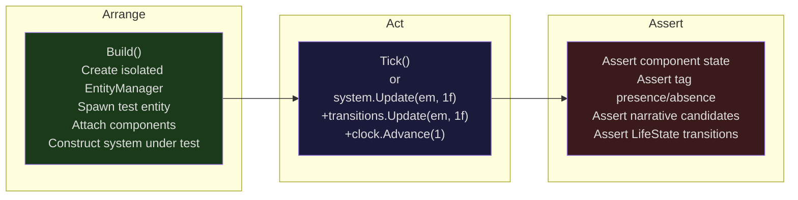
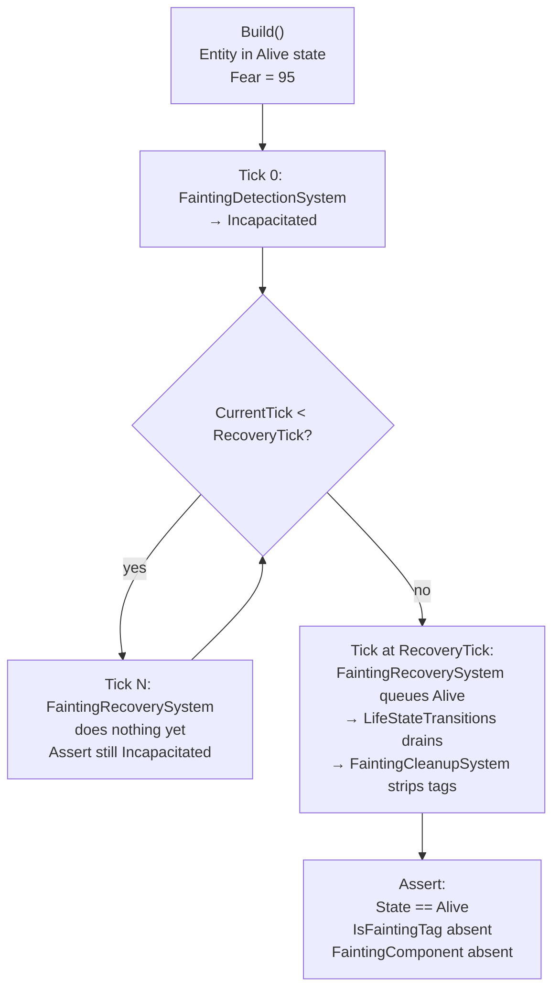

# 05 — Testing Guide

## Test Project Structure

```
APIFramework.Tests/
├── Bootstrap/                      ← CastGenerator, WorldDefinitionLoader tests
├── Components/                     ← Unit tests for component data logic
│   ├── BlockedActionsComponentTests.cs
│   ├── FallRiskComponentTests.cs
│   ├── SocialDrivesComponentTests.cs
│   ├── StressComponentTests.cs
│   ├── TaskComponentTests.cs
│   ├── WillpowerComponentTests.cs
│   ├── WorkloadComponentTests.cs
│   └── ... (18 more)
├── Core/                           ← ECS primitives (Entity, EntityManager, GridSpatialIndex)
├── Data/                           ← JSON validation for archetype configs, corpus files
├── Integration/                    ← Multi-system integration tests
│   ├── ActionSelectionScheduleIntegrationTests.cs
│   ├── MaskCrackNarrativeIntegrationTests.cs
│   ├── SmokeTests.cs
│   ├── WorkloadStressIntegrationTests.cs
│   └── ...
└── Systems/                        ← Per-system unit tests
    ├── ActionSelectionSystemTests.cs
    ├── BiologicalConditionSystemTests.cs
    ├── BrainSystemTests.cs
    ├── Chronicle/
    ├── Coupling/
    ├── LifeState/
    │   ├── FaintingDetectionSystemTests.cs   ← AT-01 through AT-09
    │   ├── FaintingRecoverySystemTests.cs    ← AT-10 through AT-12
    │   ├── FaintingCleanupSystemTests.cs     ← AT-13 through AT-15
    │   ├── FaintingIntegrationTests.cs       ← AT-16 through AT-19
    │   ├── ChokingDetectionSystemTests.cs
    │   ├── ChokingCleanupSystemTests.cs
    │   ├── BereavementSystemTests.cs
    │   ├── BereavementByProximitySystemTests.cs
    │   └── CorpseSpawnerSystemTests.cs
    └── ...
```

Additional test projects:

| Project | Tests |
|:--------|:------|
| `ECSCli.Tests` | CLI integration tests (AiSnapshotCommand, AiStreamCommand, etc.) |
| `Warden.Anthropic.Tests` | AI API integration tests |
| `Warden.Contracts.Tests` | DTO serialization and contract tests |
| `Warden.Orchestrator.Tests` | Agent orchestration tests |
| `Warden.Telemetry.Tests` | TelemetryProjector, WorldStateDto tests |

---

## xUnit Test Conventions

### The AT-## Naming Convention

Acceptance tests are named with the prefix `AT` followed by a two-digit zero-padded number. The number is scoped to the feature being tested, not globally unique across the whole test suite. AT-01 through AT-09 test FaintingDetectionSystem; AT-10 through AT-12 test FaintingRecoverySystem; and so on.

Every AT corresponds to a line in the test class's XML summary comment:

```csharp
/// <summary>
/// AT-01: Fear >= FearThreshold (Alive NPC) → IsFaintingTag attached.
/// AT-02: Fear >= FearThreshold → FaintingComponent.RecoveryTick = currentTick + FaintDurationTicks.
/// AT-03: Fear < FearThreshold → no faint, no tag.
/// </summary>
public class FaintingDetectionSystemTests { ... }
```

The test method name repeats the AT number and a short description:

```csharp
[Fact]
public void AT01_FearAboveThreshold_AliveNpc_AttachesIsFaintingTag() { ... }
```

### The static `Build()` Helper Pattern

Every test class that tests systems defines a static `Build()` helper that constructs a complete, minimal, self-contained simulation environment for the scenario being tested:

```csharp
private static (
    EntityManager em,
    NarrativeEventBus bus,
    SimulationClock clock,
    EntityRoomMembership membership,
    LifeStateTransitionSystem transitions,
    Entity npc)
Build(
    float fear      = 90f,
    LifeState state = LifeState.Alive,
    bool  alreadyFainting = false)
{
    var em         = new EntityManager();
    var bus        = new NarrativeEventBus();
    var clock      = new SimulationClock();
    var membership = new EntityRoomMembership();
    var transitions = new LifeStateTransitionSystem(bus, em, clock, DefaultLifeStateCfg(), membership);

    var npc = em.CreateEntity();
    npc.Add(new NpcTag());
    npc.Add(new LifeStateComponent { State = state });
    npc.Add(new MoodComponent { Fear = fear });
    // ... other required components
    
    return (em, bus, clock, membership, transitions, npc);
}
```

The `Build()` helper:
- Creates an isolated `EntityManager` (no shared state between tests)
- Uses `DefaultCfg()` which returns explicitly constructed config objects rather than loading files
- Sets up only the components required for the system being tested
- Accepts parameters for the varying conditions being tested (fear level, life state, etc.)

### The `Collect()` Helper for Narrative Events

Tests that need to capture narrative bus emissions use a `Collect()` helper:

```csharp
private static List<NarrativeEventCandidate> Collect(NarrativeEventBus bus, Action tick)
{
    var list = new List<NarrativeEventCandidate>();
    bus.OnCandidateEmitted += list.Add;
    tick();
    bus.OnCandidateEmitted -= list.Add;
    return list;
}
```

Usage:

```csharp
var candidates = Collect(bus, () =>
    MakeSys(transitions, bus, clock, membership).Update(em, 1f));

Assert.Contains(candidates, c => c.Kind == NarrativeEventKind.Fainted);
```

---

## Test Execution Flow Diagram



For multi-tick tests (e.g., AT-16 full fainting cycle), the Act block loops:



---

## How to Run ALL Tests

```bash
dotnet test
```

From the repo root this discovers and runs all test projects (APIFramework.Tests, ECSCli.Tests, Warden.*.Tests).

---

## How to Run Life-State Subsystem Tests

```bash
# All LifeState tests
dotnet test --filter LifeState

# Fainting subsystem only
dotnet test --filter Fainting

# Choking subsystem only
dotnet test --filter Choking

# Bereavement subsystem only
dotnet test --filter Bereavement
```

---

## How to Run a Single AT by Name

```bash
# AT-01
dotnet test --filter "AT01"

# AT-16 (full fainting cycle)
dotnet test --filter "AT16"

# AT-09 (NPC becomes Incapacitated after LifeStateTransitions drain)
dotnet test --filter "AT09"
```

The filter string matches against the test method name. Because AT-09 appears in `FaintingDetectionSystemTests`, this is unambiguous. If multiple test classes share an AT number (they are scoped per-class), qualify with the class name:

```bash
dotnet test --filter "FullyQualifiedName~FaintingDetectionSystemTests.AT09"
```

---

## How to Get Verbose Output

```bash
dotnet test --logger "console;verbosity=detailed"
```

This prints each test name as it runs and shows the failure message inline rather than in the summary.

---

## The 19 Fainting Acceptance Tests

### FaintingDetectionSystemTests (AT-01 through AT-09)

| AT | Test Method | What It Tests | Expected Outcome |
|:---|:-----------|:--------------|:-----------------|
| AT-01 | `AT01_FearAboveThreshold_AliveNpc_AttachesIsFaintingTag` | Fear ≥ FearThreshold (90 ≥ 85) on Alive NPC | `IsFaintingTag` present |
| AT-02 | `AT02_FaintingComponent_RecoveryTick_EqualsStartPlusDuration` | RecoveryTick calculation | `RecoveryTick == startTick + FaintDurationTicks` (== startTick + 20) |
| AT-03a | `AT03_FearBelowThreshold_NoFaint` | Fear 50 (below 85) | `IsFaintingTag` absent |
| AT-03b | `AT03_FearExactlyAtThreshold_TriggersFaint` | Fear exactly 85 (threshold is `>=`) | `IsFaintingTag` present |
| AT-04 | `AT04_AlreadyFainting_Idempotent_FaintingComponentNotOverwritten` | NPC already has `IsFaintingTag` | `FaintingComponent.RecoveryTick` unchanged |
| AT-05 | `AT05_DeceasedNpc_Fear100_NoFaint` | Deceased NPC with Fear=100 | `IsFaintingTag` absent (LifeState guard) |
| AT-06 | `AT06_IncapacitatedNpc_Fear100_NoFaint` | Incapacitated NPC with Fear=100 | `IsFaintingTag` absent (not Alive) |
| AT-07 | `AT07_EmitNarrativeTrue_FaintedCandidateEmitted` | EmitFaintedNarrative=true | `NarrativeEventKind.Fainted` on bus |
| AT-08 | `AT08_EmitNarrativeFalse_NoFaintedCandidate` | EmitFaintedNarrative=false | No `Fainted` candidate on bus |
| AT-09 | `AT09_AfterTransitionsDrain_NpcIsIncapacitated` | Detection + LifeStateTransitions.Update | `LifeStateComponent.State == Incapacitated` |

### FaintingRecoverySystemTests (AT-10 through AT-12)

| AT | Test Method | What It Tests | Expected Outcome |
|:---|:-----------|:--------------|:-----------------|
| AT-10a | `AT10_RecoveryTickReached_NpcBecomesAlive` | RecoveryTickOffset=0 (due this tick) | `State == Alive` after transitions drain |
| AT-10b | `AT10_RecoveryTickInPast_NpcAlsoBecomesAlive` | RecoveryTick already past | `State == Alive` (recovery fires on >= check) |
| AT-11 | `AT11_RecoveryTickInFuture_NpcRemainsIncapacitated` | RecoveryTickOffset=5 (not yet due) | `State == Incapacitated` (no recovery queued) |
| AT-12a | `AT12_EmitNarrativeTrue_RegainedConsciousnessCandidateEmitted` | EmitRegainedConsciousnessNarrative=true | `NarrativeEventKind.RegainedConsciousness` on bus |
| AT-12b | `AT12_EmitNarrativeFalse_NoRegainedConsciousnessCandidate` | EmitRegainedConsciousnessNarrative=false | No `RegainedConsciousness` candidate |

### FaintingCleanupSystemTests (AT-13 through AT-15)

| AT | Test Method | What It Tests | Expected Outcome |
|:---|:-----------|:--------------|:-----------------|
| AT-13 | `AT13_AliveNpc_WithIsFaintingTag_TagIsRemoved` | Alive NPC has leftover `IsFaintingTag` | Tag removed by cleanup |
| AT-14 | `AT14_AliveNpc_WithFaintingComponent_ComponentAlsoRemoved` | Alive NPC has `IsFaintingTag` + `FaintingComponent` | Both removed by cleanup |
| AT-15 | `AT15_IncapacitatedNpc_IsFaintingTag_NotRemoved` | Incapacitated NPC with `IsFaintingTag` (still unconscious) | Tag preserved (not yet recovered) |

### FaintingIntegrationTests (AT-16 through AT-19)

| AT | Test Method | What It Tests | Expected Outcome |
|:---|:-----------|:--------------|:-----------------|
| AT-16 | `AT16_FullCycle_FaintThenRecoverThenTagsRemoved` | Complete faint-to-recovery cycle | Incapacitated → 20 ticks later → Alive, tags stripped |
| AT-17 | `AT17_Fear_NotClearedByFaintingSystems_AfterRecovery` | Fainting systems do not touch `MoodComponent.Fear` | `Fear == 95f` after full cycle (MoodSystem decays it, not fainting systems) |
| AT-18 | `AT18_TwoNpcsFaintSameTick_BothProcessed_DeterministicOrder` | Two NPCs faint in same tick | Both `Incapacitated`; both have same `RecoveryTick` |
| AT-19 | `AT19_FaintedNpc_DoesNotReceiveCorpseTag` | Fainting is non-fatal | `CorpseTag` and `CorpseComponent` absent on fainted NPC |

---

## Test Categories

### Unit Tests

Unit tests construct the minimal environment needed for one system and assert on isolated output. Examples:

- `BiologicalConditionSystemTests.cs` — spawn one entity, set Satiation, run BiologicalConditionSystem, assert tag presence.
- `FaintingDetectionSystemTests.cs` — spawn one NPC, set Fear, run FaintingDetectionSystem + LifeStateTransitionSystem, assert state.

Unit tests must not depend on `SimulationBootstrapper` (too expensive) or any file system access.

### Integration Tests

Integration tests wire multiple systems together and test emergent behaviour. Examples:

- `FaintingIntegrationTests.cs` — wires FaintingDetectionSystem + FaintingRecoverySystem + FaintingCleanupSystem + LifeStateTransitionSystem, advances through a full cycle.
- `WorkloadStressIntegrationTests.cs` — wires WorkloadSystem + StressSystem, tests that overdue tasks raise AcuteLevel.
- `MaskCrackNarrativeIntegrationTests.cs` — wires MaskCrackSystem + NarrativeEventDetector, tests that cracks produce narrative candidates.

Integration tests may use multiple tick advances (`clock.Advance(n)` or a loop) to test time-dependent behaviour.

### Smoke Tests

`SmokeTests.cs` in `Integration/` boots a full `SimulationBootstrapper` with 1 entity and runs 100 ticks. It asserts that no exception is thrown and that invariant violation count is 0. This is the fastest signal that a refactoring has not broken fundamental simulation integrity.

---

## How to Add a New Test

Template for a new system acceptance test:

```csharp
using APIFramework.Components;
using APIFramework.Config;
using APIFramework.Core;
using APIFramework.Systems.LifeState;   // adjust namespace
using APIFramework.Systems.Narrative;
using Xunit;

namespace APIFramework.Tests.Systems.LifeState;  // adjust namespace

/// <summary>
/// AT-01: [describe condition] → [describe expected outcome]
/// AT-02: [describe condition] → [describe expected outcome]
/// </summary>
public class MyNewSystemTests
{
    // ── Default config ────────────────────────────────────────────────────────

    private static MyNewSystemConfig DefaultCfg() => new()
    {
        MyThreshold = 50f,
    };

    // ── Build helper ──────────────────────────────────────────────────────────

    private static (EntityManager em, Entity npc) Build(
        float someParam = 60f)
    {
        var em  = new EntityManager();
        var npc = em.CreateEntity();
        npc.Add(new NpcTag());
        npc.Add(new LifeStateComponent { State = LifeState.Alive });
        // Add only the components required for the system under test
        npc.Add(new SomeComponent { Value = someParam });
        return (em, npc);
    }

    // ── Collect helper for narrative events ──────────────────────────────────

    private static List<NarrativeEventCandidate> Collect(
        NarrativeEventBus bus, Action tick)
    {
        var list = new List<NarrativeEventCandidate>();
        bus.OnCandidateEmitted += list.Add;
        tick();
        bus.OnCandidateEmitted -= list.Add;
        return list;
    }

    // ── AT-01 ─────────────────────────────────────────────────────────────────

    [Fact]
    public void AT01_ValueAboveThreshold_AttachesExpectedTag()
    {
        var (em, npc) = Build(someParam: 75f); // above threshold
        new MyNewSystem(DefaultCfg()).Update(em, 1f);

        Assert.True(npc.Has<MyExpectedTag>());
    }

    // ── AT-02 ─────────────────────────────────────────────────────────────────

    [Fact]
    public void AT02_ValueBelowThreshold_NoTag()
    {
        var (em, npc) = Build(someParam: 30f); // below threshold
        new MyNewSystem(DefaultCfg()).Update(em, 1f);

        Assert.False(npc.Has<MyExpectedTag>());
    }
}
```

Key rules for new tests:
- Always use a new `EntityManager` per test — never share state.
- Always use explicitly-constructed config objects (`new MyConfig { ... }`), not file-loaded configs.
- Always add the minimum set of components needed — extra components introduce test fragility.
- Always name methods `AT##_ShortDescription` matching the class summary comment.

---

## Interpreting Test Output

**Passing:**

```
Test Run Successful.
Total tests: 19
     Passed: 19
 Total time: 0.8437 Seconds
```

**Failing:**

```
FAILED: APIFramework.Tests.Systems.LifeState.FaintingDetectionSystemTests.AT09_AfterTransitionsDrain_NpcIsIncapacitated

Error Message:
 Assert.Equal() Failure: Values differ
Expected: Incapacitated
Actual:   Alive
```

This means the system under test (FaintingDetectionSystem + LifeStateTransitions) did not change the NPC's state to Incapacitated. Investigate whether: (a) FaintingDetectionSystem didn't enqueue the request (Fear < threshold?), (b) LifeStateTransitionSystem didn't drain the queue this tick (was it registered after the call in the test?), or (c) a lifecycle bug cleared the state before the assertion.

**Skipped:**

No tests in this project use `[Skip]`. All ATs are always run. If a test appears to be skipped in CI output, check for build errors that prevented test discovery.

---

## Running Tests in CI

The CI configuration (if using GitHub Actions or Azure DevOps) should run:

```bash
dotnet test --logger "trx;LogFileName=results.trx" --results-directory TestResults/
```

And collect the `TestResults/*.trx` artifact. For a pass/fail gate on fainting tests specifically:

```bash
dotnet test --filter Fainting --logger "trx;LogFileName=fainting-results.trx"
# Exit code 0 = all pass, non-zero = failure
```

---

*See also: [04-build-and-dev-setup.md](04-build-and-dev-setup.md) | [02-system-pipeline-reference.md](02-system-pipeline-reference.md)*
