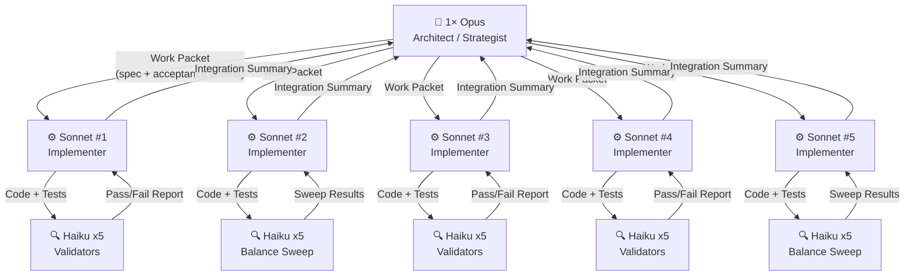

# 08 — AI Prompting Guide: The 1-5-25 Architecture

## Overview

The simulation engine is designed as a first-class AI collaboration target. The AI integration strategy uses a three-tier architecture called **1-5-25**: one Opus instance sets direction, five Sonnet instances implement and integrate, and twenty-five Haiku instances validate and balance. Each tier has distinct responsibilities, prompt patterns, and output contracts.

This document describes the role of each tier, how to write effective prompts for each, the work packet format used to pass tasks between tiers, and the escalation rules that govern when a lower tier should defer to a higher one.

---

## The 1-5-25 Hierarchy



---

## Role Definitions

### Opus — Architect (1×)

Opus is the single source of architectural intent. It reads the full codebase context (via `ai describe` and `ai snapshot`), reasons about design tradeoffs, and produces work packets that fully specify what each Sonnet must build. Opus never writes production code directly — it defines contracts, acceptance criteria, and integration rules, then delegates execution.

**Opus is responsible for:**
- Understanding the full system topology before issuing any work packet
- Writing work packets with unambiguous acceptance criteria
- Resolving conflicts between Sonnet outputs
- Making go/no-go decisions when Haiku reports a regression
- Updating the wiki and changelog after integration

**Opus is not responsible for:**
- Writing system implementations or tests (that is Sonnet's job)
- Running balance sweeps (that is Haiku's job)

### Sonnet — Implementer (5×)

Each Sonnet instance receives one work packet and owns it end-to-end: it reads the relevant source files, writes the implementation, writes the tests, runs the tests to confirm they pass, and produces an integration summary for Opus. Sonnet instances work in parallel on independent work packets; if two packets touch the same file, Opus serialises them.

**Sonnet is responsible for:**
- Reading every file listed in the work packet's "Read first" section before writing any code
- Implementing exactly what the acceptance criteria require — no more, no less
- Writing the tests first (TDD) when the work packet specifies AT numbers
- Producing a structured integration summary
- Escalating to Opus when a design ambiguity cannot be resolved without an architectural decision

**Sonnet is not responsible for:**
- Deciding whether a scenario is worth building (Opus decides)
- Running long balance sweeps (Haiku handles those)

### Haiku — Validator / Balancer (25×)

Haiku instances are the high-volume validation layer. They run automated checks, execute balance sweeps over config parameter ranges, and report simple pass/fail or metric results. Because Haiku operates at volume, its prompts must be maximally specific: no design reasoning, no ambiguity, just deterministic commands with a structured output format.

**Haiku is responsible for:**
- Running `dotnet test --filter <filter>` and reporting the result
- Running `ai narrative-stream` with `--seed` and counting event types
- Comparing telemetry frames against acceptance thresholds
- Producing a balance report in the standard format (see below)

**Haiku is not responsible for:**
- Deciding what to build or how to fix a failing test
- Making architectural decisions

---

## Work Packet Format

All Opus-to-Sonnet task assignments use the following structure. Work packets are stored in `docs/c2-infrastructure/work-packets/` and referenced by ID.

```
Work Packet: WP-X.Y.Z — <Short Title>

Branch: <branch name>
Assigned to: Sonnet

═══════════════════════════════════════════════════════════
READ FIRST (in order)
═══════════════════════════════════════════════════════════

1. APIFramework/Core/SimulationBootstrapper.cs
2. APIFramework/Config/SimConfig.cs
3. APIFramework/Components/Tags.cs
4. [any other files relevant to this packet]

═══════════════════════════════════════════════════════════
CONTEXT
═══════════════════════════════════════════════════════════

[2–4 paragraphs describing what this scenario is, why it exists,
how it fits into the broader system, and what it must NOT break.]

═══════════════════════════════════════════════════════════
DELIVERABLES
═══════════════════════════════════════════════════════════

Files to create:
  APIFramework/Components/XComponent.cs
  APIFramework/Systems/LifeState/XDetectionSystem.cs
  APIFramework/Systems/LifeState/XRecoverySystem.cs
  APIFramework.Tests/Systems/LifeState/XDetectionSystemTests.cs
  APIFramework.Tests/Systems/LifeState/XIntegrationTests.cs

Files to modify:
  APIFramework/Config/SimConfig.cs  — add XConfig class + root property
  APIFramework/Components/Tags.cs  — add IsXTag struct
  APIFramework/Core/SimulationBootstrapper.cs  — register X systems

═══════════════════════════════════════════════════════════
ACCEPTANCE CRITERIA
═══════════════════════════════════════════════════════════

AT-01  [condition] triggers [effect]
AT-02  [boundary condition] does NOT trigger [effect]
...
AT-N   [integration test: full cycle across all systems]

All tests pass: dotnet test --filter X
Zero build warnings.
SimConfig defaults documented in 07-simconfig-tuning-and-game-balance.md.

═══════════════════════════════════════════════════════════
CONSTRAINTS
═══════════════════════════════════════════════════════════

- Single-writer rule: only XDetectionSystem may set IsXTag.
- XRecoverySystem reads but does not write LifeStateComponent directly.
- No direct state mutation in test helpers — use the same pipeline path the sim uses.
- Must not regress existing AT numbers on the branch.

═══════════════════════════════════════════════════════════
OUTPUT CONTRACT
═══════════════════════════════════════════════════════════

When complete, produce an Integration Summary in this format:

## Integration Summary: WP-X.Y.Z

**Status:** PASS / PARTIAL / BLOCKED

**Tests:** N passing, 0 failing
**Build warnings:** 0

**Files created:** [list]
**Files modified:** [list]

**Design decisions made:**
- [anything that was ambiguous in the spec and how it was resolved]

**Escalate to Opus if:**
- [any unresolved questions]
```

---

## Example Opus Prompt: Issue a New Work Packet

This is how Opus receives context and produces a work packet for a new life-state scenario.

```
You are the architect for a hand-rolled ECS simulation engine in C#/.NET 8.

You have read:
- docs/wiki/01-overview-and-architecture.md
- docs/wiki/02-system-pipeline-reference.md
- The output of: dotnet run --project ECSCli -- ai describe --out engine-facts.md

Your task is to produce a work packet for WP-3.0.7: Seizure (epileptic episode triggered
by extreme exhaustion + strobe lighting). The scenario should follow the same structural
pattern as WP-3.0.6 (Fainting), which you can read at:
  APIFramework/Systems/LifeState/FaintingDetectionSystem.cs
  APIFramework/Systems/LifeState/FaintingRecoverySystem.cs
  APIFramework/Systems/LifeState/FaintingCleanupSystem.cs

Requirements from the design spec:
- Trigger: Energy < 10 AND LightingComponent.StrobeIntensity > 0.7
- Duration: 40–80 ticks (configurable)
- Recovery: auto-recovery to Alive, same pattern as fainting
- Narrative: emit Seized and RegainedConsciousness events
- Must NOT be fatal (same as fainting)
- Must not conflict with ChokingDetectionSystem (an NPC cannot simultaneously choke and seize)

Produce a complete work packet in the standard format defined in
docs/wiki/08-ai-prompting-guide-1-5-25.md. Include at least 12 acceptance tests.
List every file that must be read first, every file to create, and every file to modify.
```

---

## Example Sonnet Prompt: Implement a Work Packet

Sonnet receives the work packet and produces the implementation. The prompt must be self-contained — Sonnet has no memory of prior sessions.

```
You are implementing WP-3.0.6 (Fainting) for a hand-rolled ECS simulation in C#/.NET 8.

READ THESE FILES IN ORDER BEFORE WRITING ANY CODE:
1. APIFramework/Core/SimulationBootstrapper.cs
2. APIFramework/Config/SimConfig.cs
3. APIFramework/Components/Tags.cs
4. APIFramework/Components/FaintingComponent.cs  (if it exists)
5. APIFramework/Systems/LifeState/ChokingDetectionSystem.cs  (for the structural pattern)
6. APIFramework.Tests/Systems/LifeState/ChokingDetectionSystemTests.cs  (for the test pattern)

The complete work packet is:
[paste WP-3.0.6 content here]

Instructions:
- Write tests first (AT-01 through AT-09 in FaintingDetectionSystemTests.cs, etc.)
- Verify each test compiles before moving to the next file
- After writing all files, run: dotnet test --filter Fainting
- If any test fails, fix it before producing the Integration Summary
- Do not modify any file not listed in the work packet's "Files to modify" section
- Output the Integration Summary in the format specified in the work packet

Start by reading the files listed above.
```

---

## Example Haiku Prompt: Run a Validation Suite

Haiku prompts are maximally terse. No design context, no ambiguity — only commands with expected outputs.

```
Run the fainting test suite. Report pass/fail counts.

Command:
  dotnet test --filter Fainting --logger "console;verbosity=detailed"

Expected:
  19 tests, 0 failures, 0 errors

Output format (one line):
  FAINTING_TESTS: PASS 19/19  or  FAIL N/19 [list failing test names]
```

---

## Example Haiku Prompt: Balance Sweep

```
Run a balance sweep for FaintingConfig.FearThreshold.

For each value in [65, 70, 75, 80, 85, 90]:
  1. Edit SimConfig.json — set Fainting.FearThreshold to the value.
  2. Run:
       dotnet run --project ECSCli -- ai narrative-stream \
         --duration 14400 \
         --seed 42 \
         | jq -s '[.[] | select(.kind == "Fainted")] | length'
  3. Record the count.

Acceptance range: 2–8 Fainted events over 4 game-hours with a 10-NPC cast.

Output format (one row per value):
  FearThreshold=65  count=N  PASS/FAIL
  FearThreshold=70  count=N  PASS/FAIL
  ...

After all rows, output:
  RECOMMENDED: FearThreshold=<lowest passing value>
```

---

## Balance Report Format

Haiku balance sweep results are returned in this format. Sonnet aggregates them; Opus reviews when a regression is flagged.

```
## Balance Report: FaintingConfig.FearThreshold sweep
Date: <game-session timestamp>
Seed: 42
Duration: 14400 game-seconds
NPC count: 10
Acceptance range: 2–8 Fainted events

| FearThreshold | Fainted count | Status |
|:--------------|:--------------|:-------|
| 65            | 14            | FAIL   |
| 70            | 7             | PASS   |
| 75            | 4             | PASS   |
| 80            | 2             | PASS   |
| 85            | 0             | FAIL   |
| 90            | 0             | FAIL   |

RECOMMENDED: FearThreshold=80 (passes acceptance, lowest false-positive risk)

Regression flags:
- None. All other narrative event counts (DriveSpike, WillpowerCollapse, etc.) unchanged.
```

---

## Using the AI CLI Commands for Prompting

### Grounding Opus with engine context

Before issuing a work packet, give Opus an accurate picture of the current engine state:

```bash
dotnet run --project ECSCli -- ai describe --out engine-facts.md
```

Paste `engine-facts.md` into the Opus prompt. It lists every component type, every registered system (with phase), and every SimConfig key. This prevents Opus from inventing APIs that do not exist.

### Grounding Opus with live simulation state

For balance decisions, give Opus a snapshot of a running sim:

```bash
dotnet run --project ECSCli -- ai snapshot --out snapshot.json --pretty
```

The snapshot contains every entity's component state at tick 1. For a narrative context, run for longer:

```bash
dotnet run --project ECSCli -- ai replay \
  --seed 42 \
  --duration 3600 \
  --out replay.jsonl
```

Then give Opus the final snapshot from the replay and ask it to reason about observed behaviour.

### Feeding Sonnet its working context

Sonnet should never guess at the API. Always include the `ai describe` output and the specific source files it will modify:

```bash
dotnet run --project ECSCli -- ai describe --out engine-facts.md
# Include engine-facts.md in the Sonnet prompt alongside the work packet
```

---

## Escalation Rules

### When Haiku escalates to Sonnet

Haiku escalates when it cannot complete its task mechanically:

- A command fails with a non-zero exit code that is not a test failure (build error, missing file, etc.)
- The simulation crashes during a sweep run
- The output format does not match what the prompt specified (suggests a schema change)

Haiku does not attempt fixes. It reports the failure verbatim and stops.

### When Sonnet escalates to Opus

Sonnet escalates when completing the work packet would require an architectural decision:

- The acceptance criteria conflict with the single-writer rule or system pipeline order
- A required file modification would break an existing system that the work packet did not anticipate
- A test passes locally but the integration test reveals a cross-system interaction not covered by the spec
- Two work packets modify the same file in incompatible ways

Sonnet produces a partial Integration Summary with status `BLOCKED`, lists the specific conflict, and waits for Opus to resolve it.

### When Opus resolves escalations

Opus reads the Integration Summary, identifies the conflict, issues a revised constraint or approval, and returns the updated work packet section to Sonnet. Opus does not rewrite Sonnet's existing code — it only resolves the decision point and allows Sonnet to continue.

---

## Determinism and Reproducibility

All balance sweeps must use `--seed` to guarantee reproducibility. The seed controls:

- The `SeededRandom` instance in `SimulationBootstrapper.Random`
- The cast generator (NPC archetypes, starting drive baselines, relationships)
- Any randomised initial conditions in the world

A sweep result is only valid if the same seed, duration, and NPC count produce the same event sequence. Confirm this by running two identical commands and comparing line counts:

```bash
dotnet run --project ECSCli -- ai narrative-stream --duration 3600 --seed 42 | wc -l
dotnet run --project ECSCli -- ai narrative-stream --duration 3600 --seed 42 | wc -l
# Both must produce the same count.
```

If the counts differ, there is a non-determinism bug that must be fixed before any sweep results are trusted.

---

## Antipatterns to Avoid

**Do not give Opus implementation tasks.** Asking Opus to write a `FaintingDetectionSystem` will produce plausible but often subtly wrong code that violates the single-writer rule or breaks the system pipeline order. Opus reasons about architecture; Sonnet writes code.

**Do not give Haiku design decisions.** Asking Haiku "should FearThreshold be 75 or 85?" will produce an answer, but Haiku has no understanding of the broader narrative context. Give Haiku a range and acceptance criteria; let Sonnet and Opus interpret the results.

**Do not skip the "Read first" list.** A Sonnet that does not read `SimulationBootstrapper.cs` before writing a new system will almost certainly miss a required registration step, producing a system that compiles but never runs.

**Do not run balance sweeps without `--seed`.** Variance from unseeded runs will mask the signal from config changes. Every sweep must be seeded.

**Do not allow Sonnet to modify files outside the work packet's "Files to modify" list.** Scope creep produces changes that conflict with other parallel work packets.

---

*See also: [01-overview-and-architecture.md](01-overview-and-architecture.md) | [06-cli-reference.md](06-cli-reference.md) | [07-simconfig-tuning-and-game-balance.md](07-simconfig-tuning-and-game-balance.md)*
